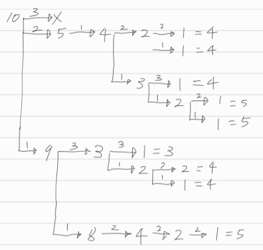
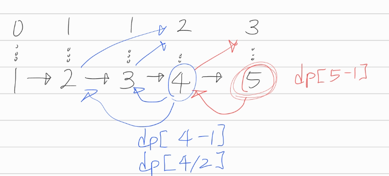

[문제](https://www.acmicpc.net/problem/1403)

## 1 만들기

 

대충 이런식으로 1을 만들 수 있다. 근데 잘 보면 중복되는 작업이 엄청 많다.

가령 3이라는 숫자에서 1을 만드는 작업을 생각해보자.

이 작업의 결과는 무엇인가? 3을 1로 만드는 최소계산횟수이다. 

그럼 2라는 숫자에서 1을 만드는 작업은 어떠한가? 값은 1이다. 

3은? 역시 1이다.

그럼 4나 5등을 구할 때마다 2랑 3의 결과를 구한다고 치자.

작업이 엄청나게 중복된다.

어떤 문제를 분할해서 풀때, 작업이 중복된다면 DP를 쓰면 좋다고 배웠다.

 

### Bottom-Up DP로 해결하기

단순하게 생각하자.

값이 큰 숫자는 결국 작은 단위의 숫자를 이용해서 그 결과를 뽑아낼 수 있다.

그러니까 작은 문제부터 해결하고, 이걸로 큰 문제를 해결하자.

 
가령 4는 -1의 결과를 dp[3]을 통해 구할 수 있다. /2의 결과는 dp[2]로 구하면 된다.

5도 마찬가지다. 이런식으로 작은 작업의 결과를 메모이제이션하면, 중복된 작업을 피할 수 있다.

```note
이 문제는 탑다운 방식으로 풀 수 도 있다.
근데 잘못하면 스택 오버플로우가 발생해서 프로그램이 죽을 수 있다. 주의하자
```


