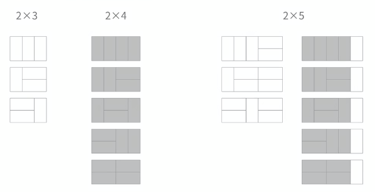

[문제](https://www.acmicpc.net/problem/11726)

## 2 X N 타일링

 작업을 가장 작은 작업으로 나눠보자. 가장 작은 작업은 더이상 나눌 수 없는 작업이다.



주어진 블럭을 이용해서 타일을 채울 수 있는 모든 경우의 수를 따져보자

```
| 
```

이거 쓰면 2 x 5-1타일이 된다. 그럼 2X4였을 때의 경우의 수는 5다. 그래서 2x5도 5개가 필요하다.

```
--
--
```

이걸 쓰면 어떻게 될까? 2 x 5-2타일이 된다. 2x3일땐 3이다. 그래서 3개가 필요하다.

2x5는 결국 2x4 + 2x3인거다. 이걸 점화식으로 표현하면 D[n] = D[n-1] + D[n-2]가 된다.

문제에서 예시로 D[9] = 55라고 했다. 한번 위의 식으로 이게 나오는지 보자

D[9] = 55

D[8] = 34

D[7] = 21

D[6] = 13

D[5] = 8

D[4] = 5

이렇게 해서 풀면 되나보다. 이 문제는 강의듣고 푼거라 내 실력이 늘지 않았다. 하지만 DP로 문제를 풀 때 어떤식으로 풀 수 있는지 확인할 수 있는 그런 문제였다. 다음에 DP문제를 풀게되면, 내 스스로 문제를 나누는 연습을 해보자.

아. 그리고 문제 좀 잘 읽자. 출력부분에 10007로 나눴을 때의 나머지를 출력하라고 되어있다. 그 이유는 2XN 타일링의 경우의 수가 엄청나게 커지기 때문이다. 그래서 모듈로 연산을 해서 정답만 구했는지 알고싶어서 이렇게 한거다. 근데 난 문제 제대로 안읽고 BigInteger로 풀려고 했다. 실수좀 하지 말자.

