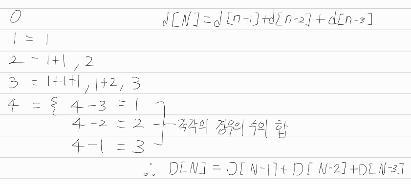

[문제](https://www.acmicpc.net/problem/9095)

## 1,2,3 더하기

이 문제도 강의듣고 푼거라 딱히 의미없다

블록문제와 같은 방식으로 풀 수 있다. 어떤 수 N을 만들 때 1을 쓴다고 치자.

1 + N-1이 된다. 다른 케이스도 생각해본다면,

2 + N-2

3 + N-3이 된다.

이게 1,2,3을 더해서 N을 만들 수 있는 모든 경우의 수라서 이렇게 풀면 된다.

다만 d[1], d[2], d[3]에 대해선 안된다. 3의 경우 3-3하면 0인데, 1,2,3을 적어도 하나를 써서 0을 만들 수 있는 방법은 없기 때문에, d[0]은 의미가 없다. 그래서 초기값으로 1,2,3의 모든 경우의수만 넣어주면 된다.

             

 

혹시나 빠지는 수가 있을지도 모른다는 생각이 들어도 그럴 필요 없다,

위의 그림과 같이, 13, 31 다 포함되어있다. 모든 경우의 수를 따지기 때문에 걱정할 필요 없다.

