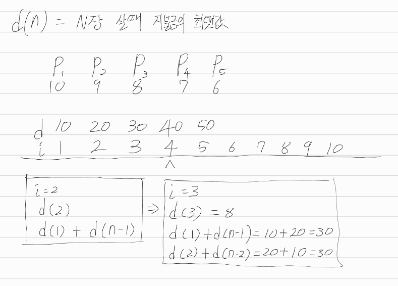

[문제](https://www.acmicpc.net/problem/11052)

## 카드 구매하기

D(n)은 n장을 가장 비싸게 살때의 금액이다.

한장사는건 항상 고정되어 있다. 1/2장같은건 없기 때문이다.

그래서 2장부터 검사해야 한다. DP공부하면서 배운걸 써보자.

우리는 총 n개의 카드팩을 사서 n장의 카드를 만들어야 한다. 

그래서 2장을 만든다면, 그냥 P2 카드팩 하나만 사도 된다.

아니면, P1 + P(2-1) 카드팩을 사도 된다. P1 카드팩은 카드가 한장 들어있으니, 이걸 사면 2-1장만 사면 된다.

이런 방식으로, 각각의 카드팩을 샀을 때를 기준으로 문제를 나눌 수 있다. 남은 문제의 결과는 메모이제이션을 써서 구하면 된다.

#### 예시

  

위의 그림을 기준으로 이해해보자. 2장을 사면, p2카드팩을 사거나 p1카드팩을 두개 사면 된다.

그러니, d1 + d(2-1)카드팩을 사면 2장을 만들 수 있는게 된다. 이때 각각의 경우에 지불한 금액을 비교하자. p1카드팩 두개 산게 더 비싸니까, d2의 결과를 20으로 갱신하자. 명심하자. d(n)은 n장의 카드를 가장 비싸게 구매할 때의 금액이다. 

d3도 마찬가지다. d3일때, d1+d(3-1)일때, d2+d(3-2)일때를 비교하자. 2장살때의 최고금액을 알고 있으니 걍 이거 써먹으면 된다.

백준아조씨는 max(D[n-i] + p[i])로 표현했다.

