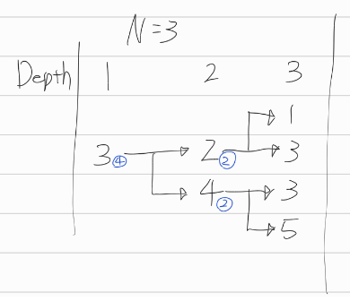
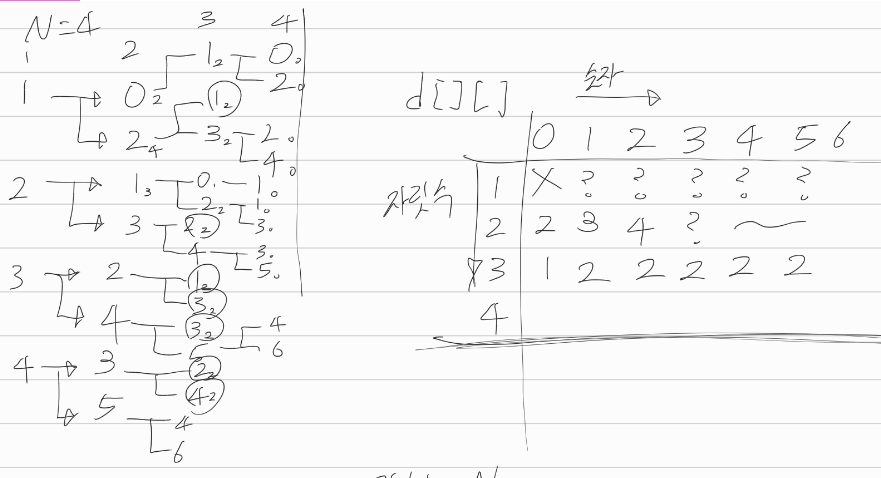

[문제](https://www.acmicpc.net/problem/10844)

## 쉬운 계단 수

인접한 모든 자릿수의 차이가 1이면 계단수라고 한다.

수의 자릿수를 깊이라고 하자.

어떤 깊이에서 어떤 수는 계단수를 몇개 가지고 있을까?

예를들어, N이 3일 때, 3으로 시작하는 경우, 이렇게 된다.

 

이런 식으로 낮은 자릿수에서 어떤 숫자가 계단수를 몇개 갖는지 알고 있다면, 높은 자릿수에서 계단수가 몇개있는지 알기 쉽다.

 낮은 자릿수에서 어떤 숫자가 계단수를 몇개 갖는지 메모이제이션하자. 이러면 다음번에 같은 자릿수의 같은 숫자의 계단수가 몇개 있는지 또 찾을 필요 없다. 구해놓은 거 가져다 쓰면된다.

다만, 숫자는 0으로 시작하지 않는다는것만 인지하면 되겠다.

