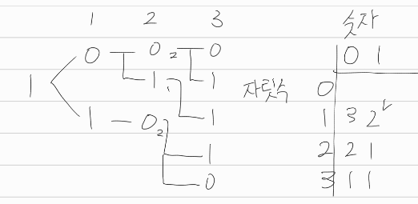
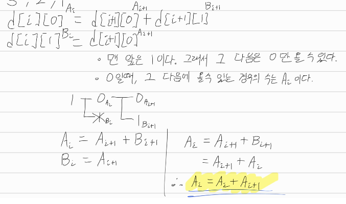
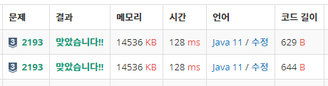

[문제](https://www.acmicpc.net/problem/2193)

## 이친수

문제에서 조건을 주기때문에, 이걸 이용하면 된다.

  

작업은 이런식으로 중복된다. 그래서 그냥 2차원 배열로 해서 구할 수 있다.

0 다음엔 0,1 둘다 올 수 있고, 1 다음엔 0만 올 수 있다. 이걸 점화식으로 만들면,

```java
d[i][0] = d[i+1][0] + d[i+1][1];
d[i][1] = d[i+1][0];
```

이렇게 된다.

#### 선생님의 풀이

1차원 배열로 할 수 있다고 한다. 한 사건에서 발생 가능한 사건이 0,1 두개뿐이라서 그렇단다.

잘 이해가 안가서 식으로 풀어보았다.

 

* 이친수의 맨 앞은 1이다. 
* 1 다음에 올 수 있는건 0뿐이다. 
* 이 경우에 생기는 이친수의 개수를 구하자. = A[i]
* 그러면 A[i] = A[i+1] + B[i+1]이 된다.
* 근데 B[i] = A[i+1]이니까, B[i+1] = A[i+2]이다
* 그래서 A[i] = A[i] + A[i+1]인걸 알 수 있다. 이걸 이용해서 구하면 된다.
* 신기하다. 역시 선생님은 천재다.

#### 이해 안가는 점

* 그래서 두 방식으로 풀어서 제출해보았다.

 

* 실행시간이 같은건 그렇다 쳐도, 메모리까지 같은건 정말 이해가 안간다.
* 왜 그럴까? 컴파일러가 최적화라도 해준걸까?

