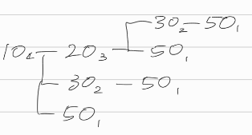
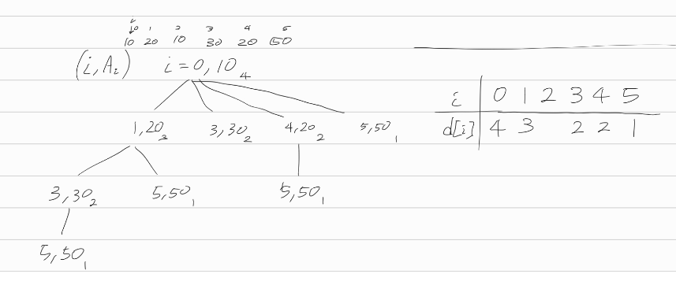

[문제](https://www.acmicpc.net/problem/11053)

## 가장 긴 증가하는 부분 수열

d[i] = 배열의 i 번째 요소가 맨 앞일때 만들어지는 수열의 길이로 놓자.

 

i = 0일때 10이니까, 이런식으로 수열의 개수를 구할 수 있다. 이때 중복되는 작업을 메모이제이션으로 없애자.

 

위의 그림을 다시 그리면 이렇게 그릴 수 있다. d배열에 메모이제이션해서 풀면 된다.

배열의 크기가 1000이어서 재귀호출이 너무 깊어져서 문제가 생길 줄 알았는데 잘 돌아갔다.

### 생각해보면 좋을 것 같은 것들

* 배열의 i번째부터 시작하는 어떤 부분수열은, i 보다 작은 인덱스에 위치한 요소를 참조하지 않는다.
* 그래서 앞부터 문제를 해결하게 되면, 만약 i = 6이라면, i = 0 ~ 5까지는 신경쓰지 않아도 된다
* 이걸 이용해서 부분문제를 나눌 수 있다면 좋을 것 같다.

### 선생님의 풀이

* 선생님은 arr[i]가 가장 마지막에 오는 경우의 모든 부분수열 개수를 d[i]로 두었다.

* 그러면 arr[i]의 앞에 있는 요소 중에서, 찾으려는 부분수열의 앞에 올 수 있는 경우를 찾는다.

* 가령, 10, 20, 30이라면, 30이 가장 마지막에 오는 부분수열을 찾는거고, 그러면 10, 20을 검사하면 된다.

  이때 10, 20과 같이 d[i]앞에 있는걸 d[j]로 두자.

* 그러면, 이렇게 간단하게 생각해볼 수 있다. d[i] = max( d[j] ) + 1

  +1을 하는 이유는, 현재 요소인 i까지 길이에 추가해야 하기 때문이다.

* 선생님은 루프로 푸셨다. 난 루프로 어떻게 해야 할지 감이 안잡혀서 재귀로 했는데, 약간 감이 온다

* 어차피 배열을 도는거다. 그러니 그냥 배열을 순회하는걸로 재귀를 대체할 수 있다.

```java
for (int j = 0; j < i; j++) {
    //조건문에서 dp[j] + 1을 하는건, i번째 수열에 붙이면 i번째까지 해서 길이가 1만큼 더 길어지기 때문
    if(arr[j] < arr[i] && dp[i] < dp[j]+1)
        dp[i] = dp[j] + 1;
}
```

* 이렇게 해서 arr[i]를 가장 마지막으로 두는 부분수열의 개수를 구할 수 있었다. 찾은 부분수열 중 가장 큰 값을 dp[i]에 메모이제이션하자.


