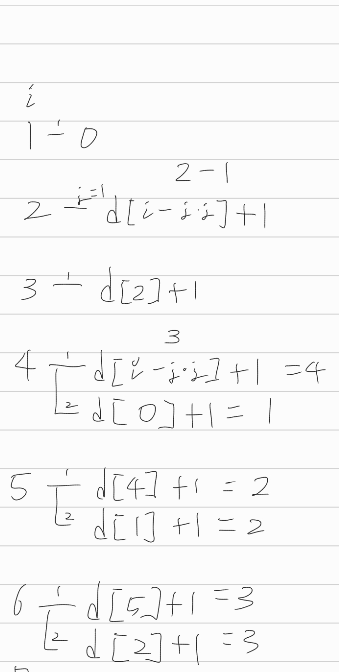

[문제](https://www.acmicpc.net/problem/1699)

## 제곱수의 합

* 처음엔 엄청 해맸다. 제곱수라길래 2제곱 3제곱 이런건줄 알았다.

* 근데 내가 이상한 착각을 한거였다. 제곱은 제곱이다. a^3은 3제곱이지, 제곱이 아니다. 착각하지 말자.

* 1,2,3 더하기 문제랑 유사한 문제다. 왜냐면, 어떤 수 n의 제곱수의 합을 구한다면, 1부터 √N사이의 수 a에 대해, n-a를 만드는 가장 낮은 항의 제곱수를 구하면 되기 때문이다.

* Bottom-Up으로 접근한다.

* i=2 -> n까지 루프를 돈다.

* j=1 -> j < √n까지 루프를 돈다.

* 이때, temp = d[i - j*j] + 1의 값을 구한다.그러면 아래와 같이 표현할 수 있다

  d[i] = MIN( d[i - j*j] + 1 )

* 첨엔 위의 식을 어떻게 해야 구할 수 있을지 막막했는데, 우연히 그냥 써본 값에 변수명을 붙여보고 좀 더 고민해보니 위의 식을 만들 수 있었다.
* 또한 루트를  쓰면 실수가 나올 수 있기 때문에, 정확한 값이 나오지 않을 수 있다. 그러니 정수의 곱으로 판단하자.
* 또한 d[i]의 초기값은 i이다. 가장 많은 항을 쓰는 경우는 1만 쓰는 경우이기 때문이다.

 

