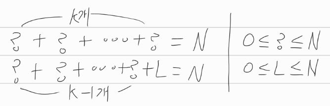
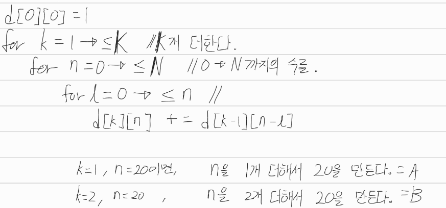

[문제](https://www.acmicpc.net/problem/2225)

## 합분해

#### Stage1 : 점화식을 정의하기

* DP문제를 풀기 위해선, 우선 점화식의 정의부터 세우자.
* 구하고자 하는게 무엇이고, 이걸 어떻게 표현할 수 있는지를 정의하라는 의미이다.
* 쉬운 문제일수록, 점화식의 정의는 문제에 드러나있다. 어려워질수록, 숨겨져있다.
* 합분해 문제의 경우에는, 점화식의 정의는 0부터 N까지의 정수 K개를 더해서 그 합이 N이 되는 경우의 수이다.
* 따라서, 정수 0~N을 K개를 더했을 때, 정수 N을 만들 수 있는 경우의 수를 점화식으로 정의하자.

```
D[K][N] = 0부터 N까지의 정수 K개를 더해서 그 합이 N이 되는 수
D[1][20]이라면, 0~20까지의 정수를 한개 더해서 그 합이 20이 되는 수를 만드는 것이다
따라서 D[1][20] = 1이다.
D[1][2], D[1][3], D[1][4]또한 1이다. 각각 2, 3, 4를 더하면 조건을 만족하기 때문이다.
```

#### Stage2 : 점화식 세우기

 

* ?를 k개 더하면 N이 나온다고 치자.
* 점화식을 풀땐, 이전값을 이용해서 현재의 점화식을 어떻게 표현할 수 있는지를 생각하면 좋다.
* N을 만들려면 0~N의 범위에 있는 정수?를 K개 더하면 된다고 했을 때, ?의 가장 마지막에 있는 수를 L로 두자.
* 그럼 ?를 k-1개 더했을 때, N-L이 된다.
* L또한 0~N의 범위에 있어서, L이 0~N일때를 다 고려해주면 된다. 그래서 아래와 같이 표현가능하다.

 

이걸 코드로 옮긴다고 했을 때,

 

이렇게 옮길 수 있다. 

실제로는 아래와 같은 결과가 나온다.

```java
10 5
0 = [    1,    0,    0,    0,    0,    0,    0,    0,    0,    0,    0 ]
1 = [    1,    1,    1,    1,    1,    1,    1,    1,    1,    1,    1 ]
2 = [    1,    2,    3,    4,    5,    6,    7,    8,    9,   10,   11 ]
3 = [    1,    3,    6,   10,   15,   21,   28,   36,   45,   55,   66 ]
4 = [    1,    4,   10,   20,   35,   56,   84,  120,  165,  220,  286 ]
5 = [    1,    5,   15,   35,   70,  126,  210,  330,  495,  715, 1001 ]
d[5][10] = 1001
```

* 0~10의 정수를 5개 더해서 10을 만들 수 있는 경우의 수는 10-L을 4개 가지고 만들 수 있는 경우의 수를 전부 더한거니까, 결국 자신의 위층(k행)에서 0부터 자신의 열(n열)까지를 전부 더한게 된다.


