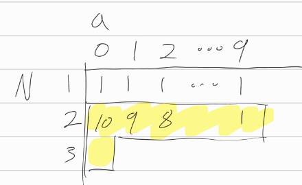

[문제](https://www.acmicpc.net/problem/11057)

## 오르막 수

#### 점화식 정의

* d[N]은 길이가 N인 오르막수의 개수이다.

```
d[N][i]는 길이가 N일때, i로 시작하는 오르막수의 개수이다.
따라서 d[1][0~9]는 전부 1이다. 길이가 1이면 오르막수도 하나뿐이기 때문이다.(자기자신)
```

#### 점화식 세우기

* 길이가 N일때, i로 시작하는 오르막수라면, 그 다음 숫자로는 i<=k 여야 한다.
* 길이가 N-1일때, k에 해당하는 모든 경우의 수를 합한게 길이가 N일때 i로 시작하는 오르막수의 개수이다.

```
d[N][i] = ∑(d[n-1][k]) , k = i, k <= 9
```

그림으로 그려보면 아래와 같다

 


