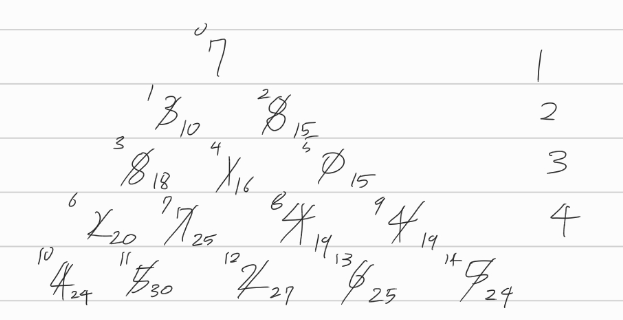

[문제](https://www.acmicpc.net/problem/1932)

## 정수 삼각형

#### 점화식 정의

* d[n]은 트리의 꼭대기에서 n번째 노드까지의 선택된 수의 합의 최대치이다.

#### 점화식 세우기

* 위에서 정의한 점화식이면 충분하다.
* 배열로 트리를 쓰는 방법만 알면 된다.

 

* 각 층마다 노드의 개수는 1, 2, 3, 4 이런식으로 증가한다
* 그래서 3층의 경우, 총 노드의 개수는 3(3+1)/2개이다.
* 이를 이용하면, 3층의 맨 왼쪽과 오른쪽의 인덱스를 층만 가지고 구할 수 있다.
* 어떤 노드의 부모노드를 구하는건 그냥 그 노드의 인덱스를 i라고 할 때, i - depth를 하면 된다. 이러면 왼쪽 부모의 인덱스가 나온다. 오른쪽 부모의 인덱스는 당연히 왼쪽 부모의 인덱스 + 1이 된다. 근데 이렇게 해서 구한 인덱스가 잘못되었을 수도 있다. 3층의 부모를 구하는데 1층의 노드의 인덱스가 잡힐수도 있고, 아니면 0보다 작은게 나올수도 있다. 그래서 부모의 층의 인덱스에 해당하는지 검사를 해주어야 한다.

