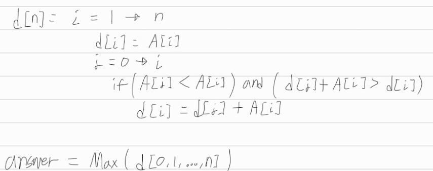

[문제](https://www.acmicpc.net/problem/11055)

## 가장 큰 증가하는 부분수열

#### 점화식 정의

* d[n] = 길이 n의 수열에서, n번째 요소를 맨 마지막으로 하는 가장 큰 증가하는 부분수열의 합이다.

#### 점화식 세우기

* 그냥 위의 점화식을 그대로 쓰면 된다.
* d[j]는 요소 j를 마지막으로 하는 가장 큰 부분수열의 합이다. 그래서 여기다가 A[i]를 더하면, 앞서 구한 부분수열의 합을 이용해서 d[i]를 구할 수 있다.

 

* 결과는 d배열에서 가장 큰 값이다.

