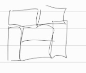
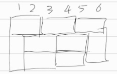
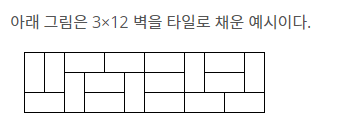

[문제](https://www.acmicpc.net/problem/2133)

## 타일 채우기

* `3XN`이므로, 항상 벽을 채울 수 없다. N이 홀수면 채우지 못한다.
* `3X2`일때, 경우의 수는 3개이다. 다른 DP문제풀듯이, `3*d[N-2]`하면 될 것 같지만, 함정이다.
* `3X4`일때, 2가지 경우의 수가 더 생긴다.

 이거랑, 이거 거꾸로 한 경우이다.

 `3X6`일때도 마찬가지이다. 

* 이런 추가케이스는 짝수번째마다 생긴다. 따라서 이거까지 고려해주면 풀린다.
* 선생님은 그려보는게 비효율이라고 하시는데, 난 잘 모르겠다. 그려보지 않고 저런 특수한 경우가 생기는걸 어떻게 알 수 있다는건지 잘 모르겠다.
* 다만 정말 아쉬운건, 문제 힌트에서 저 상황을 알려줬다는 거다.

 

* 이것만 주의깊게 봤어도, 4칸짜리 경우의 수가 생길 수 있다는 걸 알았을텐데, 놓쳤다. 경험부족이 원인이라고 판단한다. 더 많이 풀어보는 수 밖에 없을 것 같다는 생각이 든다.

