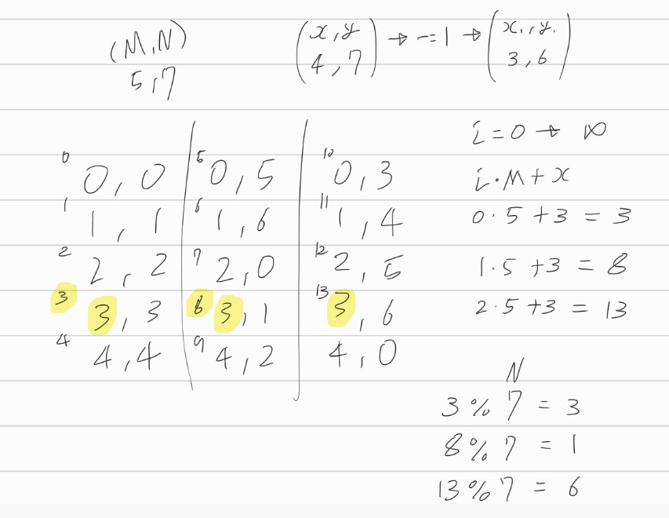

[문제](https://www.acmicpc.net/problem/6064)

## 카잉 달력

* 그냥 브루트포스로 모든 경우를 다 계산하면 풀 수 없다. M*N의 최대치가 40,000^2이기 때문이다.
* 문제에서 제시한 조건대로 해를 직접 구해본다.
* 직접 구한 해에서 패턴을 찾는다.
* 이 경우, (x,y)꼴의 해에서 각각 -1을 하면, 모듈로연산을 한것과 같은 패턴이 생긴다.

 

* 위와 같이, x,y를 -1하면, 각각 M, N으로 모듈로연산한 것과 같은 패턴이 나온다.
* 카잉달력 류의 문제를 풀게되면 이렇게 될 것 같다. 계속 ++하다가 제한선을 만나면 초기값이 되버리니까.

