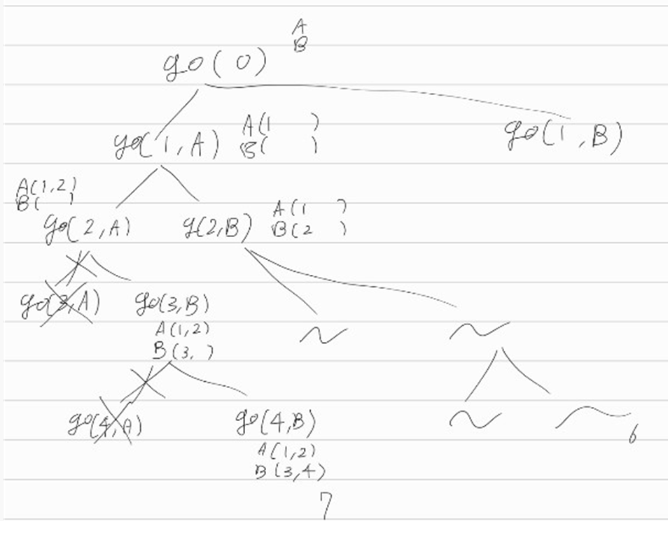

[문제](https://www.acmicpc.net/problem/14889)

## 스타트와 링크

* 재귀니까 트리처럼 쭉쭉 뻗어나간다
* 생각을 단순하게 하자. 그냥 한명씩 한 팀에 넣고 빼고 하자.
* 근데 한 팀의 선수가 N/2를 초과하면 안된다. 조건에 맞지 않으니까, 이 상황이 오면 재귀호출을 중단한다. 오늘 배운 백트래킹 방법이 이런건가보다.
* 여하튼 위의 방법을 쓰면 아래의 그림처럼 어디는 계속 재귀호출하고, 어디는 멈추게 된다.
* 마지막 선수까지 넣었다면 index가 N이 된다. 이때 두 팀의 능력치 차이를 구해서 문제를 풀면 된다.

