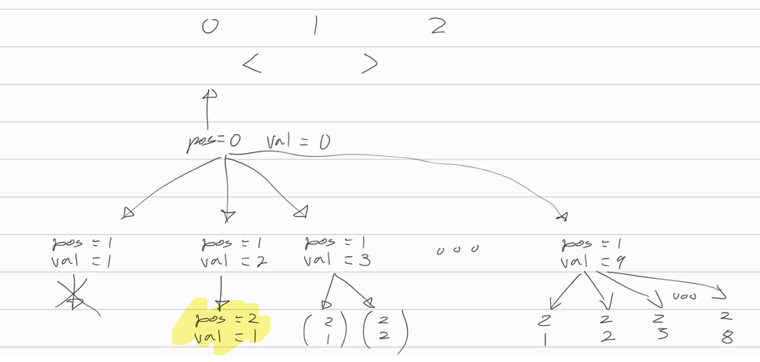

[문제](https://www.acmicpc.net/problem/2529)

## 부등호

* 확실히, 재귀호출 문제풀 때 그래프를 그려보는게 좋은 것 같다. 
* 추상코드부터 해보려고 하면 잘 안된다. 재귀호출이 익숙하지 않은건지, 어떻게, 뭘 해야 할지가 머릿속에 전혀 그려지지를 않기 때문이다.
* 하지만 그림을 그려보면 뭐가 필요하고, 뭘 어떻게 해야할지가 좀 보인다.

 

* 그림을 보면, 재귀함수의 매개변수로 필요한게 뭔지, 또, 재귀함수의 종료조건은 무엇이 되어야 할지가 눈에 보인다
* 이렇게 그림을 그려보는 연습을 더 해봐야겠다.
* 아 그리고 이 문제 풀면서 저지른 실수가 하나 있다.
  * 답은 정수의 표현범위를 벗어난다. 그래서 `long`을 사용했다.
  * 근데 정작, 초기값으로 `Integer.MAX_VALUE`로 주었다.
  * 이게 문제가 되어 풀리지 않았다. `Long.MAX_VALUE`로 바꾸어주니 풀렸다. 
  * 다음부터는 이런 실수를 하지 말자.

