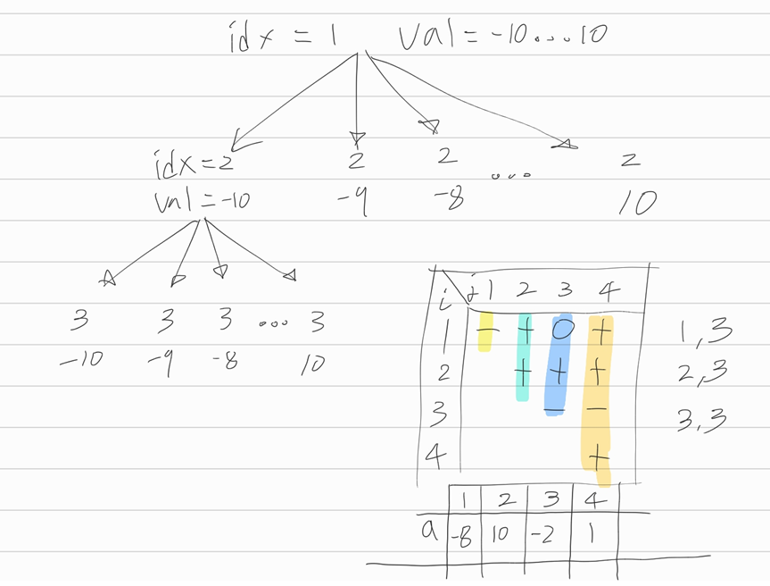

[문제](https://www.acmicpc.net/problem/1248)

## 맞혀봐

 

* 위의 트리처럼 수열을 만들어나갈 수 있다.
* 문제는, 각각의 자리에 대해서 넣을 수 있는 경우의 수가 21가지라는 것.
* 수열의 최대길이가 10이므로, `O(21^10)`이 된다. 이렇게 하면 시간초과니까 대안이 필요하다.
* 각각의 경우에 대해서 가능한 케이스인지 검사한다. 아니라면 포기시킨다. ( 백트래킹 )
* 형광팬으로 칠해진 테이블을 보자. 각각의 자리수(`j`)에 값을 넣었을 때, 가능한지 검사하는건 `O(n)`이 걸린다.
  * 3번째 자리에 대해서 -2를 넣는다 치면, `3,3`, `2,3`, `1,3`을 검사하면 된다.
  * `3,3`부터 시작하면 편하다. 3번째부터 3번째까지의 총합이니까 결국 `a[3]`을 말한다.
  * `2,3`은 앞서 `a[3]`을 더했던 값에 `a[2]`를 더하기만 하면 된다.
  * 이런식으로 해서 해당 위치에 어떤 값을 넣을 수 있는지 검사한다.
  * 못넣는다면 포기한다
  * 만약 이렇게 해서 수열이 완성되었다면, 그게 답이 된다. 조건을 다 만족시켰기 때문이다.

