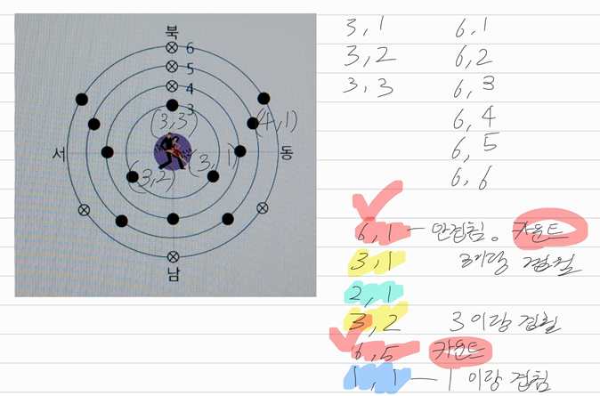

[문제](https://www.acmicpc.net/problem/10166)

## 관중석

 

* 수학문제는 최대한 별 해괴한 시도를 다 해보되, 안될 것 같으면 빨리 그만두고 다른 방법을 시도해보는게 좋은 풀이법이 아닐까 라는 생각이 들었다.
* 이 경우, 각각의 관중석을 `(a, b)`로 생각하면 편하다.
* 가령, 반지름이 3인 원의 첫번째 좌석은 `(3, 1)`으로 표현할 수 있겠다.
* 이렇게 표현했을 때, 앞서 앉았던 좌석을 어떻게 표현할 수 있을까? 그냥 `visit`배열을 쓰면 된다
* 다만, 무턱대고 `2000/3`을 해서 `visit`배열을 쓸 수 없다. 실수값이 나올 수 있기 때문이다.
  * 실수값을 배열의 인덱스로 쓸 수 없으니, 정수형으로 변환해야 하는데, 여기서 발생하는 오차때문에 풀리지 않는다.
* 이때, 최대공약수를 이용하면 된다. 가령 `(6, 2)`의 경우, 최대공약수는 2이고, 이걸로 a, b를 나누면 `(3, 1)`이 나온다. 근데 앞서서 반지름이 3일때, 이미 `(3, 1)`을 방문했으니, 카운트해주지 말자.
  * 문제에서 앞의 관중석에 가리면 빼라고 했기 때문이다.
* 여담이지만 수학문제는 툭하면 최대공약수나 소수가지고 이상한 일을 많이 하는 것 같다.
  * 유클리드 아조씨랑 에라토스테네스 아조씨를 잘 기억해야 좋을 것 같다.

