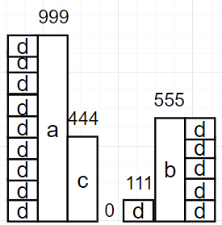

## CodePlus 알고리즘 기초 1/2 수학 1-1

#### 약수

n이 정수이고, a = n/b일 때, a를 b의 약수라고 한다. a에 얼마를 곱하면 b를 만들 수 있다.

모든 자연수는 최소한 1과 자기자신을 약수로 갖는다.

만약 약수가 1과 자기자신밖에 없다면, 그 수를 소수라고 부른다.

#### 서로소(Coprime)

두 정수의 공약수가 1밖에 없는 경우, 이를 서로소라고 한다.

#### 최대공약수

두 수의 공통된 약수중에서 가장 큰 것. 그래서 최대공약수는 두 수 중에서 가장 작은수보다 클 수 없다.

GCD라고 하는데, Greatest Common Divisor를 줄인 것이다.

약수중에서 가장 큰 숫자는 자기자신이다. 그래서 두 수의 최대공약수를 구하는 가장 쉬운 방법은, 1부터 두 수 중에서 가장 작은수 사이의 모든 정수로 두 정수를 나누고,  둘 다 나머지가 0이 나온 수(공약수)  중에서 가장 큰 숫자를 고르면 된다.

유클리드 호제법을 쓰면 이것보다 더 빠르게 구할 수 있다.

#### 유클리드 호제법

어떤 막대 a랑 b가 있다.

길이가 g인 어떤 막대를 이어 붙이면, 남는 것 없이 a랑 b막대를 만들 수 있다고 한다.

이때, g는 여러 값이 될 수 있는데, 이 중에서 가장 큰 값을 구한다고 치자.

우선 a % b의 의미부터 보자.

a % b = 0의 의미는, b막대를 a랑 같아질 때 까지 최대한 많이 가져다 붙였을 때 남는것 없이 a막대를 만들 수 있다는게 된다. a % b = c라면, 최대한 많이 가져다 붙였을 때, 길이 c만큼이 남는다는 것이다. 

이때, 남는 것 없이 b랑 c를 만들 수 있는 어떤 막대 d가 있다고 치자. 그렇다면, 우리는 이 막대를 이용해서 a랑 b를 만들 수 있다. 남는 것 없이 b랑 c를 만든다고 했으니, b는 된다고 치자. 근데 a는 어떻게? 이것도 문제가 안되는게, 아까 b막대를 최대한 이어붙여서 a를 만들려고 했고, 여기서 남은게 c였지 않은가? 근데 c도 만들었다고 했다. 그러니 길이 c 까지 만들 수 있다. 근데 방금전에 b를 만들었다고 했지 않은가. 그러니 남은 길이 b까지도 만들 수 있는 것이다. 



999(a) % 555(b) = 444(c)

555(b) % 444(c) = 111(d)

444(c) % 111(d) = 0

따라서 111(d)이 길이가 g인 막대가 된다. 그리고 이 g를 최대공약수라고 생각하면 된다.

```java
public static void getEuclidGcd(int a, int b){
    while (b != 0){
        //유클리드 호제법에 따르면 gcd(a,b) == gcd(b, a%b)와 같다.
        //나머지연산이 0이 나올때까지 이를 반복해서 최대공약수를 구한다. 
        int r = a % b;
        a = b;
        b = r;
    }
    System.out.printf("gcd : %d\n",a);
}
```

이 알고리즘은 O(lgn)의 시간복잡도를 가진다.

#### 배수

어떤 정수 a,b,k가 있을 때 a = kb를 만족하면, a는 b의 배수이다.

2의 배수는 모두 짝수이다.

10의 배수는 일의자리가 0이다.

5의 배수는 일의 자리가 5거나 0이다.

#### 최소공배수(least Common Multiple, LCM)

두 수의 공통되는 배수 중에서 가장 작은 수를 말한다. 예를 들면, 10과 12의 최소공배수는 60이다.

두 수의 최대공약수를 GCD라고 했을 때, A * B = GCD * LCM이라서, LCM = (A*B)/GCD이 된다.
