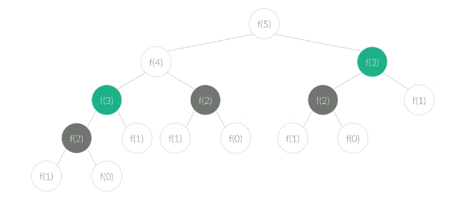

## CodePlus 알고리즘 기초 1/2 DP - 1

## 다이나믹 프로그래밍의 개념

### 다이나믹 프로그래밍과 분할정복

큰 문제를 작은문제로 나눠서 푸는 알고리즘. 번역은 동적계획법이라고 하는데, 딱히 의미 없단다.

큰 문제를 작은문제로 나누는 알고리즘은 두가지가 있는데, 하나는 DP, 남은 하나는 분할정복.

공통점은 큰 문제를 나누어 푼다는 것.

큰 문제를 작은문제 여러개로 나누어 푸는데, DP의 경우, 작은문제가 중복되는 경우이고, DC는 중복되지 않는 경우이다. DP는 문제가 중복되니까, 이걸 이용해서 효율적으로 문제를 풀면 되고, DC는 걍 풀어라

###  다이나믹 프로그래밍

두가지 속성이 필요. Overlapping SubProblem, Optimal SubStructure. 큰 문제를 작은문제로 나눠야 하는데, 작은문제들에 중복이 발생해야함. 최적부분구조는 문제의 정답이 작은 문제의 정답을 통해 구할 수 있다는 말.

##### 예제1 : 피보나치 수열

n번째 수를 구하려면 n-1번째 수가 필요. n-1은 n-2가 필요 ... 이런식으로 어떤 문제의 답이 작은 문제의 답으로 구할 수 있어야 DP로 풀 수 있다.

다이나믹 프로그래밍 없이 재귀로 풀면 아래 그림처럼 된다

당장 그림만 봐도 f(2), f(3)같은 작은문제가 중복된다. 이미 구한걸 왜 또 구해야 하냐는 것. 작은문제를 푼 결과를 기록해두고, 이걸 가져다 쓰면, 저런 중복이 사라지니 문제를 더 빨리 풀 수 있게 된다.

### 메모리제이션

작은문제의 결과를 구했다면, 이걸 기록해둔다. 그리고 나중에 써먹어서 문제해결의 효율을 높인다.

##### 예제1 : 재귀로 푸는 피보나치 수열

한번 실행하면 함수를 두개 호출함. 이게 n개임. 그래서 O(2^n)이 걸린다.

##### 예제2 : 메모리제이션이 추가된 피보나치 수열

배열을 하나 만들고, 1씩 증가하면서 계산하고, 그 결과를 배열에 넣는다. 가령 fib(0) = 0, fib(1) = 1, fib(2) = 1, fib(3) = 2, fib(4) = 4 ... 이런 결과를 배열에 넣는다. 그러면 fib(5)를 구한다면, 걍 arr[3] + arr[4]를 하면 된다. 각각의 작은 문제를 한번식만 풀게 되니까 n번째 피보나치수를 구한다면 O(n)밖에 안걸린다.

### 다이나믹의 구현 : Top-Down, Bottom-Up

큰 문제를 쪼개가며 작은 문제를 만드는 top-down, 작은 문제를 모아서 큰문제를 만드는, 쌓아올리는 bottom-up.

bottom-up은 주로 반복문을 쓴다.

예를들면, 위의 메모리제이션을 쓴 피보나치 수 구하는 방식은 작은 문제를 풀어서 큰 문제를 만든다. fib(2),fib(3) 풀어서 fib(4)를 푼다. 이런게 bottom-up이다.

top-down은 재귀로 푼다. 큰 문제에서 나눠가야 하니까. 근데 둘 중 하나만 제대로 할 줄 알면 충분하다.

두 방법은 시간차이가 있을까? 모른다. 보통 반복문이 빠르지 않을까? 재귀는 스택을 쓰니까 스택오버플로우도 나고 그러지 않을까? 백준아저씨 말로는 딱히 차이 안나는데다가 스택오버플로우 났으면 그건 내가 잘못짠거라고 한다.

또, 어떤 문제는 TD로만 풀 수 있고, BU로만 풀 수 있기도 한데, 근데 그런거 풀때쯤이면 실력 많이 늘은거니까, 걍 필요한걸로 풀라고 한다.

### 다이나믹으로 알고리즘 작성하기

##### 중요! 작업의 결과를 정의하라

예를들면, 1로 만들기 문제에서의 작업은, 어떤 수를 1로 만드는데 필요한 연산횟수이다.

DP로 푼다면 어떤 배열에 작업의 결과를 메모이제이션하고, 한번 했던 작업은 또 안하고, 메모이제이션해놨던 결과를 꺼내서 풀게 된다.

근데 작업결과배열에 어떤 값을 넣을지 조차 모르고 있다면 DP로 문제푸는게 정말정말 어려울 것이다. 뭘 하는지도 모르는데 문제를 풀 수 있을리가 없다.

그러니 작업의 결과가 뭔지부터 제대로 정의해야만  쉽고 정확하게 잘 풀 수 있을 것 같다.

