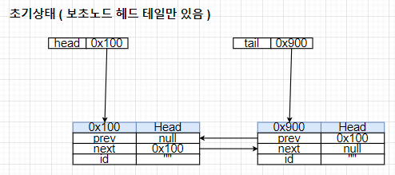
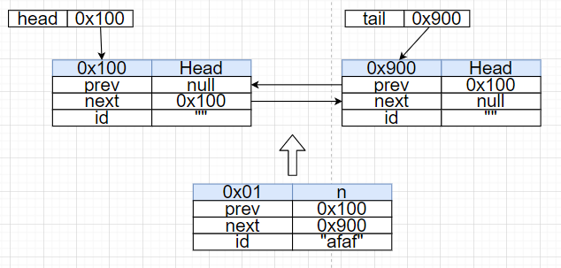
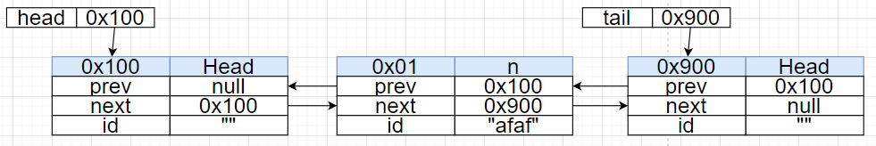

# 이중 링크드리스트 - Add연산

## Add 연산

* 보초노드를 이용해서 구현한다. 
* 새로운 노드를 맨 뒤에 추가한다.

### 초기상태

#### 링크드리스트의 초기상태에 대한 설명과 배경지식

링크드리스트의 초기상태를 나타낸 그림이다. 처음엔 이렇게 보초노드 두개밖에 없다.




#### 리스트 구현하기 전에 알아야 할 배경지식

* 리스트의 처음과 맨 마지막에는 보초노드가 있다.
* 링크드리스트의 레퍼런스 변수 head와 테일은 각각 보초노드를 가리키고 있다. 그러니까 편의상 head 보초노드, 테일 보초노드 이렇게 부르겠다.
* 보초노드는 링크드리스트의 경계선이다. 이거 사이에 있는 노드가 리스트의 요소이다.
* 테일의 이전노드는 리스트의 마지막 요소이다. 근데 이게 보초노드면? 리스트가 비어있는 것이다.

### Add-1 : 새 노드를 설정하자.

 

* **새 노드의 이전노드는, 테일노드의 이전노드이다.**
  * 그래서 새 노드 N의 prev는 tail.prev로 한다 = 0x100
* **새 노드의 다음 노드는 테일노드이다.**
  * 그래서 새 노드 N의 next는 테일노드로 한다 = 0x900

### Add-2 : 새 노드는 이걸로 됐고, 다른 노드의 링크도 고쳐줘야 한다.

* **헤드랑 테일은 아직 값을 안바꿨다.  그래서 고쳐줘야 한다.**

* **테일노드의 이전노드의 다음노드는 새 노드가 되어야 한다.** 
  * 그래서 tail.prev가 가리키는 노드의 다음노드는 N이 되어야 한다. = 0x01
* **테일노드의 이전노드는 새 노드가 되어야 한다**
  * 그래서 tail.prev는 N이 되어야 한다. = 0x01


그럼 이렇게 된다. 끝.

### 이미 노드가 있어도 잘 동작하는가?

ㅇㅇ. 비어있을때도 테일은 노드를 가리키고 있었고, prev에도 노드가 있었다. 둘 다 보초노드지만, 있긴 있었다. 하나 추가된 상황도 마찬가지로, 테일은 보초노드를 가리키고, prev는 노드를 가리킨다. 그래서 리스트가 비었건 안비었건, 똑같이 동작하기 때문에 리스트가 비었을 경우의 Add, 안비었을 경우의 Add를 따져서 구현하지 않아도 된다. 이래서 보초노드를 써서 리스트를 만드는것이다. 구현이 너무 편해지니까.

순회할때는 현재노드의 다음이 테일노드인지 검사하면 된다. 넥스트가 테일이면 현재노드가 리스트의 마지막 노드인 것이다.

### 소스코드

#### Node

```java
class Node{
    Node(){
        prev = null;
        next = null;
        id = "";
        data = 0;
    }
    Node(String paramid, int paramdata){
        prev = null;
        next = null;
        id = paramid;
        data = paramdata;
    }
    Node prev, next;
    String id;
    int data;
}
```

#### MyLinkedList

```java
class MyLinkedList{
    private Node head, tail;
    MyLinkedList(){
        head = new Node("HEAD", -1);
        tail = new Node("TAIL", -2);
        head.next = tail;
        tail.prev = head;
    }
    public void add(String id, int data){
        Node n = new Node(id, data);
        n.prev = tail.prev;
        n.next = tail;

        tail.prev.next = n;
        tail.prev = n;
    }
    public void printAll(){
        Node curr = this.head.next;
        System.out.print("|");
        while(curr != this.tail){//테일노드까지 전진했으면 멈춘다.
            System.out.print(String.format("---[%s, %d]", curr.id, curr.data));
            curr = curr.next;//현재노드를 전진시킨다.
        }
        System.out.println("---[end]\n");
    }
}
```

