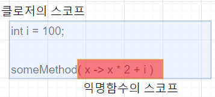

### 함수형 프로그래밍이란?

수학적 함수인 순수함수의 조합으로 프로그램을 작성하는 것. 어떤 순서의 일을 프로그래밍 하고 싶을 때, 각 단계의 일을 순수함수로 작성하고, 이 함수들을 순차적으로 실행하는 파이프라인을 만드는데 좋은 프로그래밍 패러다임이다.

### 함수형 프로그래밍의 순수함수(Pure Function)

* 순수한  함수는 수학의 함수처럼 같은 입력이 주어지면 항상 같은 결과를 출력해야 한다. 
* 함수형 프로그래밍 언어에서는 함수를 순수함수라고 부른다.
* 순수한 함수는 부작용(Side Effect)이 없다.
* 함수의 실행이 **외부에 영향을 끼치지 않는다**. 영향을 받지도 않는다.
* 순수한 함수는 스레드 안전하고 병렬적인 계산이 가능하다. 

순수함수는 **외부값이나 객체에 의존**하지 않는다. 외부에 의존하지 않고 입력받은 패러미터만 가지고 동작하기 때문에, 부작용이 없다. 이를 **참조투명성**이라고 한다. 만약 순수함수가 아니라면, 입력받은 패러미터 외에 다른 값을 참조해서 동작한다. 따라서 외부값에 의해 다른값이 리턴될 수 있는 **부작용**이 있다.

```note
자바의 경우 익명함수를 만들면 자유변수는 전부 final이나 effectively final로 취급해야 한다. 왜 그런지 잘 몰랐는데, 호눅스님이 자바에는 클로저가 없기 때문이라고 알려주셨다. 클로저가 뭘까?
```

**그러게...? 클로저가 뭘까?**

### 클로저의 정의

실행시점에서 함수를 패러미터로 넘기거나 할 때, 함수 스코프 밖의 자유변수에 접근하는 경우, 함수가 읽으려는 변수까지 감싸서 객체로 만든 다음 넘기게 되는데, 이 객체를 클로저라고  부른다. 클로저 함수를 실행하게 되면, 함수 스코프 밖의 변수값이라도, 클로저에 담겨 있기 때문에 그 값을 읽을 수 있다.

#### 영상을 보고 정리한 클로저

[출처 : 모던 자바. 못다한 이야기 - 클로저](https://www.youtube.com/watch?v=pjtk7vvryio&feature=youtu.be)

someMethod라는 메서드에 람다표현식을 넘긴다고 치자. 근데 이 람다표현식은 자신의 외부에 있는 변수인 i에 접근한다. 이거 괜찮은걸까?

```java
int i = 100;
someMethod ( x -> x * 2 + i)//엄밀히 말해서 이 람다표현식은 익명함수가 된다.또는 익명 메서드.
```

* 여기서 x는 패러미터이고, 2는 상수값이다. 넘어가자.

* 그러면 i는 뭘까? i는 람다표현식 밖의 **None-Local Variable**이다.

  이걸 다른말로 **자유변수(Free Variable)**이라고도 부른다

* 여하튼 이런 식으로 익명함수가 스코프 **외부의 변수**에 접근하면, 우리는 이걸 특별히 **클로저라고 부른다**.

 

보면 익명함수의 원래 스코프는 빨강색까지가 함수의 스코프다. 근데 지금 이 람다표현식에서 외부의 변수에 접근하고 있다. 이때, **스코프의 범위를 확장해서 파란색으로 색칠한 저기까지로 덮어버린다**. 이걸 다른말로  **Close Over**한다 라고 불러서, 이런걸 클로저라고 부른단다. 여하튼 스코프를 자유변수까지 확장해주기 때문에 표현식에서 접근할 수 있게 된다.

  > close over
  >
  > *phrasal verb*
  >
  > close over somebody/somethingto surround and cover somebody/something

한가지 주의할 점이 있는데, 변수 자체에 대한 정보를 캡쳐하는게 아닌, 변수의 값을 캡쳐하는 것 이라고 한다.

#### 예제로 다시 한번 정리해보기

```java
class ClosureExample{
    int num = -200;
    public void test(){
        int num = 1;
        //람다 표현식을 아규먼트로 넘기는 테스트 코드
        testClosure( "Test Lambda", () -> {
            System.out.println(num);
            System.out.println("this.num : " + this.num);
        });
        testClosure("Test Anonymous", new Runnable() {
            @Override
            public void run() {
                System.out.println(num);
                System.out.println("this.num : " + ClosureExample.this.num);
            }
        });
    }//test()
}//class ClosureExample
```

* 인클로징 클래스의 변수에 접근하는 경우, 스코프의 범위를 자유변수까지 확장해서 덮어버린다.(Close Over)

  그래서 이걸 **클로저**라고  부른다

* 익명클래스건 람다표현식이건, 자유변수는 Final 또는 Effectively Finally로 취급해야 한다. 값을 바꿀 수 없다.

* 익명클래스의 this는 Runnable인터페이스로 만든 익명클래스의 인스턴스이다. EnclosingClass인 ClosureExample클래스의 인스턴스를 가리키지 않는다.

* 반면, 람다표현식의 경우, this 키워드는 람다표현식을 실행한 인스턴스를 가리킨다. 이 점에 주의해야 한다.

### 그래서 자바엔 클로저가 있다는걸까 없다는걸까?

> 클로저는 어휘적(lexical) 클로저 또는 함수(function) 클로저를 간단하게 부르는 말이다. 단순하게 말하면 자신을 감싼 영역에 있는 외부 변수에 접근하는 함수다. 클로저에서 접근하는 함수 밖의 변수를 자유 변수(free variable)라 한다. 이 정의에 따르면 람다 표현식으로 정의한 익명 함수 가운데 일부는 클로저고 일부는 클로저가 아니다.
>
> 변수의 범위와 연관해 클로저를 정의하기도 하지만 단순히 함수를 감싼 객체를 모두 클로저라고 표현하기도 한다. Groovy에서는 자유 변수를 참조하는지 여부와 상관없이 익명 함수를 클로저라 한다.[9](https://d2.naver.com/helloworld/4911107#fn:9) 그 외에도 함수를 객체로 감싸는 패턴은 Function Object, Functor, Functionoid 등 다양하게 불린다.[10](https://d2.naver.com/helloworld/4911107#fn:10)
>
> [by 네이버 D2 람다가 이끌어 갈 모던 java](https://d2.naver.com/helloworld/4911107)

아무래도 언어마다 클로저에 대한 정의가 다른 모양이다. 그렇지만 한가지 확실한건, 자신을 감싼 영역의 변수에 접근하는 함수를 클로저 또는 함수 클로저라고 부르는건 다들 같은 모양이다. 그럼 자바는? 자바는 어떨까?

> 우리가 Java에 클로저를 더한다면 그것은 이미 지원되고 있는 문법의 테두리 안에서 조심스럽게 이뤄져야 할 것입니다. 즉, 클로저가 내부에 하나의 메서드만 가지고 있는 인터페이스를 구현하는 형태를 가져야 한다는 뜻입니다. Runnable 같은 인터페이스나 TimerTask 같은 클래스처럼 말입니다. 이미 존재하는 익명 클래스 문법에 약간의 수정을 가할 필요도 있습니다. final 관련된 요구 사항도 조금 현실적으로 변할 필요가 있습니다.
>
> 그로부터 4년 뒤인 2010년에는 다음과 같은 의견을 밝혔다.[12](https://d2.naver.com/helloworld/4911107#fn:12)
>
> 이미 익명 클래스로 할 수 있는 일을 더 쉽게 하고, 불필요하게 장황해지지 않게 하는 것이 가장 중요하다고 생각합니다. 람다 표현식에서 변하는(mutable) 변수에 접근해 값을 덮어 쓸 수 있는 것은 좋기도 하고 나쁘기도 한 것이 아니라 더 나쁜 것이라고 봅니다.

음. 그래서 람다표현식을 포함한 익명함수에서 참조하는 자유변수는 final 또는 effectively final로 취급해야 하는 모양이다. 

그러다가 2014년이 되어 람다표현식과 스트림 인터페이스가 도입되었다.

> Java 8에서는 함수를 적용할 수 있는 새로운 인터페이스로 java.util.stream.Stream을 도입했다. 앞에서 본 Functional Java에서 같은 역할을 하는 클래스도 Stream이었고, Scala나 Kotlin에도 Stream 타입이 있다. 예제 22에서 java.util.List.stream() 메서드를 호출해 List 타입의 객체로부터 Stream 타입의 객체를 얻었다.
>
> java.util.Collection이나 Iterable 등 기존의 인터페이스에 새로운 메서드를 추가하는 대신 새로운 역할을 하는 인터페이스를 분리했다. Collection.stream(), Iterable.forEach() 메서드 등 몇 가지를 기본 메서드로 추가했다. 기본 메서드는 인터페이스 정의에 기본적인 구현을 포함한 것이다. 이를 통해 인터페이스에 새로운 메서드를 추가해도 이전 버전의 구현체가 규약을 어기지 않게 지원할 수 있다.

기존것을 뜯어 고치는 방식이 아닌 새로운 인터페이스를 추가해서 이전 버전의 코드에 의존하는 프로그램이 안정적으로 버전 업그레이드를 할 수 있게 했다. 그리고 이 새로운 인터페이스가 스트림 인터페이스인거구나. 자바에서 FP를 하는걸 도와주고, 부가적으로 프리미티브 타입을 지원하는 IntStream등의 인터페이스를 지원해서 성능을 향상시킨다거나, 병렬처리에 도움을 주는 메서드를 지원한다거나 하는 이점이 있다.

##### 아니 그래서 자바엔 클로저가 있는걸까?

결국 함수를 위한 새로운 타입은 끝끝내 도입되지 않았고, 새로운 인터페이스로 표현되었다. 원래 함수형 프로그래밍은 함수를 First-Class-Citzen, 일급시민으로 취급해서 가장 제약이 적게 하고 패러미터로 넘기고 리턴으로 받고 그래야 하는데, 자바의 함수는 여전히 일급시민이 아닌것이다. 당장 java.util.function패키지 밑에 있는 무수히 많은 인터페이스를 보자. 패러미터는 몇개구요, 리턴은 이래요 하는 식으로 인터페이스로 타입을 지정해놨다. 아무리 제네릭을 썼다지만, 여전히 제약은 존재한다. 여기에 없는 메서드 시그니쳐를 가진 함수를 넘기려면? 새로운 인터페이스를 만들어야 한다. 

### 람다표현식의 내부구현까지 읽음. 이어서 읽을 것