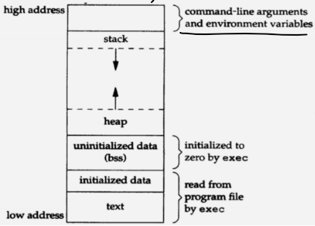
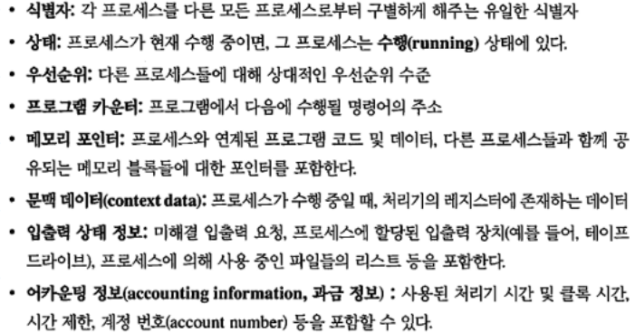
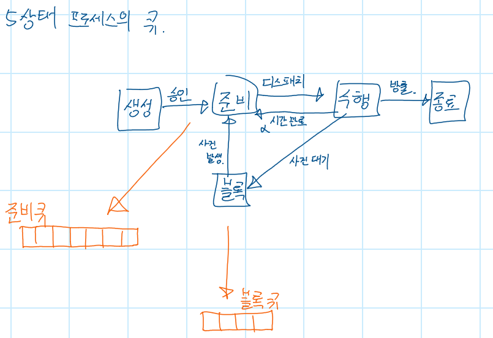

## 프로세스의 등장

#### 프로세스의 등장배경

멀티프로그래밍 시스템과 시분할 시스템이 등장하면서, 주메모리에 여러개의 프로그램을 적재하고, 이들을 번갈아가면서 실행하게 되었다. 그러다보니, 프로그램들이 같은 공유자원을 쓰고 서로의 작업을 덮어써비리는 문제가 발생하거나, 잘못된 메모리접근으로 어떤 프로그램들이 다른 프로그램의 결과를 방해하거나, 서로 자원을 가진 상태로 서로의 자원이 풀리길 기다리는 교착상태 등 다양한 문제가 발생했다. 이에 따라 수행중인 프로그램의 상태를 감시하고 제어할 수 있는 방법이 필요했는데, 그래서 나온게 프로세스이다.

#### 프로세스의 정의

프로세스는 **수행중인 프로그램**으로서, 프로그램의 인스턴스라고 할 수 있다. 커널은 PCB라는 자료구조를 이용해서 프로세스의 상태를 감시하고 제어할 수 있다. PCB에는 프로세스의 아이디, 사용한 CPU시간 등 프로세스에 대한 다양한 정보가 있다. 또한 프로세스 컨택스트라는 정보도 있는데, 여기엔 처리기 레지스터값과 같은 프로세스의 수행에 필요한 상태정보가 보관된다. **프로세스 스위칭**이 발생해서 준비상태나 블록상태로 전이되는 경우, 그 당시의 **처리기 레지스터에 있던 정보를 PCB에 저장**한다. 나중에 다시 수행상태로 전이되어 **수행을 재개**하게 되면, PCB에 저장해놨던 레지스터 값들을  다시 **CPU레지스터에 저장**해서 수행을 이어서 할 수 있는 상태로 **복원**한다.

#### 프로세스의 구성 - 1, 프로세스의 메모리 구조

 

##### 텍스트

CPU가 실행할 바이너리 코드가 저장된 부분이다. 다시말해서, 프로그램의 소스코드가 컴파일되어 실행가능한 바이너리코드가 되는데, 이게 텍스트 영역에 있다

##### 데이터

초기화한 데이터 구조에 따라서 읽고 쓰는게 가능한 영역이다. 초기화 여부로 별도관리해서 두공간으로 나눠놨다는건가?

```note
Initialized data영역이랑 uninitialized data 영역은 초기화 됐고 안됐고로 나뉜건가? 흠. 좀 더 공부해봐야겠다.
```

##### 힙

프로그램 실행중에 동적으로 메모리를 할당해서 쓸 수 있는 영역을 말한다. new 등으로 클래스를 인스턴스로 만들면 요기 힙 영역에 동적으로 메모리가 할당된다.

그렇다보니, 여러 함수에서 공유해야하는 자원이라던가, 함수가 리턴되어도 남아있어야 하는 자원은 동적할당을 해서 힙 메모리에 저장하거나 데이터 영역(전역변수로 저장)에 저장해야 한다. 만약 스택에 저장된 값을, 해당 함수가 리턴된 다음에 호출하려고 하면 메모리 접근위반으로 프로그램이 죽을 것이다. 근데 자바도 그럴 수 있나?

##### 스택

함수를 호출하면 지역변수도 쓰고 패러미터도 쓰고 그러는데, 이 정보가 스택영역에 쌓인다. 함수 호출할때의 복귀주소같은것도 이곳에 저장된다. 함수가 리턴되어 종료되면, 스택에서 함수가 할당한 공간도 지워지기 때문에, 일시적인 데이터를 저장하는 메모리영역이라고 할 수 있다.

#### 프로세스의 구성 - 2, 프로세스의 PCB

* PCB(Process Control Block, 프로세스 제어블록)는 운영체제가 관리하는 자료구조이다. 

  다시말해서, 커널(운영체제)꺼다.

* 운영체제는 PCB를 가지고 프로세스를 감시하고 제어한다.

* 프로세스의 정보를 담고 있는만큼, PCB는 너무 소중한 자료구조라서 일반 사용자가 접근하지 못하게 보호된 메모리 영역 안에 있다. 일부 운영체제에서는 PCB는 커널스택의 처음에 위치한다고 한다.

  [by 위키피디아 프로세스 제어블록](https://ko.wikipedia.org/wiki/%ED%94%84%EB%A1%9C%EC%84%B8%EC%8A%A4_%EC%A0%9C%EC%96%B4_%EB%B8%94%EB%A1%9D)

* 비슷한 친구로 TCB라는 애도 있다. 얘는 Thread Control Block으로 스레드를 감시하고 제어하는데 쓰이는 자료구조이다.

* 참고로 프로세스의 컨택스트는 프로세스의 PCB에 기록되어 있다.

  [by 위키피디아 문맥교환](https://ko.wikipedia.org/wiki/%EB%AC%B8%EB%A7%A5_%EA%B5%90%ED%99%98)

* PCB안의 내용은 대충 이렇다



#### 프로세스의 구성 - 3, 프로세스의 문맥(컨택스트, Context)

프로그램 수행문맥 ( 프로세스 컨택스트라고도 부른다 ). PCB에 기록되어 있다.

프로세스 컨택스트란, 운영체제가 프로세스를 감시하고 제어할 때 필요한 내부적인 데이터이다. CPU가 프로세스를 처리하기 위해선 다양한 정보가 필요하다. 예를들면, 프로그램 카운터나 명령어 레지스터, 데이터 레지스터 등의 정보가 있어야 한다. 컨택스트 스위칭 이후, 프로세스의 수행을 재개하기 위해서, 이 정보를 가지고 있을 공간이 필요한데, 그게 이거다.

그 외에도 운영체제가 프로세스의 상태를 감시하는데 쓰는 정보도 있다. 운영체제가 어떤 프로세스가 지금 어떤 상태인지, 어떤  입출력 이벤트를 기다리고 있는지 알고 싶다면, 수행문맥을 보면 된다.

#### 프로세스의 상태전이도



프로세스가 생성되면 준비상태로 전이된다. CPU스케줄러의 선택을 받은 프로세스는 준비상태에서 수행상태로 전이된다. 이걸 디스패치된다고 표현한다. 수행상태로 전이된 프로세스는 CPU에 의해 수행된다. 작업이 다 끝나면, 종료상태로 전이된다. 작업이 다 안끝나고, 운영체제에 의해 강제로 프로세스 스위칭되는 경우, 블록이나 준비상태로 전이될 수 있다.

프로세스가 자원을 요구했다고 치자. 예를 들면 IO요청을 했다. 그럼 그 결과가 올때까지 CPU를 붙들고 기다리지 않는다. 프로세스 스위칭이 발생해서 다른 프로세스를 수행한다. 그럼 수행중이던 프로세스는 블록상태로 전이되고, 자신이 요청한 작업의 완료를 알리는 이벤트가 오기를 기다린다. 

이벤트가 발생하면, 블록상태에 있던 프로세스는 준비상태로 전이되고, 스케줄러의 선택을 기다린다.

상태전이도를 정말 간단하게 표현하면, 저런식으로 준비큐랑 블록큐가 있다. 준비큐에는 스케줄러의 선택을 기다리는 프로세스들이 살고있다. 블록큐에는 어떤 이벤트를 기다리는 프로세스들이 살고있다. 요건 이벤트마다 별도의 큐를 두는걸로 구현할 수 있다.

#### 프로세스 교환과 문맥교환(Process Switching, Context Switching)

##### 프로세스 교환시점

현재 수행중인 프로세스는 여러가지 이유로 수행이 중단될 수 있다. 중단사유는 아래와 같다

* 클록(타이머) 인터럽트
* 입출력 인터럽트
* 운영체제 시스템 콜
* 신호(세마포어)

정리하면, 프로세스는 자기 작업을 다 마치거나, 또는 필요에 의해 CPU를 양보할 수 있다. 아니면, 운영체제가 봤을 때, 뭔가 급한 일이 있거나(인터럽트가 발생했다거나)하면, 현재 수행중인 프로세스로 부터 강제로 CPU를 양보하게 만들 수 있다. CPU를 양보한다는건 결국 현재 수행중인 프로세스를 바꾸겠다는 말과 같다. 이걸 프로세스 스위칭이라고 부르는 것 뿐이다.

앞서 CPU는 타임퀀텀만큼 프로세스를 번갈아가면서 수행한다고 말했는데, 이 "번갈아 가면서" 라는 말을 주의깊게 보자. 번갈아 간다는 건, 현재 수행중인 프로세스를 바꿔간다는 말과 같다. 뭐 그런거다 ㅇㅇ.

정리하면, 현재 수행중인 프로세스로 부터 CPU를 뺏고, 다른 프로세스를 수행하는걸 프로세스 스위칭이라고 부르는 거고, 이게 발생하는 이유, 다시 말해서 언제 발생하는지는 위의 내용과 같다.

##### 프로세스 스위칭의 과정

모드스위칭이 발생하면, 현재 수행중이던 프로세스와 새로 디스패치될 프로세스의 입장을 알아야 한다.

###### 현재 수행중인 프로세스의 입장

​	만약 작업이 다 안끝났다면, 언젠간 다시 디스패치되어 수행을 재개해야 한다. 그때를 위해 수행에 필요한 정보	(문맥 데이터)를 보관해야 한다.

###### 새로 디스패치된 프로세스의 입장

​	당장 수행을 재개해야 하니까, 보관해놨던 수행에 필요한 정보(문맥데이터)를 꺼내서 세팅해야한다.

###### 프로세스 스위칭이 이루어지는 과정

1. 프로세스A의 프로그램 카운터와 다른 레지스터들을 포함한 처리기 문맥(PC 등의 레지스터 정보)을 저장한다
2. 현재 수행상태에 있는 프로세스A의 PCB를 업데이트한다. 그런 다음, 수행상태로 부터 준비나 블록, 준비/보류상태 등으로 전이된다. 잘자요. 바이바이.
3. 프로세스A의 PCB를 적절한 큐(준비, 블록, 준비/보류 등등)로 옮긴다
4. 단기 스케줄링 알고리즘에 따라 준비상태 프로세스 중에서 다음에 수행시킬 프로세스B를 선택한다.
5. 선택된 프로세스B의 PCB를 업데이트한다. 그리고 얘는 수행상태로 전이된다.
6. 메모리 관리와 관련된 자료구조를 갱신한다 ( 요 내용은 기억이 안나니까 다시 공부하자(3부에서 다룬데))
7. 선택된 프로세스가 이전 수행상태에서 사용하던 CPU의 문맥데이터를 복원한다. 복원이 뭐냐면, PCB에 기록된 레지스터 정보를 읽어서 CPU의 레지스터에 넣는걸 말한다. 수행 재개해야 하니까 하는거다.

**CPU를 뺏기면 다음 수행을 위해 자신의 PCB에 컨택스트 정보를 보관해두고, 다시 얻으면 수행재개를 위해 PCB에 있던 컨택스트 정보를 복원한다. 이 사실을 기억하자.**