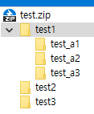

## 쉘 명령어

### 파일찾기 find

```shell
$ find -name "test*"
./test1
./test1/test_a1
./test1/test_a2
./test1/test_a3
./test2
./test3

```

### 명령어 파이프라인과 xargs

여러개의 명령어를 이어붙여서 사용하는 것을 말한다. 

명령어를 잘 조합해서 이어붙이면 유용한 기능을 만들 수 있다.

##### 예제1 : 현재 디렉토리 밑에 test로 시작하는 파일의 개수를 모두 찾기

```shell
$ find -name "test*" | wc -l
6
```

##### xargs : 파이프라인에서 앞의 결과를 새로운 명령어의 아규먼트로 넘긴다.

##### 예제2 : test로 시작하는 모든 파일을 압축한다.

```shell
$ find -name "test*" | xargs zip "./test.zip"
  adding: test1/ (192 bytes security) (stored 0%)
  adding: test1/test_a1/ (192 bytes security) (stored 0%)
  adding: test1/test_a2/ (192 bytes security) (stored 0%)
  adding: test1/test_a3/ (192 bytes security) (stored 0%)
  adding: test2/ (192 bytes security) (stored 0%)
  adding: test3/ (192 bytes security) (stored 0%)

```

find로 test로 시작하는 모든 파일을 찾고, xargs로 find의 결과를 zip 명령어의 아규먼트로 사용한다.

압축파일이 생긴걸 확인할 수 있다.

 

### 원격지에 파일 복사 scp ( secure copy )

scp -P 포트번호 전송할파일 아이디@호스트주소:/경로

```shell
$ scp -P 20022 test.zip nas@192.168.0.7:/backup
nas@192.168.0.7's password:
test.zip                                      100% 2044   356.0KB/s   00:00
```


