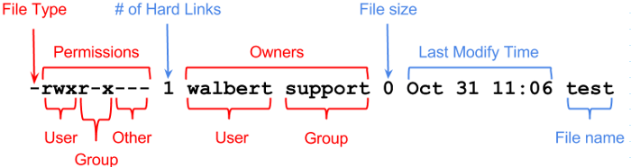

## 파일의 속성

### 유닉스의 파일과 권한

유닉스는 다중 사용자 운영체제(멀티 유저 OS)이다. 그래서 여러 사용자가 하나의 컴퓨터를 공유해서 쓰게된다. 그런데 누가 다른 사용자의 파일을 함부로 접근해서 읽거나 수정하고 지워버리면 큰일이다. 그래서 유닉스는 파일에 권한 속성을 만들었다. 만약 권한이 없다면? 못읽거나 수정을 못하게 된다.



#### 파일유형(File Type)

파일의 유형. 이게 디렉토리냐 파일이냐를 표시한다. 만약 d이면 디렉토리고, -이면 일반 파일이다.

#### 권한(Permissions)

총 9개의 비트로 구성되고, 3비트씩 묶어서 읽으면 된다. 이렇게 3개의 묶음이 생기는데, 각각 사용자, 그룹, 다른 사용자에 대한 권한을 표시한다.

3비트는 읽기, 쓰기, 실행권한을 의미한다.

이미지의 경우, 사용자(walbert)는 읽고 쓰고 실행할 수 있는 반면, 이 파일의 소유그룹 support는 읽고 실행은 할 수 있지만, 수정할 수 없다. 다른 그룹의 사용자는 읽을수도, 수정할수도, 실행할 수 도 없다.

폴더의 경우 약간 의미가 달라진다. 읽기 권한이 있어야 해당 폴더의 목록을 볼 수 있다. 쓰기 권한이 있어야 그 폴더 안에서 파일을 만들고 지우는게 가능하다. 근데, 실행권한이 있어야 해당 폴더로 이동할 수 있다. 

|      | file                         | dir                                             |
| ---- | ---------------------------- | ----------------------------------------------- |
| r    | 해당 파일을 읽거나 복사 가능 | 해당 디렉토리의 목록을 볼 수 있음               |
| w    | 수정, 이동, 삭제 가능        | 해당 디렉토리 내에서 파일 생성 및 삭제가 가능함 |
| x    | 해당 파일을 실행할 수 있음   | 해당 디렉토리로 cd명령을 통해 이동할 수 있음    |

#### 소유자(Owners)

이 파일을 소유한 사용자를 표시한다. 이미지의 경우 walbert가 파일의 소유자이다.

이 파일을 소유한 그룹을 표시한다. 이미지의 경우 support그룹이 이 파일을 소유했다.

권한파트에서도  설명했지만, 파일 소유자와 그룹에 대해 각각 다른 권한을 지정할 수 있다. 이걸 이용해서 소유자와 그룹에 대해 다른 권한을 부여해서 관리할 수 있다. 소유자는 모든 권한을 가지지만, 같은 그룹의 사용자들은 쓰기권한만 없게 설정한다던가 뭔가 디테일한 권한설정을 할 수 있다.

## 파일의 권한을 수정해보자

#### 권한(Permission) 수정

chmod xxx filename

여기서 xxx의 각 숫자는 8진수 숫자이다. 8진수라고 하니까 좀 어렵게 느껴질 수 있지만, 좀만 생각해보면 쉽다.

예를들면, rwx 권한을 다 주고 싶다고 치자. 그러면 111이지 않은가? 111을 10진수로 표현해보자. 그러면 그냥 7이다. 2^2 + 2 + 1 = 7이니까. 이걸 8진수로 표현한다? 어차피 1의자리에서만 표현한다치면 걍 10진수랑 똑같은 숫자로 봐도 된다. 8진수의 7이나 10진수의 7이나 다 같은 7이지 않은가.

예를 하나 더 들어보자. 읽기권한만 주고싶다. rwx니까, 100이다. 이걸 10진수로 바꿔보자. 4이다. 8진수도 4이다. 그러니까 4를 넣으면 된다

##### 예제1 : 사용자는 rwx, 그룹은 r-x, 다른 그룹 사용자는 r--으로 권한을 변경해보자.

```shell
$ ls -al
-rw-rw-r--  1 nas nas    0 Jan 23 07:06 asdf
$ chmod 764 asdf
$ ls -al
-rwxrw-r--  1 nas nas    0 Jan 23 07:06 asdf
```

##### 예제2 : 파일의 소유자 및 그룹을 바꿔보자.

파일 소유자 변경 : chown 지정한사용자 지정한파일

```shell
#루트로 qwer파일을 생성한다
$sudo touch qwer
$ls -al
-rw-r--r--  1 root root    0 Jan 23 07:13 qwer

#소유자를 바꿔보자
chown nas asdf
$ sudo chown nas qwer
$ ls -al
-rw-r--r--  1 nas root    0 Jan 23 07:13 qwer
```

파일을 소유한 그룹도 변경 : chgrp 지정한그룹 지정한파일

```shell
$ chgrp nas qwer
$ ls -al
-rw-r--r--  1 nas nas    0 Jan 23 07:13 qwer
```

