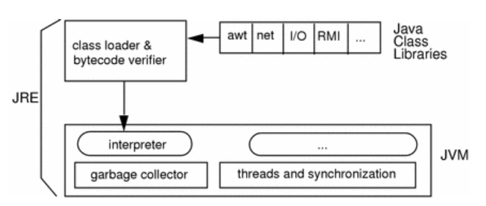
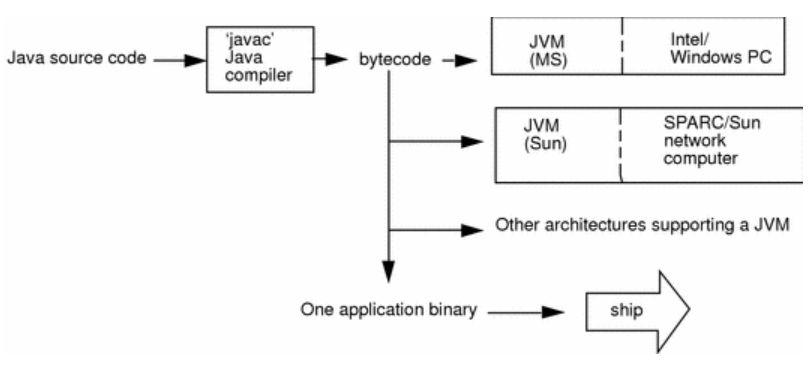

[참조링크1](https://docs.oracle.com/cd/E19455-01/806-3461/6jck06gqb/index.html)

[참조링크2](https://www.infoworld.com/article/3304858/what-is-the-jre-introduction-to-the-java-runtime-environment.html)

[참조링크3](https://www.geeksforgeeks.org/introduction-to-java)

# JAVA 기초

## 자바의 특성

* 객체지향 프로그래밍이 가능한 언어이다.

* 컴퓨터 아키텍쳐에 독립적인 코드로 컴파일된다. 이 코드는 JVM에 의해 실행되는데, 

  해당 아키텍쳐에 맞게 번역되어 실행된다.

* C++에 비해서 자바에서 지원하지 않는 것.

  *  프로그래머에 의해 제어되는 동적 메모리
  * 포인터 연산
  * 구조체

## JRE : Java Programming Environment

* jre는 JVM에서 돌아가도록 컴파일 된 프로그램이 실행될 수 있는 소프트웨어 환경이다.

*  

  그림을 보면 JRE는 클래스로더와 자바의 코어 라이브러리, 그리고 JVM을 가지고 있는걸 볼 수 있다.

### JRE에 있는 것

#### 1.코어 자바 클래스 라이브러리 == 코드

* 자바 프로그램을 실행하고, native method를 동적으로 링크하고, 메모리를 관리하고,

  예외를 처리하는 **코드**

#### 2.클래스 로더

* 클래스파일을 불러오고 코어 자바 클래스 라이브러리에 연결하는 일을 한다.

```note
자바 클래스 라이브러리에 연결한다는게 뭐지? 이게 의미하는건 뭘까?
```

#### 3.JVM

* JVM은 메모리를 쓰는 명령어 셋을 가지고 있는 abstract computing machine으로, 클래스파일에 기록된 바이트코드를 번역해서 실행하는 역할을 담당한다. 즉 자바 프로그램을 실행하는데 필요한 프로그램이다.

* Java코드는 javac라는 컴파일러를 써서 바이트코드로 컴파일되고 .class라는 확장자를 쓰는 파일로 저장된다. JVM은 이런 바이트코드를 해석해서 프로그램을 실행한다. 덕분에 Java는 크로스 플랫폼 이식성을 지원한다. 그 과정은 아래의 그림과 같다.

* 자바 프로그램의 실행과정

  
  javac 컴파일러를 써서 자바 소스코드를 바이트코드로 컴파일하면, 윈도우 컴퓨터든 Sun 컴퓨터든 아키텍쳐에 상관없이 프로그램을 돌릴 수 있다. JVM위에서 돌아가기 때문이다. 단, 해당 아키텍쳐에 JVM이 지원되어야 가능하겠다.

### JRE에는 없는 것

* javac. 컴파일러를 포함하지 않는다.
* javadoc나 jdb같은 개발도구를 제공하지 않는다
* 위의 두가지는 JDK, Java Development Kit에서 제공한다.