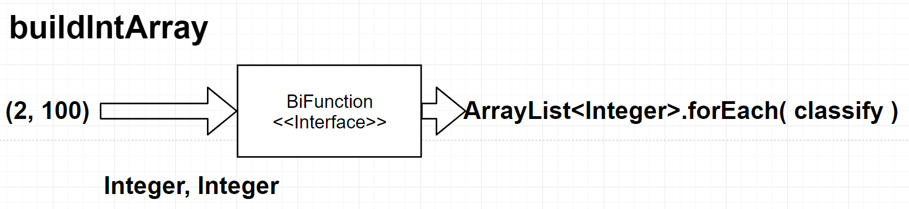

## 람다표현식

#### 람다 표현식은 Functional Interface에 대입해서 쓴다.

자바의 메서드는 단독으로 선언할 수 없고, 항상 클래스의 구성멤버로 선언해야 한다.
그래서 람다표현식도 메서드를 가지고 있는 인스턴스를 생성해야 한다.
그럴려면 타입이 필요하고, 인터페이스를 이 타입으로 쓴다.
그러면 인터페이스 변수에 람다표현식이 대입된다.
인터페이스의 추상메서드의 프로토타입에 따라 대입할 수 있는 람다표현식이 제한된다.
람다표현식은 하나의 메서드만 정의하기 때문에, 인터페이스는 하나의 추상메서드만 갖고 있어야 한다.
FunctionalInterface 어노테이션을 붙이면, 인터페이스에 추상메서드가 2개 선언되지 않도록 컴파일러가 체크해준다.

```java
@FunctionalInterface
interface MyFunctionalIntf{
    public int method(int x, int y);
}
MyFunctionalIntf add = (x, y)->x + y;
System.out.println("Result : " + FunctionalTest.add.method(10, 20));
//output : Result : 30
```

#### 람다표현식 대입용 표준 인터페이스를 써야 한다.

java.util.function에 가보면 미리 선언된 표준 Functional Interface가 있다.

```java
@FunctionalInterface
public interface Predicate<T> {
    boolean test(T t);
    default Predicate<T> and(Predicate<? super T> other) {
        Objects.requireNonNull(other);
        return (t) -> test(t) && other.test(t);
    }
    /*...*/
}
```

이런 식으로 필요한 인터페이스가 선언되어 있으니, 필요한 인터페이스를 가져다 쓰면 된다.

```java
Predicate<Integer> isEven     = (x)->x % 2 == 0;
Predicate<Integer> isOdd      = (x)->x % 2 == 1;
System.out.println("isEven.test(12) : " + isEven.test(12));
System.out.println("isOdd.test(13) : " + isOdd.test(13));
/*
output
isEven.test(12) : true
isOdd.test(13) : true
*/
```

맞는 인터페이스에 람다표현식을 대입하고 쓰면 된다.

## 예제 : 약수, 진약수 등의 수로 변환하는 함수 만들기

패러미터로 받은 정수의 모든 약수를 구해서 hashSet에 넣고 리턴하는 순수함수를 작성해보자. 그러면 아래의 그림처럼 돌아가야 하니, 인터페이스는 Function<< Integer, HashSet<Integer>>로 하면 되겠다.


인터페이스에 대입할 람다 표현식은 아래와 같다.

```java
public static Function<Integer, HashSet<Integer>> factors = (n)->{
    HashSet<Integer> factors = new HashSet<>();
    for (int pod=1; pod <= Math.sqrt(n); pod++) {
        if ( isFactor.test(n, pod) ) {
            factors.add(pod);
            factors.add(n / pod);
        }
    }
    return factors;
};
//factors 람다표현식을 실행하고 싶으면, apply(n)메서드를 호출하면 된다.
//아래 코드는 완전수를 구할 때 factors 함수를 응용하는 예제이다.
public static Predicate<Integer> isPerfect = (n)->sum.apply(factors.apply(n)) - n == n;
```

나머지 메서드도 이런식으로 변환해주면 된다.

### 미션2

#### 고차함수를 이용해서 2부터 100까지의 자연수를 분류해서 출력한다.



buildIntArray함수로 두개의 정수를 ArrayList로 변환한다. 2, 100이면 2부터 100까지의 ArrayList<Integer>가 생긴다. 리턴받은 다음 forEach함수를 호출한다. 이때 정수값을 패러미터로 받아서 분류하여 출력하는 컨슈머 함수인 classify를 forEach함수의 아규먼트로 넘긴다. 그러면 ArrayList의 모든 요소에 대해 classify컨슈머가 실행된다.

```java
buildIntArray.apply(2, 100).forEach(classify);
/*
*** output ***
 2 : deficient, prime
 3 : deficient, prime
 4 : deficient, 
...
94 : deficient, 
95 : deficient, 
96 : abundant, 
97 : deficient, prime
98 : deficient, 
99 : deficient, 
100 : abundant, 
*/
```

### 코드를 리팩토링 해보기

#### andThen을 사용해보자.

완전수를 구할 때, 아래처럼 짰는데, 오늘 강의를 들어보고 나니, 이러면 함수형 프로그래밍의 장점 중 하나인 가독성을 포기하는 것 같다.

```java
(n)->sum.apply(factors.apply(n)) - n == n;
```

apply도 두번 써야 하고, 우선 내가 생각하는 방식이랑 다르게 작성되었다. factors와 sum을 각각 fx, gx로 두면 아래처럼 표현할 수 있다.

f(x) = factors(int x)

g(x) = sum(arr[])

그러면 두 함수를 중첩해서 h(x)로 표현하면 **h(x) = g(f(x))** 이렇게 된다. 

근데, f(x)먼저 실행되고, 그 결과를 받아서 g(x)가 실행되는 거다. 이런 순차적인 흐름을 코드에서 표현하고 싶다. 그럴 때 andThen을 쓰면 된다.

```java
Function<Integer, Integer> sumAllFactors = factors.andThen(sum);
Predicate<Integer> isPerfect = (n)->sumAllFactors.apply(n) - n == n;
```

factors가 실행되고, 그 결과가 함수sum의 아규먼트로 넘어간다. 사람마다 다를 수 있겠는데 이 편이 더 보기 좋은 것 같다.

또한, 이런식으로 함수 여러개를 순차적으로 묶어서 새로운 함수 sumAllFactors를 만들었다. 이런식으로 순수함수를 조합해서 프로그래밍하면 재사용성도 높일 수 있겠다는 생각이 들었다.

#### 스트림을 사용해보자

스트림은 질의를 수행할 데이터소스를 입력으로 받는다.

입력을 원하는대로 계산한다. 이때의 과정을 중간연산이라고 한다. 중간연산은 여러개로 구성될 수 있고, 얘들은 스트림을 입력으로 받고, 스트림을 출력으로 내보내야 한다.

스트림 파이프라인의 최종연산을 해서 결과를 만든다.

중간연산에는 다음과 같은 연산이 있다.

* filter
* map
* limit
* sorted
* distinct

최종연산에는 다음과 같은 연산이 있다.

* forEach : 스트림의 각 요소를 입력으로 받은 컨슈머를 이용해서 소비한다.
* count : 스트림의 요소 개수를 반환한다.
* collect : 스트림을 리듀스해서 컬렉션을 만든다.

#### 스트림 만들기

##### Stream.iterate

```java
//public static<T> Stream<T> iterate(final T seed, final UnaryOperator<T> f)
//public interface UnaryOperator<T> extends Function<T, T>
Stream.iterate(0, n -> n+1).forEach(System.out::println);
```

스트림 API에는 스트림을 만들 수 있는 정적메서드가 두개 있다. 하나는 iterate, 다른 하나는 generate이다. iterate 정적메서드의 첫번째 패러미터는 초기값이다. 그리고 두번째는 람다표현식을 담을 수 있는 UnaryOperator라서, 람다표현식을 넘길 수 있다. 그러면 초기값과 람다표현식을 가지고 값을 계속 생성하는 무한스트림이 된다. 그래서 위의 코드를 실행하면 끝도없이 계속 출력한다. 이런식의 끝이 없는 스트림을 무한스트림, 또는 언바운드 스트림이라고 부른다.

그럼 끝을 지정하고 싶다면? limit()로 제한시키면 된다.

```java
Stream.iterate(1, n -> n+1)
                .limit(100)
                .forEach(System.out::println);
```

이터레이션의 범위를 지정하고 싶으면 이렇게도 쓸 수 있다.

```java
Stream.iterate(1, (x)->x*x<=n,(i)->i+1)
```

이정도면 그냥 for루프처럼 쓸 수 있겠다.

##### Stream.generate

iterate에선 초기값과 람다식을 가지고 스트림을 생산했는데, 이렇게 안하고 입력 패러미터로 Supplier를 넘겨서 스트림을 만들 수 있다.

```java
//public static<T> Stream<T> generate(Supplier<? extends T> s)
//public static double random()
Stream.generate(Math::random)
    .limit(5)
    .forEach(System.out::println);
```

Supplier를 이용해서 limit에서 지정한 수만큼 스트림을 생산한다. 그래서 저 코드는 랜덤값을 5개 생성한다.

#### 기본형 특화 스트림과 객체 스트림

스트림 API는 박싱 비용을 피할 수 있도록 각각의 타입에 특화된 IntStream, DoubleStream, LongStream이 있다. 각 인터페이스는 합계를 계산하거나 최댓값을 찾는 max같이 숫자 관련 리듀싱 연산을 하는 메서드를 제공한다. 

```java
ArrayList<Integer> arr = new ArrayList<Integer>();
arr.stream().mapToInt(i->i).sum()
arr.stream().mapToInt(i->i).count()
arr.stream().mapToInt(i->i).average()
arr.stream().mapToInt(i->i).count()
arr.stream().mapToInt(i->i).count()
```

필요하다면 다시 객체스트림으로 복원할 수 있는데, 이게 boxed()메서드이다. 

collect해야 할 때 객체스트림으로 복원하는게 필요할 수 있다.

IntStream의 collect와 Stream<Integer>의 collect는 패러미터 형식이 다르다.

```java
//IntStream.java
<R> R collect(Supplier<R> supplier,
                  ObjIntConsumer<R> accumulator,
                  BiConsumer<R, R> combiner);
//Stream.java
<R, A> R collect(Collector<? super T, A, R> collector);
//
public static <T>
    Collector<T, ?, Set<T>> toSet() {
    return new CollectorImpl<>((Supplier<Set<T>>) HashSet::new, Set::add,
                               (left, right) -> {
                                   if (left.size() < right.size()) {
                                       right.addAll(left); return right;
                                   } else {
                                       left.addAll(right); return left;
                                   }
                               },
                               CH_UNORDERED_ID);
}
```

위의 코드는 실제 자바의 IntStream과 Stream의 코드이다. Stream<Integer>로 박싱된 스트림의 경우, Collectors.toSet()메서드를 패러미터로 넘겨서 스트림을 set으로 간편하게 바꾸는게 가능하다. 패러미터를 저렇게 받아서 돌아가게 해놨으니까 그렇다. 반면 IntStream은 패러미터 개수부터 다르기 때문에, 저런 사용이 불가능하다. 만약 IntStream으로 collect(Collectors.toSet())을 쓰고 싶다면 boxed()함수를 쓰면 된다.

```java
(n)->IntStream.range(1, n)
    .boxed()
    .filter((x)->isFactor.test(x,n))
    .collect(Collectors.toSet());
```

IntStream.range()함수로 인해 생긴 IntStream을 Stream<Integer>로 변환할 수 있다.

#### collect를 사용해보자

collect 메서드는 도출하려는 결과를 누적하는 컨테이너를 바꾸도록 설계된 메서드이다.

```java
HashSet<Integer> set = arr.stream()
                .filter(n->n%2 == 0)
                .collect(HashSet::new, Set::add, Set::addAll);
set.forEach(System.out::println);       
//public boolean addAll(Collection<? extends E> c)
```

collect의 패러미터는 각각 Supplier, Accumulator, Combiner이다.

그래서 맨 앞에 HashSet::new를 해준다. collect로 누적연산한 결과를 저장할 컨테이너를 만들어야 하니, HashSet::new를 해주면 된다.

두번째는 누적연산에 해당하는 람다식이다. Set::add처럼 메서드 레퍼런스를 써도 되고, 아니면 직접 람다표현식으로 정의해도 된다. 

세번째는 조합연산이다. 병렬처리를 하는 경우, 조합기로 각각의 스레드가 출력한 컨테이너를 합쳐야 한다. 이 역시 람다표현식으로 따로 정의할 수 있다. 오해하면 안되는건, 얘는 누적연산이 아니라 조합연산이다. 그래서 이쪽에 넘어가는 패러미터는 컨테이너와 요소가 아니라 컨테이너와 컨테이너이다. 그래서 addAll 메서드레퍼런스를 넣는것이다. 싱글스레드일때는 조합연산을 안쓴다고 한다.

```java
HashSet<Integer> set = arr.stream()
                .filter(n->n%2==1)
                .collect(HashSet::new,
                        (tmpSet, i)->{tmpSet.add(i); tmpSet.add(i+1);},
                        (tmpSet, tmpSet2)->{tmpSet.addAll(tmpSet2);});
```

컨테이너에 하는 누적 연산을 커스텀하고 싶다면 저렇게 람다표현식으로 할 수 있다.

#### reduce를 사용해보자

reduce는 두 값을 하나로 도출하는 불변형 연산이다. 스트림의 모든 요소를 처리해서 하나의 값으로 도출한다.

만약 reduce연산으로 누적연산에서 자료구조를 수정하게 시키게 구현했다면, 병렬로 수행했을때 문제가 될 수 있다. 이렇게 쓸꺼면 reduce가 아닌 collect로 구현하자. 다시말해서, 가변컨테이너 관련 작업이고, 병렬성을 확보하려면 reduce가 아닌 collect메서드로 해야한다. *출처 : 모던 자바 인 액션 206page*

```java
System.out.println("sum : " + arr.stream().reduce(0, (a, b)->(a + b)));
System.out.println("(a, b)->a+b : " + arr.stream().reduce(0, (a, b)->a+b));
System.out.println("(a, b)->a+1 : " + arr.stream().reduce(0, (a, b)->a+1));
System.out.println("(a, b)->b+1 : " + arr.stream().reduce(0, (a, b)->b+1));
//sum : 5
//(a, b)->a+b : 5
//(a, b)->a+1 : 5
//(a, b)->b+1 : 2
```

첫번째 패러미터로 초기값을 넣고, 두번째 패러미터로 스트림의 모든 요소를 조합하는 연산을 넣는다. 이때 a, b의 타입은 스트림의 타입이 되고, a가 누적값이고, b가 스트림의 요소값이 된다. 이 경우 초기값을 0으로 했으니 첫번째 계산에서의 a값은 0이 된다는 사실을 알 수 있다.

a+1의 결과는 5가 나왔다. a가 누적값이기 때문에 +1을 5번한 결과가 누적되었기 때문이다.

b+1의 결과는 5가 나왔다. b는 누적값이 아니라서 +1을 5번한 결과가 누적되지 않았다.

#### factors 다시 구현하기

```java
(n)-> Stream.iterate(1, (x)->x*x<=n,(i)->i+1)
    .filter((x2)->isFactor.test(n, x2))
    .collect(HashSet::new, (set, x3)->{set.add(x3); set.add(n/x3);}, HashSet::addAll);
```

1. 기존에 IntStream.range로 IntStream을 생산하던 코드를 Stream.iterate로 수정했다. 추가로 n까지 생산하는게 아닌, √n까지만 스트림을 생성하도록 제한했다.
2. filter메서드에 isFactor라는 BiPredicate인터페이스를 쓰는 람다표현식으로 약수인지 검사하도록 수정했다.
3. collect 메서드를 이용해서 약수 x3와 n/x3를 누적결과인 HashSet에 add하도록 했다. 이때, 누적결과인 HashSet을 계속 수정해야하므로, collect메서드를 사용해서 구현했다.

##### sum도 다시 구현하기

```java
(setA)->setA.stream().reduce(0, Integer::sum)
```

1. 입력 패러미터로 받은 집합A로 부터 스트림을 뽑는다.
2. reduce메서드로 스트림의 모든 요소를 다 더한다. 모든 요소에 대해 연산해서 하나의 값을 도출하는 것이므로 reduce메서드를 사용해서 구현했다.