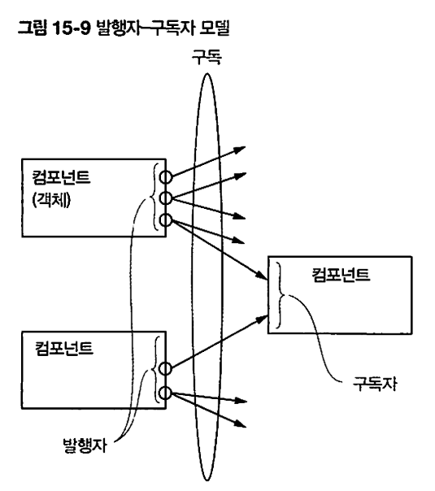
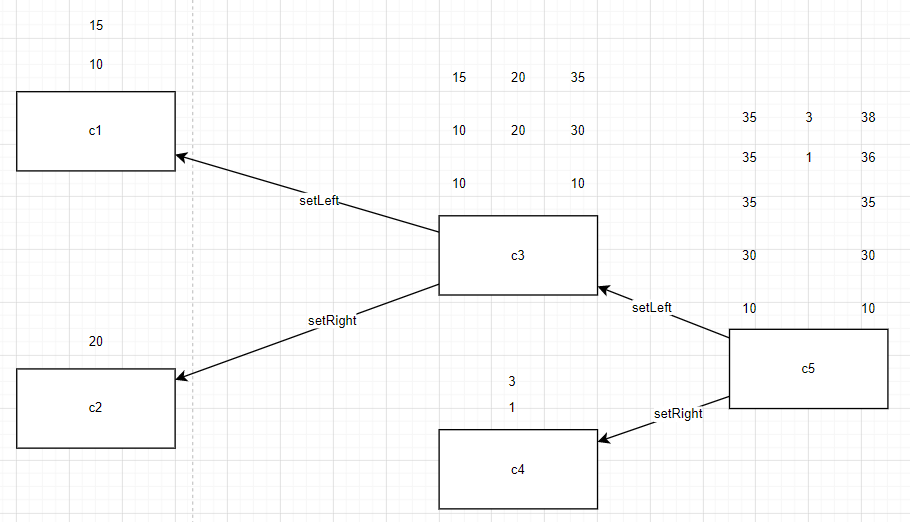
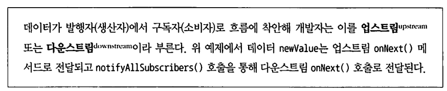
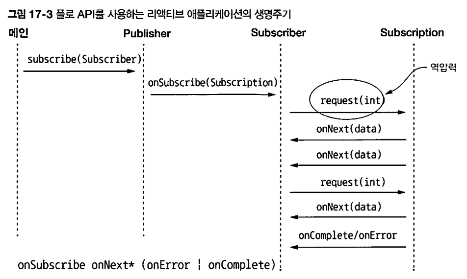

## 리액티브 프로그래밍

```note
아직 내공이 부족해서 리액티브 프로그래밍을 제대로 이해하지 못한 상태로 글을 쓴거라 틀린 내용이 매우 많을 수 있습니다. 만약 틀린 부분을 찾으셨다면 깃헙 이슈탭에 댓글을 남겨주시면 정말 감사하겠습니다!
```

## 리액티브 프로그래밍

객체지향이나 함수형처럼, 리액티브 프로그래밍도 프로그래밍 패러다임이다. 이 경우엔 프로그래밍을 어떤 이벤트에 반응(react)하는 방식으로 프로그램을 작성한다.

자바의 경우, java9부터 제공하는 java.util.concurrent.Flow의 인터페이스에 있는 발행-구독(publish-subscribe)모델을 적용해서 리액티브 프로그래밍을 한단다. 이걸 간단히 정리하면 아래와 같다.

* 구독자가 구독할 수 있는 발행자
* 구독하면 연결이 생긴다.
* 연결을 통해 메세지를 전송할 수 있고, 받을 수 있다.

### 발행자 구독자 모델



어떤 컴포넌트에서 어떤 이벤트가 생겼다. 그때 퍼블리셔를 써서 이벤트가 발생했다는 메세지를 구독자들한테 전송(notify)한다. 구독자들은 메세지를 받고 반응(react)하면 된다.

가령, c1, 2, 3가 있는데, c3는 c1과 c2의 값이 변경되는거에 반응하고 싶단다. 그러면 이렇게 하면 된다.

```pseudocode
ArithmeticCell c3;
SimpleCell c1,c2;
//c1,c2,c3 셋 다 onNext메서드가 정의되어 있다.
//셋 다 publisher, subscriber인터페이스를 구현한다.
//c3가 남들과 다른점은, setLeft, setRight 메서드가 정의되었다는 점이다.
//얘는 자신의 left,right값을 업데이트하구, onNext(left+right)를 호출한다.
//onNext할때마다 자신의 값을 출력한다.


c1.subscribe(c3::setLeft)
c1.subscribe(c3::setRight)

c1.onNext(10)//c3는 이미 c1을 구독했기 때문에, 이 변경의 결과를 통보(notify)받는다
c2.onNext(20)//이것도 마찬가지.
/*
C1 : 10 
C3 : 10 //c3는 c1의 행동에 대응했다.
C2 : 20 
C3 : 30 //c2에 대응함.
C1 : 15 
C3 : 35//c1에 대응함 ㅇㅇ.
*/
```

이 경우, c1이랑 c2가 발행자(Publisher)가 되고, c3가 구독자(Subscriber)가 된다. 그리고 c3는 자신이 구독한 객체들의 상태변화에 대응할 수 있게 된다! 

구독자에 대해서 또 구독하게 시킬수도 있다.

```pseudocode
ArithmeticCell c3,c5;
SimpleCell c1,c2,c4;

c1.subscribe(c3::setLeft)
c2.subscribe(c3::setRight)

c3.subscribe(c5::setLeft)
c4.subscribe(c5::setRight)

c1.onNext(10)
c2.onNext(20)
c1.onNext(15)
c4.onNext(1)
c4.onNext(3)
```

위의 코드대로 실행하면, 아래처럼 수행된다.

c1의 결과가 c3로, c3의 결과가 또다서 c5로 이어지게 만들 수 있는 것이다. 



### 업스트림과 다운스트림 : [출처](https://stackoverflow.com/questions/53441858/explain-about-downstream-and-upstream-in-rxjava)

아.... 이해가 안간다..... 그래서 이 부분은 특히나 더 틀린 설명일 수 있다. 주의해서 봐주세요... 틀린거 찾으셨다면 알려주세요...

발행자랑 구독자 사이에 데이터의 흐름이 생긴다. 발행자가 이벤트의 발생을 통보하면, 그걸 구독자가 받아먹기 때문인데, 이때 발행자를 생산자로 보고, 구독자를 소비자로 보자.

```java
	    upstream          downstream
source <--------- operator -----------> consumer/further operators
```

생산자로부터 튀어나오는걸 업스트림이라고 부르고, 그게 소비자로 넘겨지는걸 다운스트림이라고 하는 모양이다.

책에 따르면, newValue라는 데이터는 업스트림  onNext()메서드로 전달된단다.

notifyAllSubscribers()메서드를 호출함으로서, 다운스트림 onNext()호출로 전달된다고 한다.



그래서 생산자의 onNext가 업스트림이 되고, 소비자의 onNext가 다운스트림이 된다는 말일까? 이건 좀 더 공부가 필요하겠다. 

onNext외에도, 에러상황에 대한 처리나 완료에 대한 처리를 할 수 있도록, onError와 onComplete같은 메서드가 필요하다고 한다. 자바 FlowAPI의 Subscriber는 onError이랑 onComplete를 지원한다고 한다.

### 역압력(흐름 제어)

#### 압력

근데, 이런 상황을 생각해보자. 어떤 데이터가 쌓이는데, 이걸 제공하는 발행자가 있다고 치자. 이 데이터가 적으면, 발행자한테 가입해도 문제가 없겠다. 근데 데이터가 엄청 쌓였다면? 엄청 많은 데이터가 매초마다 발행된다면? 엄청난 압력에 구독자는 정신이 나갈 것 같다. 이런 상황을 압력이라고 부른단다.

#### 역압력(흐름 제어)

발행자로부터 쏟아지는 엄청난 정보의 흐름을 제어할 수 있어야 한다. 역으로, 구독자가 발행자한테 정보를 요청하면 된다. 

onSubscriber()라는 메서드가 있다. 발행자와 구독자 사이에서 연결이 생기면(구독하면 생김) 첫 이벤트로 이 메서드가 호출된다. 구독자는 onSubscribe메서드를 통해 전달된 subscription객체를 자신의 로컬에 저장해놓는다. 구독자는 수많은 이벤트를 받지 않도록, onSubscribe, onNext, onError등의 마지막 동작에 channel.request(1)을 추가해서 오직 한 이벤트만 받도록 요청한다. 

발행자는 요청을 보낸 채널에만 onNext, onError 이벤트를 보내도록 notifyAllSubscribers코드를 바꾼다. 이런식으로 해서 흐름제어를 한단다.



이런식으로 진행된단다. Subscriber는 연결되면 최초로 호출되는 콜백인 OnSubscribe를 통해 흐름제어를 할 수 있다는 것.

## 예제 : 타이머 발행자와 구독자

타이머클래스는 1초가 지난게 확인되면 이벤트를 발행한다.

구독자인 MyConsumer 클래스는 이벤트가 발행되면 출력한다.

#### MyPublisher, MySubscriber

```java
public interface MyPublisher<T> {
    public void subscribe(MySubscriber<? super T> subscriber);
}
public interface MySubscriber<T> {
    public void onNext(T t);
    public void onComplete(T t);
}
```

#### Timer

```java
class Timer implements MyPublisher<Boolean> {
    long prevTime = 0;
    private ArrayList<MySubscriber> subscribers;
    Timer(){
        subscribers = new ArrayList<>();
        startTimer();
    }
    private void startTimer(){
        prevTime = System.currentTimeMillis();
    }
    public void checkTimeOut(){
        long currTime = System.currentTimeMillis();
        if(currTime - prevTime >= 1000){
            prevTime = currTime;
            //매초마다 구독자들한테 이벤트를 발행한다.
            //발행자와 구독자는 인터페이스를 통해 연결된다.
            //Subscriber 인터페이스의 onNext!
            subscribers.forEach( (subscriber)->subscriber.onNext(true) );
        }
    }

    @Override
    public void subscribe(MySubscriber<? super Boolean> subscriber) {
        subscribers.add(subscriber);
    }
}
```

#### MyConsumer

```java
class MyConsumer implements MySubscriber<Boolean>{
    String name;
    MyConsumer(String name){
        this.name = name;
    }
    @Override
    public void onNext(Boolean aBoolean) {
        System.out.println(name + " >> Tick");
    }

    @Override
    public void onComplete(Boolean aBoolean) {

    }
}
```

#### Main

```java
public static void main(String[] args) {
    Timer timer = new Timer();
    timer.subscribe(new MyConsumer("asdf"));
    timer.subscribe(new MyConsumer("qwer"));
    while (true){
        timer.checkTimeOut();
    }
}
/***** output
asdf >> Tick
qwer >> Tick
asdf >> Tick
qwer >> Tick
......
*/
```

매초마다 컨슈머의 메서드가 실행된다! 

이게 좋은게 뭐냐면, 매 초마다 어떤 작업을 해야하는 애들이 있다면, 그냥 간단하게 타이머 인스턴스만 구독하면 된다. 심지어 인터페이스로 연결된거라 구독자의 코드가 변경되어도 변경이 다른 클래스에게 영향을 주지 않는다. 또한 싱글스레드에서도 어떤 인스턴스의 이벤트에 반응해서 어떤 행동을 하게 만들 수 있다는 점도 정말 좋은 것 같다.

