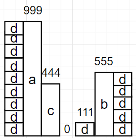

## 오늘은 어땠을까

컨디션 : 졸림.

정규표현식을 공부하고 정리했다.

코테는, 오등큰수 문제를 풀고, 알고리즘 기초1/2 수학 파트를 듣고 정리했다.

나머지연산에 대해 배우고, GCD, LCM을 구하는 방법을 배웠다.

유클리드 호제법과 에라토스테네스의 체에 대해 배우고 문제를 풀었다.

***

#### 오늘 할 일

- [x] 이틀전에 배운 정규표현식 간단하게 정리하기

- [x] 코테문제부터 풀기

- [ ] 남은시간은 객체지향에 대해 계속 공부하자.

  객체지향의 사실과 오해라는 책을 읽으면서 내 방식대로 한번 구조화해보자.

  그런 다음 루카스의 학습정리를 보고 글로 정리해보자. 

  오늘 다 하자는게 아니다. 이건 좀 몇일 시간을 들여야 할 것 같다.

  * 업캐스팅, 다운캐스팅
  * 간접참조 및 객체지향 5대원칙(단일책임의 원칙 등...)


## 오늘 배운 내용  
### 정규표현식

#### 이렇게 생각하자

* 어떤 문자열과 **매칭되는 패턴**을 만드는게 목표

#### 주의할 점

* 하나의 정규표현식 안에 하나의 패턴만 있을거라고 생각하면 안된다. 패턴들의 조합으로 구성할 수 있다.

* 검사 위치, 방향, 범위가 있다.  어떤 위치에서 어떤 방향으로 얼마나 검사할 지 인지해야한다.

* 현재 위치가 어디인지도 인지하고 있어야 한다.

  현재 위치가 어디냐? 패턴검사 문자가 시작하는 위치가 현재 위치다.

  abcd\d{1,3}qwer이면, 현재 위치는 d 부터다. d 부터 숫자가 1~3개 나와야 한다는 것을 의미한다.

#### 예제

* [예제 링크 regexr.com](https://regexr.com/5kc7d)

#### 문자 검사하기

```regex
a	:	문자 a만 나와야 함
ab	:	문자 ab만 나와야 함
abc	:	문자 abc만 나와야 함
```

#### 숫자 검사하기 : \d

```regex
\d
```

\d는 숫자 하나와 매칭된다.

```note
**주의할 점!**  
단 하나의 숫자랑 매칭될 뿐이다.  
12345라면, 현재위치를 기준으로, 우측 방향의 5개의 숫자와 5번 매칭되는 형태이다.  
```

#### 앞의 패턴을 지정된 범위에 적용해서 검사하기

```regex
패턴{from, to}  
ex
	\d{1, 5}
```

현재 위치에서 from부터 to까지의 범위에 대해, 앞의 표현식을 적용한다

그래서 \d{1, 5}는 현재 위치에서 1부터 5까지 \d가 맞는지 검사한다.

```regex
예제2
,{1} 의 의미는?
현재 위치에 ,가 하나만 나와야 함을 의미한다.
```

#### 패턴 조합하기

* 앞의 문자가 abcd로 시작하고, 뒤에 숫자가 한개에서 4개만 와야 한다면?

```regex
abcd\d{1,4}
```

### 코딩테스트 준비

#### BOJ 17299 오등큰수

##### 풀이

오큰수 풀때랑 같은데, 한가지 차이만 인지하면 된다.

arr[i]값으로 비교하는게 아니다. 이 값이 수열에서 몇번 등장했는지를 가지고 오등큰수를 구해야 한다.
    

이것만 인지하면 오큰수랑 딱히 차이는 없다.

 대신 수열에서 몇번 등장했는지 알아야 하는데, 이건 hashmap을 쓰면 쉽다.
    

입력하면서 해시맵에도 넣자. 이미 있는 숫자면 1을 더해주자.

 나중에 오등큰수를 비교할 때. 맵에서 꺼내서 쓰면 된다.

### CodePlus 수학 - 1

#### 나머지연산(Modulo, MOD)

어떤 문제를 해결할 때, 10007로 나눈 나머지를 출력해라 그때 쓰는 방법?

정답이 너무 커질 수 있는데, int, longlong등의 범위도 넘어갈 수 있다.

정답구하는게 중요하지, 긴자리 연산하는게 중요한게 아님

정답 구하는걸 보려고 나머지 출력해라 라는 경우가 있음.

정답 다 구하고 나머지연산하는게 아니고, 정답을 갱신할때마다  나머지연산을 해줘야 함

(A + B)%M = (A % M + B % M) % M이다.

이게 성립하기 때문에, 큰 숫자에 직접 나머지연산을 하지 않아도 구할 수 있다.

뺄셈에 대해 조심할게 있다.

(6 - 5) % 3 = 1 % 3 = 1인데, 이것도 위처럼 해도 될까?

(6%3 - 5%3) % 3 = ( 0 - 2 ) % 3 =  1이어야하는데, 과연 프로그램도 그렇게 될까?

c++이랑 자바는 저 식대로 돌리면 -2, 파이썬은 1이 나온다. 그래서 조심해서 계산해야 한다.

이걸 방지하려면 어떻게 해야할까?

-c < (a%c -  b%c) < c 를 만족한다. 어떤 수를 c로 나머지연산하면, 그 결과는 반드시 0 ~ c-1이기 때문에, 

이런 부등식이 성립한다. 여튼간에 괄호안에 + c를 넣어주자. 어차피 c % c가 되기때문에, 0이 되니까 더해줘도 문제없다. 자기 자신으로 나눴는데 나머지가 생길리가 없지 않은가.

```java
int a = 6, b = 5, c = 3;
int tmp1 = (a-b) % c;
int tmp2 = (a % c - b % c) % c;
int tmp3 = (a % c - b % c + c) % c;
System.out.printf("(a-b) %% c : %d\n", tmp1);
System.out.printf("(a %% c - b %% c) %% c : %d\n", tmp2);
System.out.printf("(a %% c - b %% c + c) %% c : %d\n", tmp3);
/*Output
    (a-b) % c : 1
    (a % c - b % c) % c : -2
    (a % c - b % c + c) % c : 1
*/
```

#### 약수

n이 정수이고, a = n/b일 때, a를 b의 약수라고 한다. a에 얼마를 곱하면 b를 만들 수 있다.

모든 자연수는 최소한 1과 자기자신을 약수로 갖는다.

만약 약수가 1과 자기자신밖에 없다면, 그 수를 소수라고 부른다.

#### 서로소(Coprime)

두 정수의 공약수가 1밖에 없는 경우, 이를 서로소라고 한다.

#### 최대공약수

두 수의 공통된 약수중에서 가장 큰 것. 그래서 최대공약수는 두 수 중에서 가장 작은수보다 클 수 없다.

GCD라고 하는데, Greatest Common Divisor를 줄인 것이다.

약수중에서 가장 큰 숫자는 자기자신이다. 그래서 두 수의 최대공약수를 구하는 가장 쉬운 방법은, 1부터 두 수 중에서 가장 작은수 사이의 모든 정수로 두 정수를 나누고,  둘 다 나머지가 0이 나온 수(공약수)  중에서 가장 큰 숫자를 고르면 된다.

유클리드 호제법을 쓰면 이것보다 더 빠르게 구할 수 있다.

#### 유클리드 호제법

어떤 막대 a랑 b가 있다.

길이가 g인 어떤 막대를 이어 붙이면, 남는 것 없이 a랑 b막대를 만들 수 있다고 한다.

이때, g는 여러 값이 될 수 있는데, 이 중에서 가장 큰 값을 구한다고 치자.

우선 a % b의 의미부터 보자.

a % b = 0의 의미는, b막대를 a랑 같아질 때 까지 최대한 많이 가져다 붙였을 때 남는것 없이 a막대를 만들 수 있다는게 된다. a % b = c라면, 최대한 많이 가져다 붙였을 때, 길이 c만큼이 남는다는 것이다. 

이때, 남는 것 없이 b랑 c를 만들 수 있는 어떤 막대 d가 있다고 치자. 그렇다면, 우리는 이 막대를 이용해서 a랑 b를 만들 수 있다. 남는 것 없이 b랑 c를 만든다고 했으니, b는 된다고 치자. 근데 a는 어떻게? 이것도 문제가 안되는게, 아까 b막대를 최대한 이어붙여서 a를 만들려고 했고, 여기서 남은게 c였지 않은가? 근데 c도 만들었다고 했다. 그러니 길이 c 까지 만들 수 있다. 근데 방금전에 b를 만들었다고 했지 않은가. 그러니 남은 길이 b까지도 만들 수 있는 것이다. 



999(a) % 555(b) = 444(c)

555(b) % 444(c) = 111(d)

444(c) % 111(d) = 0

따라서 111(d)이 길이가 g인 막대가 된다. 그리고 이 g를 최대공약수라고 생각하면 된다.

```java
public static void getEuclidGcd(int a, int b){
    while (b != 0){
        //유클리드 호제법에 따르면 gcd(a,b) == gcd(b, a%b)와 같다.
        //나머지연산이 0이 나올때까지 이를 반복해서 최대공약수를 구한다. 
        int r = a % b;
        a = b;
        b = r;
    }
    System.out.printf("gcd : %d\n",a);
}
```

이 알고리즘은 O(lgn)의 시간복잡도를 가진다.

#### 배수

어떤 정수 a,b,k가 있을 때 a = kb를 만족하면, a는 b의 배수이다.

2의 배수는 모두 짝수이다.

10의 배수는 일의자리가 0이다.

5의 배수는 일의 자리가 5거나 0이다.

#### 최소공배수(least Common Multiple, LCM)

두 수의 공통되는 배수 중에서 가장 작은 수를 말한다. 예를 들면, 10과 12의 최소공배수는 60이다.

두 수의 최대공약수를 GCD라고 했을 때, A * B = GCD * LCM이라서, LCM = (A*B)/GCD이 된다.

#### 소수(PrimeNumber)

약수가 1과 자기자신밖에 없는 수를 말한다.

어떤 수 N이 소수인지 판별하려면 어떻게 해야 할까?

또, 범위 안의 모든 소수를 찾으려면 어떻게 해야 할까?

##### 어떤 수 N이 소수인지 판별하기

N이 2보다 작다면, 소수가 아니다.

N이 소수가 아니라면, A * B = N을 만족하는 A랑 B가 있다. 그러면 A는 √N보다 작고, B는 √N 보다 클 수밖에 없다. 근데 둘 다 √N보다 작으면, A*B < N이기 때문에 모순이다. 두 수가 √N보다 크면 A * B > N이 되버려서 이것도 모순이다. 그래서 항상 A는 √N보다 작고, B는 √N 보다 크다. 그러니까 2부터 √N까지만 약수를 찾으면 된다. 이 안에 없으면 A, B 둘 다 √N 보다 크다는 소리고, 아까 이건 모순이라고 했으니까 √N 이후로는 검사할 필요 없다.

그래서 O(√N)이다.

##### 어떤 수 N이하의 소수를 구하는 알고리즘( 에라토스테네스의 체 )

위의 알고리즘으로 1부터 N까지 소수판별을 하면, O(N√N)이 된다. N이 백만이라고 치면 백만 * 천으로 10억이 나오니 너무 오래걸린다.

이걸 해결하기 위해서 에라토스테네스의 체를 쓸 수 있다.

1부터 100까지의 소수를 구한다. 그러면 √100인 10까지 아래와 같은 일을 반복한다.

i의 배수를 다 지운다. 그래서 2의 배수를 다 지운다. 남은 수 중에서 3의 배수도 다 지운다 4는 2의 배수로 이미 지워졌다. 5의 배수를 다 지운다.  7의 배수까지 지우면, 모든 소수를 구했다고 볼 수 있다. 아까 A * B = N을 생각해보면, √N보다 작거나 같은 모든 A에 대해 검사를 한 셈이니, 테이블에 남은 수는 전부 소수임이 보장된다. 아 그리고, 어떤 소수의 제곱 이전의 수는 이미 다 제거된 상태이다. 가령 3 * 2, 3 * 3을 생각해보자. 이미 2에서 2의 배수인 모든걸 다 지웠다. 그리고 3 * 2이지 않은가, 얜 2의 배수인거니까 이미 지워졌다. 그래서 제곱부터 지워나가면 된다.

시간복잡도는 O(NlglgN)이다. 

이걸 프로그래밍으로 써먹는게 좀 까다로웠다. 어떤 수 N 이하의 소수를 찾는다면, 우선 테이블부터 만들어야 한다. 0부터 N+1까지의 테이블을 만든다. 2부터 소수인데, 그렇다고 배열의 0번째를 2로 취급하면 까다로우니, 그냥 앞의 0, 1은 낭비하게 내버려둔다. N+1까지 크기를 잡은 이유는, N이하의 소수를 찾는거라 그렇다. isDeleted[N]을 했을 때, 얘가 지워졌는지 확인하려면 N + 1만큼의 공간을 할당하는게 좋다. 테이블을 만들었으면, i = 0 -> i < N; i++로 루프를 돈다. 이때 isDeleted[i]가 false라면, 지워지지 않았다는 소리니, 얘는 소수다. 시작조건이 2였으니, 2는 무조건 소수로 취급된다. 이렇게 소수로 취급된 요소는 따로 보관한다.

그런 다음, 에라토스테네스의 체에서 배운대로, 소수의 배수를 전부 날려야 한다. j = i + i -> j <= N ; j += i로 루프를 돌면서 check[j]에 true를 넣으면 된다. 현재 루프에서 찾은 소수 i의 배수는 += i이다. 구구단을 생각해보면 간단할 것 같다. 2 * 2 = 4, 2 * 3 = 6, 2 * 4 = 8 이런식이니까, 인덱스가 배수로 뛰고 싶으면, 자신만큼 계속 더해주면 된다. 그러면 *2, *3, *4, *5 ... 해나가는거랑 같기 때문이다. 여하튼 스탭은 그렇다치고, 어떤 소수의 제곱부터 지워나가랬는데, i + i부터 지워나가고 있다. i * i로 하게 되면, 변수의 표현 범위를 쉽게 벗어날 수 있어서 이상한 값이 들어가기 쉽다. 그래서 그냥 i + i부터 하는 것.

메모 : 골드바흐의 추측 전까지 들었다.

***

## 코딩일일결산
* **내일의 나에게 보내는 전달사항**
  
  * 이어서 객체지향에 대해 공부하기
* **GOOD**
  
  * 깃헙 이슈탭에 이미지를 안넣으면서, 포스트에 이미지를 쉽게 넣는 방법을 찾았다. Typora를 쓰면 클립보드에 있는 이미지를 알아서 포스트가 있는 폴더에 이미지파일로 생성하고, 그 링크를 포스트에 붙여준다.
  * 
* **BAD**
  
  * 코테 공부하느라 객체지향 공부를 못했다. 시간분배를 좀 잘해야할텐데