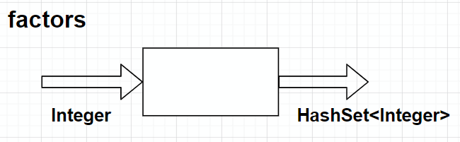
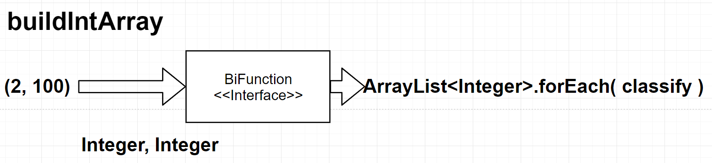

## 오늘은 어땠을까

컨디션 : 피곤하고 졸림. 잠을 잘 못잤음.

***

##### 오늘 할 일

- [x] 리액티브 선언문 읽어보기
- [x] 함수형 프로그래밍이 뭔지 간단하게 알아보기
- [x] 람다대수에 대해 간단하게 알아보기
- [x] 함수형 프로그래밍의 특성에 대해 알아보기
- [x] Java의 람다표현식과 익명클래스를 비교해서 공부하기(영상보면서)
- [x] 함수형 프로그래밍을 적용해서 미션1 풀기
- [x] 고차함수가 뭔지 간단하게 알아보고 map, reduce, filter를 써서 미션 2 풀기

##### 남은 시간이 부족하므로 아래의 작업은 오늘 하지 않는다.

- [ ] ~~코테문제 풀기~~
- [ ] ~~객체지향의 사실과 오해를 읽고 정리하기~~


## 오늘 배운 내용  
### 함수형 프로그래밍

#### 함수형 프로그래밍의 순수함수(Pure Function)

* 순수한  함수는 수학의 함수처럼 같은 입력이 주어지면 항상 같은 결과를 출력해야 한다. 
* 함수형 프로그래밍 언어에서는 함수를 순수함수라고 부른다.
* 순수한 함수는 부작용(Side Effect)이 없다.
* 함수의 실행이 외부에 영향을 끼치지 않는다
* 순수한 함수는 스레드 안전하고 병렬적인 계산이 가능하다. 

순수함수는 외부값이나 객체에 의존하지 않는다. 외부에 의존하지 않고 입력받은 패러미터만 가지고 동작하기 때문에, 부작용이 없다. 이를 **참조투명성**이라고 한다. 만약 순수함수가 아니라면, 입력받은 패러미터 외에 다른 값을 참조해서 동작한다. 따라서 외부값에 의해 다른값이 리턴될 수 있는 **부작용**이 있다.

```note
자바의 람다표현식은 표현식에서 접근하는 모든 자유변수를 final이나 Effectively Final로 취급해야한다.
왜 그럴까? 람다표현식으로 표현한 함수를 순수함수로 쓰기 위해서가 아닐까?
```

#### 클로저(Closure)?

* 루카스에서 본 클로저에 대한 설명은 아래와 같다.
* 클로저란 람다 계산의 구현체이다.
* 선언된 범위(Scope)에서 접근가능한 변수를 캡쳐해서 저장하고 닫힌다.
* 클로저는 캡쳐한 변수를 참조(Reference)한다
* 이것만 봐선 뭔지 잘 모르겠다. 영상을 보고 공부해보자.

##### 영상을 보고 정리한 클로저

[출처 : 모던 자바. 못다한 이야기 - 클로저](https://www.youtube.com/watch?v=pjtk7vvryio&feature=youtu.be)

```java
int i = 100;
someMethod ( x -> x * 2 + i)//엄밀히 말해서 이 람다표현식은 익명함수가 된다.또는 익명 메서드.
```

* 여기서 x는 패러미터이고, 2는 상수값이다. 넘어가자.

* 그러면 i는 뭘까? i는 람다표현식 밖의 None-Local Variable이다.

  이걸 다른말로 **자유변수(Free Variable)**이라고도 부른다

* 여하튼 이런 식으로 익명함수가 스코프 **외부의 변수**에 접근하면, 우리는 이걸 특별히 **클로저라고 부른다**.

 

보면 익명함수의 원래 스코프는 빨강색까지가 함수의 스코프다. 근데 지금 이 람다표현식에서 외부의 변수에 접근하고 있다. 이때, **스코프의 범위를 확장해서 파란색으로 색칠한 저기까지로 덮어버린다**. 이걸 다른말로  **Close Over**한다 라고 불러서, 이런걸 클로저라고 부른단다. 여하튼 스코프를 자유변수까지 확장해주기 때문에 표현식에서 접근할 수 있게 된다.

  > close over
  >
  > *phrasal verb*
  >
  > close over somebody/somethingto surround and cover somebody/something

한가지 주의할 점이 있는데, 변수 자체에 대한 정보를 캡쳐하는게 아닌, 변수의 값을 캡쳐하는 것 이라고 한다.

##### 예제로 다시 한번 정리해보기

```java
class ClosureExample{
    int num = -200;
    public void test(){
        int num = 1;
        //람다 표현식을 아규먼트로 넘기는 테스트 코드
        testClosure( "Test Lambda", () -> {
            System.out.println(num);
            System.out.println("this.num : " + this.num);
        });
        testClosure("Test Anonymous", new Runnable() {
            @Override
            public void run() {
                System.out.println(num);
                System.out.println("this.num : " + ClosureExample.this.num);
            }
        });
    }//test()
}//class ClosureExample
```

* 인클로징 클래스의 변수에 접근하는 경우, 스코프의 범위를 자유변수까지 확장해서 덮어버린다.(Close Over)

  그래서 이걸 **클로저**라고  부른다

* 익명클래스건 람다표현식이건, 자유변수는 Final 또는 Effectively Finally로 취급해야 한다. 값을 바꿀 수 없다.

* 익명클래스의 this는 Runnable인터페이스로 만든 익명클래스의 인스턴스이다. EnclosingClass인 ClosureExample클래스의 인스턴스를 가리키지 않는다.

* 반면, 람다표현식의 경우, this 키워드는 람다표현식을 실행한 인스턴스를 가리킨다. 이 점에 주의해야 한다.

  ```note
  영상에선 람다표현식은 표현식 자체에 대한 스코프가 없어서 그렇다고 한 것 같은데, 이 부분은 잘 이해하지 못했다. 추가적인 공부가 필요하겠다. 일단은 람다표현식 안에서의 this키워드는 인클로징 클래스의 인스턴스를 가리킨다고 알고 있자. 추가로 모던자바 클로저 9-1 50:13까지 봤다. 이어서 볼 때 참고하자.
  ```

### 정리하면......

#### 람다함수는 함수를 단순하게 표현하게  해주는 표현식이다.

람다 대수는 함수를 단순하게 표현할 수 있게 해주며, 이름이 필요없다(익명함수). 변수의 이름도 필요없어서 다른 람다표현이면 같은 이름의 변수일지라도 다른 변수이다. 두개의 입력을 받는 함수를 하나의 입력을 받아 또 다른 함수를 출력하는 함수로 고칠 수 있다. 어떤 함수의 출력을 다른 함수의 입력으로 쓸 수 있다는걸 말하는 것 같다. 그리고 람다표현에 묶여있지 않은 변수를 자유변수라고 부른다.

#### 함수형 프로그래밍이란?

공유상태나 변경가능한 데이터를 피하고, 수학적 함수인 순수한 함수를 조합해서 프로그램을 만드는 방식을 함수형 프로그래밍이라고 한다.  함수형 프로그래밍의 함수는 1급객체이고 변수에 넣을 수 있고, 패러미터로 전달하거나 리턴값으로 사용할 수 있다.

#### 순수함수란? [추가참조](https://jinwooe.wordpress.com/2017/12/21/%EB%B6%80%EC%88%98-%ED%9A%A8%EA%B3%BC-side-effect-%EC%B0%B8%EC%A1%B0-%ED%88%AC%EB%AA%85%EC%84%B1-referential-transparency/)

함수형 프로그램에서 말하는 함수는 순수한 함수를 말한다. 순수한 함수는 같은 입력에 대해 항상 같은 출력을 리턴한다. SideEffect가 없는 결과를 생성하기때문에, 순수함수에서 프로그램의 상태를 변경하지 않는다.

순수함수는 SideEffect가 없어야 한다. 이를 부수효과라고 번역하는데, 부수효과란, 함수의 실행으로 함수 외부에 영향을 주는 경우를 말한다. 예외를 발생시키는것도 SideEffect라고 한다. 

참조 투명성이란, 함수가 함수 외부의 영향을 받지 않는것을 말한다. 함수는 패러미터에만 의존해야 한다. 외부의 값에 의존하는 경우, 외부의 값이 변경되면 이것의 영향을 받기 때문에, 같은 입력에 대해 같은 출력을 리턴하지 않을 수 있다.

#### 고차함수란?

아규먼트로 함수를 넘길 수 있고 리턴값으로 함수를 리턴하는 함수를 고차함수라고 한다.

#### 클로저란?

클로저란 내부함수가 외부함수의 문맥에 접근할 수 있는 것을 말한다. 예를 들면 람다표현식에서 외부함수의 변수에 접근하는 경우, 스코프를 확장해서 표현식이 외부함수의 변수에 접근할 수 있게 한다. 이때 외부함수의 변수를 자유변수(FreeVariable)라고 한다. 자바의 경우 자유변수는 final이거나 Effectively Final이기 때문에, 값을 수정할 수 없고, 읽을 수 만 있다.

#### 람다가 없으면 함수형 프로그래밍을 못하는걸까?

그건 아니다. 익명클래스로도 함수형 프로그래밍을 할 수는 있다.

루카스를 보면 람다가 없던시절이랑 람다가 있던 시절을 비교해서 설명했다. 처음엔 이게 나오는 의미를 잘 몰랐다. 일단 지금 드는 생각으로는, 우리가 해야하는건 함수형 프로그래밍을 하고 싶은거고, 그러기 위해선 함수를 패러미터로 보내거나 타입으로 지정하거나 리턴할 수 있어야 한다. 그러면 이걸 어떻게 구현할 수 있을까?

익명클래스를 쓰면 된다. 익명클래스로 만들고, 이걸 패러미로 받은 쪽에서 익명클래스.runFunc()한다고 치면, runFunc()메서드를 정의해서 넘기면 된다.

근데 우린 함수만 넘기고 싶었던 건데 굳이 익명클래스까지 넘겨야 하는걸까? 라고 생각한다면, java8부터는 람다표현식을 쓸 수 있기 때문에, 굳이 익명클래스를 쓸 이유가 없겠다.

일단 람다가 없어도 익명클래스를 쓰면 주고받고 다 할 수 있는데다가 익명클래스도 자유변수에 대한 접근은 final하게 해야 하기 때문에 못하는건 없다고 생각하지만, 엄청 코드가 지저분해질 것 같다.

### 함수형 프로그래밍 연습

- 불변성 (Immutable) 값이나 변수를 적극 활용해야 한다.

  람다표현식을 쓰는 경우, 표현식에서 참조하는 인클로징 클래스의 모든 변수는 final이나 Effectively Final로 쓰게 된다. 그래서 값이 바뀌지 않는다. 

  ```note
  이런 특성 덕분에 멀티스레드 환경에서 쓸 수 있다고 하는건가? 추가적인 공부가 필요하겠다.
  ```

- 함수가 참조 투명성을 지키고, 부작용을 줄일 수 있도록 구현해야 한다.

  앞서 정리한 것 처럼, 순수함수내에서 외부값이나 객체를 참조하지 않도록 해야 한다. 외부에 의존하면 참조투명성이 없게 되어 부작용(Side Effect)이 발생할 위험이 생긴다.

- 순수함수 (Pure Function) 로 구현해야 한다.

  같은 입력이 들어오면 항상 같은 출력이 나가도록 구현해야 한다.

#### 람다 표현식은 Functional Interface에 대입해서 쓴다.

자바의 메서드는 단독으로 선언할 수 없고, 항상 클래스의 구성멤버로 선언해야 한다.
그래서 람다표현식도 메서드를 가지고 있는 인스턴스를 생성해야 한다.
그럴려면 타입이 필요하고, 인터페이스를 이 타입으로 쓴다.
그러면 인터페이스 변수에 람다표현식이 대입된다.
인터페이스의 추상메서드의 프로토타입에 따라 대입할 수 있는 람다표현식이 제한된다.
람다표현식은 하나의 메서드만 정의하기 때문에, 인터페이스는 하나의 추상메서드만 갖고 있어야 한다.
FunctionalInterface 어노테이션을 붙이면, 인터페이스에 추상메서드가 2개 선언되지 않도록 컴파일러가 체크해준다.

```java
@FunctionalInterface
interface MyFunctionalIntf{
    public int method(int x, int y);
}
MyFunctionalIntf add = (x, y)->x + y;
System.out.println("Result : " + FunctionalTest.add.method(10, 20));
//output : Result : 30
```

#### 람다표현식 대입용 표준 인터페이스를 써야 한다.

java.util.function에 가보면 미리 선언된 표준 Functional Interface가 있다.

```java
@FunctionalInterface
public interface Predicate<T> {
    boolean test(T t);
    default Predicate<T> and(Predicate<? super T> other) {
        Objects.requireNonNull(other);
        return (t) -> test(t) && other.test(t);
    }
    /*...*/
}
```

이런 식으로 필요한 인터페이스가 선언되어 있으니, 필요한 인터페이스를 가져다 쓰면 된다.

```java
Predicate<Integer> isEven     = (x)->x % 2 == 0;
Predicate<Integer> isOdd      = (x)->x % 2 == 1;
System.out.println("isEven.test(12) : " + isEven.test(12));
System.out.println("isOdd.test(13) : " + isOdd.test(13));
/*
output
isEven.test(12) : true
isOdd.test(13) : true
*/
```

맞는 인터페이스에 람다표현식을 대입하고 쓰면 된다.


### 배경지식 : 대수학

#### 진약수

자신을 제외한 모든 양의 약수.

#### 완전수(Perfect)

자기 자신을 제외한 약수들의 합이 자기자신이 되는 수를 완전수라고 한다

#### 과잉수(Abundant)

모든 진약수들의 합이 자신보다 큰 수.

#### 부족수(Deficient)

모든 진약수들의 합이 자신보다 작은 수

#### 소수(Prime)

1이랑 자기 자신만 약수로 가지는 수.

근데 1은 소수가 아니다. 분명 1과 자기자신을 약수로 가지긴 하지만, 소수로 취급하지 않는다.

### 미션1

#### 함수형 프로그래밍을 적용해야한다.

문제에서 제시한 함수들을 순수함수로 변환해야한다.

외부의 값에 의존하지 않고, 패러미터에만 의존하게끔 코드를 작성해보자. 

패러미터로 받은 정수의 모든 약수를 구해서 hashSet에 넣고 리턴하는 순수함수를 작성해보자. 그러면 아래의 그림처럼 돌아가야 하니, 인터페이스는 Function<< Integer, HashSet<Integer>>로 하면 되겠다.



인터페이스에 대입할 람다 표현식은 아래와 같다.

```java
public static Function<Integer, HashSet<Integer>> factors = (n)->{
    HashSet<Integer> factors = new HashSet<>();
    for (int pod=1; pod <= Math.sqrt(n); pod++) {
        if ( isFactor.test(n, pod) ) {
            factors.add(pod);
            factors.add(n / pod);
        }
    }
    return factors;
};
//factors 람다표현식을 실행하고 싶으면, apply(n)메서드를 호출하면 된다.
//아래 코드는 완전수를 구할 때 factors 함수를 응용하는 예제이다.
public static Predicate<Integer> isPerfect = (n)->sum.apply(factors.apply(n)) - n == n;
```

나머지 메서드도 이런식으로 변환해주면 된다.

### 미션2

#### 고차함수를 이용해서 2부터 100까지의 자연수를 분류해서 출력한다.



buildIntArray함수로 두개의 정수를 ArrayList로 변환한다. 2, 100이면 2부터 100까지의 ArrayList<Integer>가 생긴다. 리턴받은 다음 forEach함수를 호출한다. 이때 정수값을 패러미터로 받아서 분류하여 출력하는 컨슈머 함수인 classify를 forEach함수의 아규먼트로 넘긴다. 그러면 ArrayList의 모든 요소에 대해 classify컨슈머가 실행된다.

```java
buildIntArray.apply(2, 100).forEach(classify);
/*
*** output ***
 2 : deficient, prime
 3 : deficient, prime
 4 : deficient, 
...
94 : deficient, 
95 : deficient, 
96 : abundant, 
97 : deficient, prime
98 : deficient, 
99 : deficient, 
100 : abundant, 
*/
```

### 더 생각해 볼 내용

분명 미션에서 reduce나 map, filter도 써보랬는데, 써보질 못하고 forEach만 썼다. 뭔가 놓친걸까? 내일 좀 더 공부해봐야겠다.

***

## 코딩일일결산

#### 내일의 나에게 보내는 전달사항

* 고차함수에 대해 더 공부하기.
* 루카스 학습정리 하기.

#### GOOD

* 뭔가 열심히 공부하긴 했다.

#### BAD

* 시간분배를 잘 못했다. 