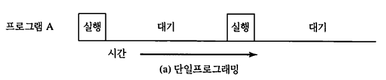
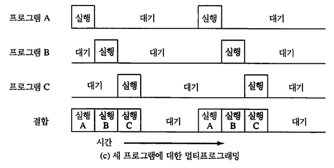
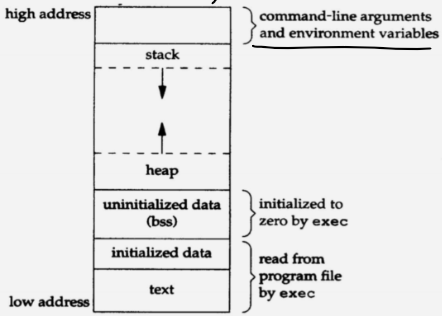
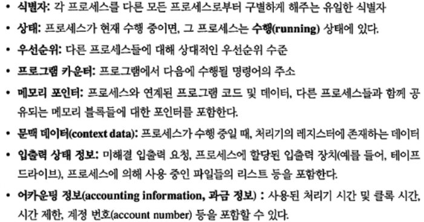
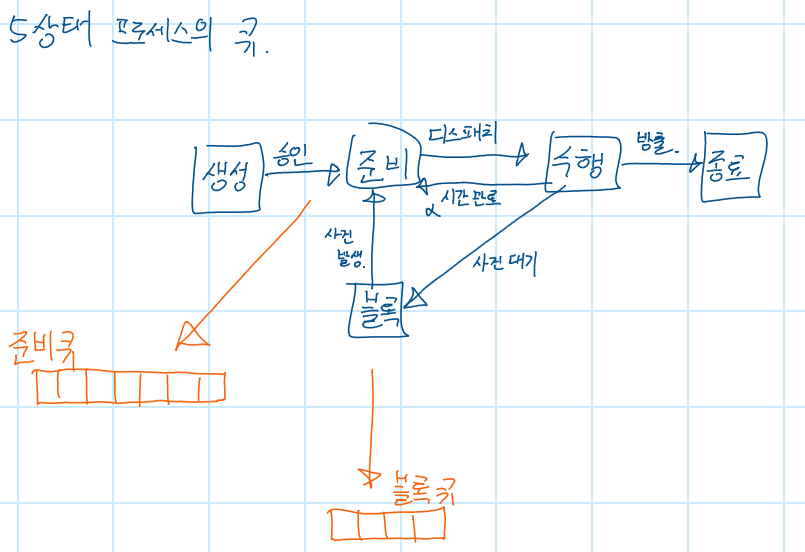

# 오늘 할 일

- [x] 운영체제의 역할에 대해 정리한다
- [x] 운영체제의 발전에 대해 간단하게 정리한다.
- [x] 시분할 운영체제에 대해 정리한다
- [x] 프로세스가 왜 나왔는지 정리한다
- [x] 프로세스의 메모리구조에 대해 정리한다
- [x] 프로세스 제어블록에 대해 정리한다
- [x] 프로세스 컨택스트에 대해 정리한다
- [x] 프로세스 컨택스트 스위칭에 대해 정리한다
- [x] 스레드에 대해서도 간단하게 정리한다
- [x] 프로세스 상태전이도-5단계 정리하기
- [x] CPU 스케줄링 알고리즘(라운드로빈) 정리하기
- [ ] ~~하버드구조와 폰노이만 구조를 정리한다~~
- [ ] ~~코테문제 풀기~~

##### 안한거

* 폰노이만구조랑 하버드구조 정리. 이건 내일할래.

# 오늘 배운 내용  
## 대체 프로세스는 왜 생겼을까?

그 전에 운영체제부터 정리하자.

### 운영체제

#### 운영체제의 역할

여러가지 역할이 있는데, 그 중 하나가 **응용 프로그램의 실행을 제어**하는 것이다.

그리고 운영체제는 **사용자가 컴퓨터를 편하게 쓸 수 있게** 도와줘야 된다. 그리고 **시스템 자원을 효율적으로 관리**해줘야 한다.

#### 만약 운영체제가 없다면?

컴퓨터는 여러개의 하드웨어로 구성된다. 근데 이 위에서 운영체제 없이 응용프로그램을 만들면 어떤 일이 생길까? 프로그램이 동작하려면 공통적으로 메모리에 값을 저장하고 CPU를 써서 명령어를 수행해야 한다. 응용마다 이게 필요하니까 각자 알아서 하드웨어를 이용하는 기능을 구현할 것이다.  그러면 다음과 같은 문제가 생긴다.

##### 비효율성 = 떨어지는 재사용성

응용프로그램 하나 만드는데 하드웨어를 이용하고 관리하는 코드도 작성해야 한다. 시간이 엄청 걸리겠다. 

##### 비일관성

물론 표준을 만들고 이걸 지켜가면서 하드웨어를 이용하는 코드를 짠다면 괜찮을 수도 있겠지만, 모든 프로그램이 다 완벽하게 표준을 지킬 것이라는 보장이 없지 않은가. 그래서 일관성이 떨어질 수 밖에 없다.

#### 운영체제가 있다면?

어떤 프로그램이던 메모리랑 CPU는 당연히 쓸것이고, 파일시스템에 접근하는 응용프로그램도 매우 많겠지 않은가? 그리고 방법도 다 같을 것이다. 어떤 프로그램이던 CPU랑 메모리랑 파일시스템을 쓰는 방법이 천차만별일 이유가 없다. 그러니까 이걸 **일관성있게 하나의 프로그램으로 만들면** 어떨까? 응용프로그램이 하드웨어를 쓰기 위해 코드를 새로 짤 필요 없이, **일관성있는 하드웨어 제어 프로그램**에 요청해서 원하는 기능을 수행할 수 있게 되면 위에서 말했던 비효율성과 비일관성 문제를 해결할 수 있다.

이런 프로그램을 운영체제라고 부른다. 그리고 응용 프로그램이 하드웨어와 같은 시스템자원을 편리하고 일관성 있게 쓸 수 있게 도와주는 일을 시스템 자원의 추상화라고 부른다. 운영체제는 시스템의 자원을 사용하는 공통적인 루틴(방법)을 제공한다.

하드웨어만 관리하면 되는게 아니다. 응용프로그램마저 관리해주어야 한다. 사용자는 하나의 컴퓨터를 가지고 여러 프로그램을 동시에 쓰고 싶어한다. 이 요구사항은 어떻게 해야 만족시킬 수 있을까? 고건 시분할 운영체제를 가지고 해결할 수 있다.


### 시분할 운영체제

##### 배경지식

CPU의 코어는 한 순간에 하나의 실행흐름만 처리할 수 있다. 그런데 어떤 프로세스가 자신의 작업이 끝날때까지 계속 CPU를 독점하고 있으면 어떻게 될까? 다른 프로세스들은 이 작업이 끝날때까지 실행될 수 없다.  그러면 싱글코어CPU를 장착한 컴퓨터는 쓰기 매우 불편할것이다. 어떤 프로그램을 쓰면서 다른 프로그램도 쓴다던가 하는게 불가능할것이다. 근데 우리는 카톡도 하면서 게임도하고 음악도 듣고 그런다. 물론 요즘 싱글코어 컴퓨터를 쓰는 사람은 없긴 하지만, 싱글코어 컴퓨터를 써도 카톡하면서 게임도하고 음악도 들을 수 있다. 이게 왜 가능한 걸까? 그건 우리가 쓰는 컴퓨터의 운영체제가 멀티 프로그래밍 방식으로 돌아가기 때문이다.

아니 그러면 예전의 운영체제는 어땠을까?

###### 운영체제의 발전과 멀티프로그래밍의 등장

예전의 컴퓨터는 단순 일괄처리 시스템(Simple Batch System)으로 동작했다. 처리하고 싶은 작업들을 전체 작업묶음(batch)으로 만들고 입력장치에 넣는다. 그러면 모니터라는 프로그램이 작업묶음을 일괄처리한다. 어떤 프로그램의 실행이 끝나면, 제어가 모니터 프로그램으로 다시 넘어온다. 그러면 모니터는 다음 프로그램을 적재하고 실행하는 식이다.

근데 한가지 문제가 있다. CPU에 비해서 입출력장치의 속도가 너무 느리다보니, CPU는 입출력장치에 일을 시키면 이게 끝날때까지 아무것도 안하고 기다리게 된다. 이처럼 **단일 프로그래밍** 방식은  CPU시간을 낭비할 수 밖에 없게 된다. 이걸 낭비하지 말고 써먹을 수 없을까? 해서 나온게 **멀티 프로그래밍**이다.

###### 멀티 프로그래밍 ( 멀티프로그래밍은 다른말로는 멀티 태스킹이라고 부르기도 한다. )

단일프로그래밍 방식은 아래 그림처럼 동작한다.

 

어떤 프로그램이 시작되려면, 먼저 수행되고 있는 프로그램이 끝나야 시작할 수 있다. 앞서 설명한 것 처럼, CPU의 처리속도에 비해 입출력장치는 매우 느리기 때문에, 입출력장치에 요청을 하면 그 결과가 응답될 때 까지 CPU는 놀고 있어야 한다. 위의 그림에 있는 대기시간이 바로 CPU가 놀고있는 시간을 말하는 것이다.

그럼 멀티프로그래밍은 어떻게 동작하는지 보자

 

멀티프로그래밍에선 어떤 프로그램이 끝나지 않아도 다른 프로그램을 시작시킬 수 있다. 컴퓨터 성능이 허락하는 한, 많은 프로그램을 시작시킬 수 있다. 

CPU는 어떤 프로세스를 끝날때까지 실행하지 않는다. 타임퀀텀만큼만 실행한다. 그런 다음 다른 프로세스를 타임퀀텀만큼 수행한다. 이런 식으로 수행중인 프로세스를 번갈아가면서 타임퀀텀만큼 실행한다. 또한 입출력장치등에 요청을 하고나면 응답이 올때까지 기다리지 않고, 다른 프로세스에게 CPU를 양보한다. 단일프로그래밍에서 낭비되던 시간에 다른 프로세스를 수행해서 시간낭비를 최소화하는 것이다.  

아 그리고 멀티프로그래밍의 유용한 기능중에 DMA(Direct Memory Access)라는게 있다. 얘는 인터럽트 기반 입출력인데, 이걸 쓰면 효율적으로 입출력장치를 쓸 수 있다. 동작을 간단하게 설명하면, CPU가 입출력장치한테 입출력 명령을 내린다. CPU는 입출력 결과를 안기다리고, 다른 프로세스를 수행한다. 입출력 작업이 완료되면 인터럽트가 발생하는데, 이때 인터럽트 서비스 루틴으로 제어가 넘어가서 입출력 완료에 대한 처리를 할 수 있다. 낭비되는 CPU시간이 줄어들기 때문에 성능향상에 큰 도움이 된다.

정말 좋은 방법이긴 한데, 그만큼 대가를 치뤄야 한다. 이제는 메모리 관리를 해줘야 한다.

단일프로그래밍이라면 하나의 프로그램만 메모리에 올려서 처리하기 때문에 관리해줄게 별로 없지만, 멀티 프로그래밍은 한 순간에 여러개의 프로그램이 메모리에 올라와 있다. 한정된 메모리공간에 여러개의 프로그램을 효율적으로 적재하는 방법도 필요하고, 수행중인 프로그램들이 서로의 메모리에 무단으로 접근하지 못하게 관리해주는것도 필요하다.

##### 그래서 시분할 시스템(Time Sharing)이란...

이름을 보자. 왜 Time Sharing일까? CPU의 시간을 짧은 시간으로 잘개 쪼개고, 그 시간동안 프로그램을 번갈아가면서 수행하기 때문이다. 

현대 운영체제는 시분할 시스템이다. 시분할 시스템에선 여러개의 프로그램을 주메모리에 적재하고, 얘들을 번갈아가면서 수행한다. 다중 사용자 운영체제가 설치된 컴퓨터를 쓴다고 했을 때, CPU는 여러 사용자의 응용프로그램을 번갈아가면서 수행한다. 덕분에 여러명의 사용자가 컴퓨터 한대에 접속해서 쓸 수 있다. 물론, 실제로는 동시에 컴퓨터를 쓴다는건 잘못된 표현이다. 실제로는 한 순간에는 하나의 프로그램만 수행할 수 있다. 다만 CPU시간을 정말정말 작게 쪼갠거라서, 사람이 봤을때는 마치 동시에 동작하는것 처럼 느낄 뿐이다. 

##### 운영체제의 발전에서 나온 부산물들

기나긴 시간동안 사람들의 요구사항을 만족시키기 위해서 운영체제는 계속해서 발전해왔고, 그 과정에서 얻은 이론적 주요 진전으로는 프로세스, 메모리관리, 보안, 스케줄링 및 자원관리 이렇게 4가지가 있다.

오늘 배울 내용은 프로세스에 중점을 두어야 하니, 프로세스만 중점적으로 정리했다.

### 프로세스가 태어난 이유

#### 정의

컴퓨터상에서 수행중인 프로그램의 **인스턴스**로서, CPU에 할당되어 수행될 수 있는 개체(Entity)를 말한다.

#### 프로세스는 뭘 위해 나왔을까?

앞서 정리한 내용처럼, 컴퓨터는 발전을 거듭하면서 멀티프로그래밍 일괄처리, 시분할, 실시간 트랜잭션 시스템이 등장했다. 이 세가지 시스템은 타이밍과 동기화 문제를 발생시켰다. 그리고 이 문제를 해결하기 위해 탄생한게 바로 프로세스이다.

```note
엥, 실시간 트랜잭션은 뭐지? 나중에 정리해봐야겠다.
```

타이밍과 동기화문제는 뭘 말하는걸까? 이걸 말하기 전에 앞서 정리한 내용을 한번 더 정리하자.

##### 멀티 프로그래밍

멀티프로그래밍이란, CPU에 비해 느린 외부장치의 기능을 쓸 때, 요청만 하고 다른 작업을 처리하다가 완료되면 그때 가서 완료에 대한 처리작업을 해주는 식으로 CPU의 시간을 낭비하는 상황을 최소화하는 기법이다.

앞서 말한 DMA처럼, 멀티프로그래밍 방식으로 동작하는 컴퓨터는 CPU시간낭비를 최소화하기 위해 입출력 요청만하고, 그 결과를 기다리지 않고 다른 작업을 처리하다가, 입출력이 완료되면 인터럽트 발생을 통해 완료에 대한 처리작업을 수행하는 등, 효율적으로 동작할 수 있다.

##### 범용 시분할 시스템

이 시스템의 목적은 여러 사용자의 요청에 대해 빠르게 응답하는것, 그리고 가능한 많은 사용자를 동시지원하는것이다. CPU시간을 잘개 쪼개고, 이 시간만큼 여러사용자의 프로그램을 번갈아가며 실행한다. 근데 쪼갠 시간이 매우 짧아서 여러 사용자들이 하나의 컴퓨터를 공유해서 쓸 수 있다.

```note
일괄처리 멀티프로그래밍 시스템은 사용자가 한개 또는 몇개의 응용프로그램만 쓸 수 있는 반면, 시분할 시스템의 경우에는, 프로그램개발, 작업수행, 다양한 응용프로그램을 사용할 수 있다고 한다. 책에 있는 내용 고대로 쓴건데, 이건 볼때마다 느끼는거지만 무슨 말인지 잘 모르겠다.
```

##### 다양한 작업수행 과정을 순서있게 처리할 수 있는 방법은?

동일 시간대에 진행중인 많은 작업(프로그램?)이 있다고 치자. 이걸 어떤 순서로 처리해야 할까? 옛날의 시스템 프로그래머들은 여기서 많이 힘들었다고 한다. 버그가 생겨도 이게 왜 발생하는지 찾기도 힘들고, 응용 프로그램의 에러인지, 하드웨어의 에러인지 구분하기도 어려워서 그랬다고 한다. 

멀티프로그래밍 시스템이나 시분할 시스템에서 어려움을 겪었던 주된 4가지는 동기화문제, 상호배제 실패문제, 비결정적인 프로그램 연산문제, 교착상태 문제가 있다고 한다. 

동기화문제가 말하는 것은, 어떤 프로그램이 어떤 신호를 기다리면서 보류상태로 기다리고 있었는데, 만약 신호전달기법의 문제로 이게 전달되지 않는다면? 처리되지 않는 문제가 생긴다. 

상호배제 문제의 경우, 다수의 사용자가 동시에 공유자원을 쓰는경우 발생할 수 있는데, 얘들이 같은 파일을 수정한다면? 서로가 서로의 작업을 덮어쓴다던가 하는 문제가 발생할 수 있으니, 한 순간에 하나만 접근해서 쓸 수 있는 상호배제 기법이 필요하다. 

비결정적 프로그램 연산은 앞서 상호배제문제와 약간 비슷한데, 어떤 연산을 위해 입력에만 의존하는 프로그램이 있다고 치자. 근데 멀티프로그래밍 시스템이다. 같은 공유메모리를 쓰는 여러 프로그램이 인터리빙 방식으로 실행된다면? 얘네 중 한 프로그램이 공유된 메모리에 값을 쓴 것 때문에 결정적인 연산을 해야하는 프로그램이 영향받아서 이상한 결과가 나온다면? 이렇게 문제가 생기는거다.

어떤 두 프로그램 A,B가 있는데, 얘네 둘은 각각 자원a,b를 갖고 있다. 근데 A는 b를 원하고 B는 a를 원한다. 둘 다 자원을 가진 상태로 서로가 자원을 양보하기를 기다리고 있다면? 그리고 서로 절대 양보 안하면? 영원히 기다리게 된다. 이런 상태를 교착상태라고 한다.

이렇게 문제가 많다보니, 머나먼 고대의 똑똑한 사람들은 수행중인 프로그램들을 감시하고 제어하기 위한 방법을 만들었다. 그렇게 탄생한게 바로 프로세스이다. 

프로세스에는 수행 가능한 프로그램과 프로그램 수행에 필요한 데이터(변수, 작업공간, 버퍼), 프로그램 수행문맥 ( 프로세스 컨택스트라고도 부른다 )으로 구성된다. 그러면 메모리에서 자리를 차지한 프로세스는 어떻게 생겼을까? 

```note
여담.
그래서 프로세스는 이런 문제를 어떻게 해결했을까?
나중에 차근차근 공부하면서 이 내용도 정리해보자.
지금 이거까지 다 하기엔 너무 방대하고 어려운 내용이다.
```

### 프로세스의 구성

프로세스의 구성을 메모리구조랑, PCB랑 프로세스 컨택스트 이 세가지로 나눠서 정리해보았다.

#### 프로세스의 구성 - 1, 프로세스의 메모리 구조

 

##### 텍스트

CPU가 실행할 바이너리 코드가 저장된 부분이다. 다시말해서, 프로그램의 소스코드가 컴파일되어 실행가능한 바이너리코드가 되는데, 이게 텍스트 영역에 있다

##### 데이터

초기화한 데이터 구조에 따라서 읽고 쓰는게 가능한 영역이다. 초기화 여부로 별도관리해서 두공간으로 나눠놨다는건가?

```note
Initialized data영역이랑 uninitialized data 영역은 초기화 됐고 안됐고로 나뉜건가? 흠. 좀 더 공부해봐야겠다.
```

##### 힙

프로그램 실행중에 동적으로 메모리를 할당해서 쓸 수 있는 영역을 말한다. new 등으로 클래스를 인스턴스로 만들면 요기 힙 영역에 동적으로 메모리가 할당된다.

그렇다보니, 여러 함수에서 공유해야하는 자원이라던가, 함수가 리턴되어도 남아있어야 하는 자원은 동적할당을 해서 힙 메모리에 저장하거나 데이터 영역(전역변수로 저장)에 저장해야 한다. 만약 스택에 저장된 값을, 해당 함수가 리턴된 다음에 호출하려고 하면 메모리 접근위반으로 프로그램이 죽을 것이다. 근데 자바도 그럴 수 있나?

##### 스택

함수를 호출하면 지역변수도 쓰고 패러미터도 쓰고 그러는데, 이 정보가 스택영역에 쌓인다. 함수 호출할때의 복귀주소같은것도 이곳에 저장된다. 함수가 리턴되어 종료되면, 스택에서 함수가 할당한 공간도 지워지기 때문에, 일시적인 데이터를 저장하는 메모리영역이라고 할 수 있다.

```note
사용자의 스택이랑 커널의 스택도 정리하자.
ㅎㅎ 그러면 추가로 공부할거 엄청 많을텐데...... 힘들다......
```


#### 프로세스의 구성 - 2, 프로세스의 PCB

* PCB(Process Control Block, 프로세스 제어블록)는 운영체제가 관리하는 자료구조이다. 

  다시말해서, 커널(운영체제)꺼다.

* 운영체제는 PCB를 가지고 프로세스를 감시하고 제어한다.

* 프로세스의 정보를 담고 있는만큼, PCB는 너무 소중한 자료구조라서 일반 사용자가 접근하지 못하게 보호된 메모리 영역 안에 있다. 일부 운영체제에서는 PCB는 커널스택의 처음에 위치한다고 한다.

  [by 위키피디아 프로세스 제어블록](https://ko.wikipedia.org/wiki/%ED%94%84%EB%A1%9C%EC%84%B8%EC%8A%A4_%EC%A0%9C%EC%96%B4_%EB%B8%94%EB%A1%9D)

* 비슷한 친구로 TCB라는 애도 있다. 얘는 Thread Control Block으로 스레드를 감시하고 제어하는데 쓰이는 자료구조이다.

* 참고로 프로세스의 컨택스트는 프로세스의 PCB에 기록되어 있다.

  [by 위키피디아 문맥교환](https://ko.wikipedia.org/wiki/%EB%AC%B8%EB%A7%A5_%EA%B5%90%ED%99%98)

* PCB안의 내용은 대충 이렇다



#### 프로세스의 구성 - 3, 프로세스의 문맥(컨택스트, Context)

프로그램 수행문맥 ( 프로세스 컨택스트라고도 부른다 ). PCB에 기록되어 있다.

프로세스 컨택스트란, 운영체제가 프로세스를 감시하고 제어할 때 필요한 내부적인 데이터이다. CPU가 프로세스를 처리하기 위해선 다양한 정보가 필요하다. 예를들면, 프로그램 카운터나 명령어 레지스터, 데이터 레지스터 등의 정보가 있어야 한다. 컨택스트 스위칭 이후, 프로세스의 수행을 재개하기 위해서, 이 정보를 가지고 있을 공간이 필요한데, 그게 이거다.

그 외에도 운영체제가 프로세스의 상태를 감시하는데 쓰는 정보도 있다. 운영체제가 어떤 프로세스가 지금 어떤 상태인지, 어떤  입출력 이벤트를 기다리고 있는지 알고 싶다면, 수행문맥을 보면 된다.

#### 프로세스의 상태전이도




와 글씨 진짜 못써. 내가 쓴거지만 진짜 글씨 못쓴다.

여튼간에 프로세스가 생성되면 준비상태로 전이된다. CPU스케줄러의 선택을 받은 프로세스는 준비상태에서 수행상태로 전이된다. 이걸 디스패치된다고 표현한다. 수행상태로 전이된 프로세스는 CPU에 의해 수행된다. 작업이 다 끝나면, 종료상태로 전이된다. 작업이 다 안끝나고, 운영체제에 의해 강제로 프로세스 스위칭되는 경우, 블록이나 준비상태로 전이될 수 있다.

프로세스가 자원을 요구했다고 치자. 예를 들면 IO요청을 했다. 그럼 그 결과가 올때까지 CPU를 붙들고 기다리지 않는다. 프로세스 스위칭이 발생해서 다른 프로세스를 수행한다. 그럼 수행중이던 프로세스는 블록상태로 전이되고, 자신이 요청한 작업의 완료를 알리는 이벤트가 오기를 기다린다. 

이벤트가 발생하면, 블록상태에 있던 프로세스는 준비상태로 전이되고, 스케줄러의 선택을 기다린다.

상태전이도를 정말 간단하게 표현하면, 저런식으로 준비큐랑 블록큐가 있다. 준비큐에는 스케줄러의 선택을 기다리는 프로세스들이 살고있다. 블록큐에는 어떤 이벤트를 기다리는 프로세스들이 살고있다. 요건 이벤트마다 별도의 큐를 두는걸로 구현할 수 있다.

#### 프로세스 교환과 문맥교환(Process Switching, Context Switching)

##### 프로세스 교환시점

현재 수행중인 프로세스는 여러가지 이유로 수행이 중단될 수 있다. 중단사유는 아래와 같다

* 클록(타이머) 인터럽트
* 입출력 인터럽트
* 운영체제 시스템 콜
* 신호(세마포어)

정리하면, 프로세스는 자기 작업을 다 마치거나, 또는 필요에 의해 CPU를 양보할 수 있다. 아니면, 운영체제가 봤을 때, 뭔가 급한 일이 있거나(인터럽트가 발생했다거나)하면, 현재 수행중인 프로세스로 부터 강제로 CPU를 양보하게 만들 수 있다. CPU를 양보한다는건 결국 현재 수행중인 프로세스를 바꾸겠다는 말과 같다. 이걸 프로세스 스위칭이라고 부르는 것 뿐이다.

앞서 CPU는 타임퀀텀만큼 프로세스를 번갈아가면서 수행한다고 말했는데, 이 "번갈아 가면서" 라는 말을 주의깊게 보자. 번갈아 간다는 건, 현재 수행중인 프로세스를 바꿔간다는 말과 같다. 뭐 그런거다 ㅇㅇ.

정리하면, 현재 수행중인 프로세스로 부터 CPU를 뺏고, 다른 프로세스를 수행하는걸 프로세스 스위칭이라고 부르는 거고, 이게 발생하는 이유, 다시 말해서 언제 발생하는지는 위의 내용과 같다.

##### 프로세스 스위칭의 과정

모드스위칭이 발생하면, 현재 수행중이던 프로세스와 새로 디스패치될 프로세스의 입장을 알아야 한다.

###### 현재 수행중인 프로세스의 입장

​	만약 작업이 다 안끝났다면, 언젠간 다시 디스패치되어 수행을 재개해야 한다. 그때를 위해 수행에 필요한 정보	(문맥 데이터)를 보관해야 한다.

###### 새로 디스패치된 프로세스의 입장

​	당장 수행을 재개해야 하니까, 보관해놨던 수행에 필요한 정보(문맥데이터)를 꺼내서 세팅해야한다.

###### 프로세스 스위칭이 이루어지는 과정

1. 프로세스A의 프로그램 카운터와 다른 레지스터들을 포함한 처리기 문맥(PC 등의 레지스터 정보)을 저장한다
2. 현재 수행상태에 있는 프로세스A의 PCB를 업데이트한다. 그런 다음, 수행상태로 부터 준비나 블록, 준비/보류상태 등으로 전이된다. 잘자요. 바이바이.
3. 프로세스A의 PCB를 적절한 큐(준비, 블록, 준비/보류 등등)로 옮긴다
4. 단기 스케줄링 알고리즘에 따라 준비상태 프로세스 중에서 다음에 수행시킬 프로세스B를 선택한다.
5. 선택된 프로세스B의 PCB를 업데이트한다. 그리고 얘는 수행상태로 전이된다.
6. 메모리 관리와 관련된 자료구조를 갱신한다 ( 요 내용은 기억이 안나니까 다시 공부하자(3부에서 다룬데))
7. 선택된 프로세스가 이전 수행상태에서 사용하던 CPU의 문맥데이터를 복원한다. 복원이 뭐냐면, PCB에 기록된 레지스터 정보를 읽어서 CPU의 레지스터에 넣는걸 말한다. 수행 재개해야 하니까 하는거다.

**CPU를 뺏기면 다음 수행을 위해 자신의 PCB에 컨택스트 정보를 보관해두고, 다시 얻으면 수행재개를 위해 PCB에 있던 컨택스트 정보를 복원한다. 이 사실을 기억하자.**

### 프로세스와 스레드

프로세스는 수행중인 프로그램이다. 따라서 프로세스는 수행을 위해서, CPU 스케줄러에 의해 디스패치되는 자원을 가지고 있어야 한다. 이러한 실행흐름을 쓰레드라고 부른다. 모든 프로세스는 태어날 때, 단 하나의 스레드를 가지고 있다. 수행중에 자식스레드를 추가로 가질 수 있다. 중요한건, 스레드도 자원이고, 이게 스케줄러에 의해 디스패치되는 자원이라는 점이다. 그래서 멀티코어 CPU라고 해도, 싱글스레드프로그램은 큰 성능향상을 기대하기 어려운 이유가 바로 이것이다. 한 순간에 디스패치될 수 있는 자원(실행흐름, 스레드)이 하나뿐이라서, 한 순간에 하나의 코어에서만 실행될 수 있기 때문이다. 코어가 많아진 만큼 CPU경쟁이 줄어드니까 이걸로 성능향상을 얻을 수 있다고 할 수 있긴 하지만, 글쎄, 그걸로 얻는 성능상 이점이 얼마나 될지는 잘 모르겠다.  

```memo
2021-01-22 CS10 호눅스님 수업 듣고 나서 여담
싱글코어 프로세서에서 멀티스레드로 돌리면 성능이 향상된다는데 정말?
```


## CPU 스케줄링

CPU 스케줄링은 장기, 중기, 단기 스케줄링으로 나뉜다.

#### 장기 스케줄링

장기 스케줄링은 프로세스를 시스템에 진입시킬지 말지를 결정한다. 그래서 프로그램은 장기 스케줄러의 선택을 받아야 프로세스로 태어날 수 있다.

프로세스가 많아지면 많아질 수록 CPU에 대한 경쟁이 심해진다. CPU는 하나인데, 프로세스는 매우 많은데다가, CPU는 한 순간에 하나의 프로세스만 처리할 수 있다. 그래서 프로세스가 너무 많아지면, 그만큼 프로세스에 할당되는 타임퀀텀은 짧아진다. 짧은 시간동안만 처리될 수 있느니 프로세스의 작업이 다 끝날 때까지 그만큼 더 오랜 시간이 걸릴 것이다.

#### 중기 스케줄링

시스템에 따라 새로 생성된 프로세스는 무조건 스왑아웃상태로 시작하기도 한다. 얘는 중기 스케줄러로 들어가는 큐에 들어간다.

중기 스케줄링 알고리즘은 프로세스가 스왑 인과 아웃을 어떻게 할지 결정하는 알고리즘이다. 이게 뭐였더라? 이것도 나중에 정리하자

#### 단기 스케줄링

단기 스케줄링은 다음에 실행할 프로세스를 결정하는 것을 말한다. 다른말로는 CPU 스케줄링이라고 부른다. 라운드로빈이나 HRRN등 여러가지가 있는데, 나중에 공부해보도록 하자.

```note
CPU 스케줄링 알고리즘은 나중에 다시 제대로 정리하도록 하자
```

### 프로세스 상태전이도 시뮬레이션

프로세스마다 작업완료까지 걸리는 시간이 있다. 예를 들면, 프로세스 A는 작업이 완료되기까지 3초만큼의 시간이 필요하다. 스케줄링 알고리즘은 FIFO이다. 그래서 그냥 큐를 쓰면 될  것 같다.

#### 요구사항 수정

준비상태랑 대기상태를 말하는데, 프로세스가 시작하면 대기큐에 들어간다고 한다. 근데 나한테는 이 표현보다는 준비큐에 들어간다는 표현이 더 와닿는다. 그리고 대기상태보단 블록상태가 나한테는 더 익숙해서 용어를 바꿔서 구현하려고 한다.

#### 프로세스와 PCB를 구현하자

프로세스마다 가상의 텍스트공간을 구현한다. 처리가 필요한 명령어들이 요기에 저장되어 있고, 각각의 명령어는 수행에 1초가 걸리는 상황이라고 가정하려고 한다. 이건 큐로 표현한다. 예를들면, 작업완료에 3초가 걸리는 프로세스가 있다고 치면, 텍스트영역에 1초걸리는 명령어가 3개 있다고 치자. 그럼 큐에 작업을 3개 넣는걸로 구현하자

```java
public class MyProcess {
    MyProcessControlBlock pcb;
    Queue<MyInstruction> textArea;
}
```

프로세스 안에 PCB를 만들자. 요기에 pid, 타임아웃시간, 사용한 CPU시간, 프로세스 상태정보등을 저장하자. 실제 프로세스가 그렇게 되어있으니까.

```java
public class MyProcessControlBlock {
    public String pid;
    public MyProcessState processState;
    public int usedCPUTime;
    public int requiredTotalCpuTime;
    public int numberOfThreads;
    public int timeout;
}
```

#### 시뮬레이터의 구현

운영체제는 프로세스를 pcb를 이용해서 프로세스를 감시하고 제어한다.

프로세스는 생성, 준비, 수행, 블록, 종료상태 총 5가지 상태로 관리된다. 

수행상태를  제외한 상태는 큐로 구성된다.

수행상태인 프로세스는 단 하나이다. 단일코어가 한 시점에 처리할 수 있는 실행흐름은 단 하나뿐이니까 그렇다.

 

요걸 자바로 구현해보자. 근데 블록상태로 전이되는 케이스를 확인하지 못했다. 그래서 블록상태는 빼고 구현하려고 한다.

```java
public class MyOperatingSystem {
    Queue<MyProcess>    stateReady;
    MyProcess           stateRunning;
    Queue<MyProcess>    stateTerminated;
    Queue<MyProcess>    stateCreated;
    public void execSimulator(){//시뮬레이터 메인루프
        while (!stateCreated.isEmpty()){//시작상태에 있는 모든 프로세스를 준비상태로 전이시킨다.
            stateReady.add(stateCreated.poll());
        }
        while (stateRunning != null || stateReady.size() != 0){
            if(stateRunning != null && stateRunning.getTimeOut() != 0){
                execProcess();
                continue;
            }
            if(stateRunning != null){
                onProcessTimeOut();
            }
            dispatchProcess();
            execProcess();
        }
        printAllProcesses();
        System.out.println("모든 프로세스가 종료되었습니다.");
    }
    public void startProgram(MyProcess newProcess){//생성->준비
        stateReady.add(newProcess);
        newProcess.setStateReady();
    }    
    private void dispatchProcess(int timeout){//준비 -> 수행
        stateRunning = stateReady.poll();
        assert stateRunning != null;
        stateRunning.setStateRunning();
        stateRunning.setTimeOut(timeout);
    }
    private void execProcess(){//프로세스 수행
        if(stateRunning.fetchInstruction() == null)
            return;
        stateRunning.addUsedCpuTime(getProcessedTime(stateRunning));
        stateRunning.reduceTimeOut();
        printAllProcesses();
        if(stateRunning.isTaskFinished())
            onProcessRelease();
    }
    private int getProcessedTime(MyProcess process){//프로세스의 실행시간을 계산.
        if(missionNumber == 1){
            return 1;
        }else {
            return 2*process.getNumOfThreads();//pcb에서 스레드개수를 읽어서 계산한다.
        }
    }
    private void onProcessTimeOut(){//수행 -> 준비
        MyProcess tmp = stateRunning;
        stateRunning = null;
        tmp.setStateReady();
        stateReady.add(tmp);
    }
    private void onProcessRelease(){//수행 -> 종료
        MyProcess tmp = stateRunning;
        stateRunning = null;
        tmp.setStateTerminated();
        stateTerminated.add(tmp);
    }
}
public class MyProcess {
    MyProcessControlBlock pcb;
    Queue<MyInstruction> textArea;
    public void reduceTimeOut(){
        pcb.timeout--;
    }
    public int getTimeOut(){
        return pcb.timeout;
    }
}
```

* 현재 수행중인 프로세스가 있으면서 타임아웃되지 않았다면, 얘를 수행하고 다음 타임퀀텀으로 넘어간다.
* 현재 수행중인 프로세스가 있는데 타임아웃되었다면, 얘를 준비상태로 전이시킨다.
* 준비상태 큐에서 프로세스 하나를 수행상태로 디스패치한다.
* 현재 수행중인 프로세스를 실행한다.
* 이런 작업을 준비상태에 남은 프로세스가 없으면서 현재 수행중인 프로세스도 없을때까지 반복한다.
* 상태전이를 나타내는 dispatchProcess(), onProcessTimeOut()등의 메서드는 프로세스의 PCB정보를 읽고 제어한다. 예를 들면, execProcess()로 프로세스를 수행할때마다 pcb의 타임아웃값을 수정한다. 이런식으로 실제 운영체제처럼 pcb를 읽고 프로세스를 제어하도록 구현했다.


***

# 코딩일일결산

#### 내일의 나에게 보내는 전달사항

* 하버드구조랑 폰노이만 구조 차이 정리할 것

#### GOOD

* 와 운영체제를 만들었다. 와아.

#### BAD

* 
