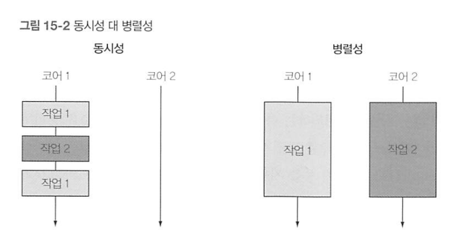
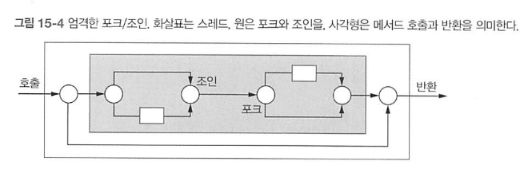
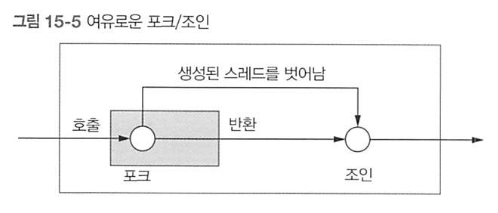
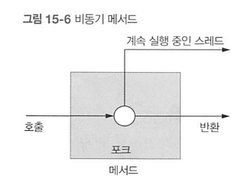
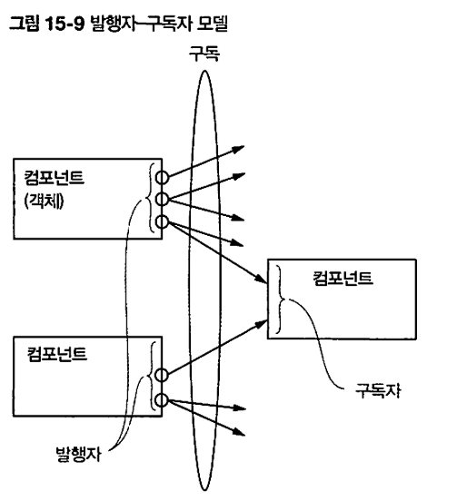

# 오늘 할 일

- [x] 동기와 비동기에 대해 공부하기

# 오늘 배운 내용  

### Sync, Async, Blocking, NonBlocking의 차이

[Sync -Async, Blocking-NonBlocking](https://www.youtube.com/watch?v=IdpkfygWIMk)

이걸 보고 정리해보자

## CompletableFuture : 모던 자바 인 액션

[추가참조](https://laughcryrepeat.tistory.com/47)

아래의 내용은 책을 읽고 느낀 제 생각을 정리한 글입니다. 따라서 책의 저자가 말하고자 한 내용과 다른 내용이 있을 수 있고, 틀린내용이 있을지도 모릅니다. 혹시 틀린 내용이 있다면 블로그 깃헙 저장소의 이슈탭에 코멘트를 남겨주시면 감사하겠습니다!

### 최근 SW개발 방법을 뒤집는 두가지 추세

#### 첫번째 추세 : 병렬처리 = 멀티코어 활용

클록속도를 무한히 빠르게 만드는건 불가능하다. 발열을 잡을 수 없기 때문이다. 그 대신 코어를 여러개 두기로 했다. 그리고 하나의 태스크를 여러개의 작은 태스크로 나누고, 여러개의 코어에서 병렬로 처리하여 더 짧은 시간에 태스크를 처리할 수 있게 하였다. 이게 병렬처리라고 생각한다.

#### 두번째 추세 : 마이크로서비스 아키텍쳐

##### 마이크로서비스 아키텍쳐

> ​	마이크로서비스는 소프트웨어가 잘 정의된 API를 통해 통신하는 소규모의 독립적인 서비스로 구성되어 있는 경우의 소프트웨어 개발을 위한 아키텍처 및 조직적 접근 방식입니다. 이러한 서비스는 독립적인 소규모 팀에서 보유합니다.
>
> [from aws](https://aws.amazon.com/ko/microservices/)

자율성과 전문성을 가진 마이크로서비스 아키텍쳐를 만들고, 얘들을 융합해서 새로운 서비스를 만든다. 이게 요즘의 트랜드라고 한다. 예를들면, 내 애플리케이션에 구글 번역서비스를 붙여서 새로운 서비스를 만들 수 있는데, 이게 마이크로 서비스 아키텍쳐를 응용한 경우이다.

##### 마이크로서비스 아키텍처방식을 쓰면 네트워크 통신이 많아지게 된다.

근데 네트워크를 통해서 서비스를 요청하고 결과를 응답받는거니까, 오래 걸릴 수 있다. 또 네트워크가 느려서 지연되기 시작하면 더 오래 걸릴 수 있다. 이때 내 프로그램이 외부 서비스에 요청한걸 계속 기다리고 있다면? 기다리는동안 아무것도 못한다면? 사용자는 애플리케이션이 죽었나보다 생각할지도 모른다. 

##### 비동기 처리의 필요성

그래서 비동기처리를 해야한다. 외부서비스가 결과를 응답해주기를 기다리지 말고, 내 애플리케이션은 요청만 하고 다른 일을 하고 있어야 한다. 화면을 갱신해준다던가, 아니면 다른 작업을 처리하고 있어야 한다. 처리기가 해야 할 일은 산더미인데, 의미없이 아무것도 안하고 기다리고 있는 꼴은 참을 수 없다.(처리기 불쌍해...)

근데 이걸 어떻게 구현하느냐가 문제다. 책에 따르면, 자바는 이런 환경에서 사용할 수 있는 두가지 주요도구를 제공한다. Future인터페이스로 자바 8의 CompletableFuture를 써서 구현하거나, 아니면 자바9에 추가된 발행구독 프로토콜에 기반한 리액티브 프로그래밍 개념을 따르는 Flow API를 쓰면 된다고 한다.

### 동시성(Concurrency)과 병렬성(Parallelism)

두 속성은 프로그래밍의 속성에 관한 것으로, 절대로 반대되는 개념이 아니다. 그저 실행이 겹치냐 마냐에 대한 이야기와 하드웨어에 의해 동시에 처리될 수 있느냐의 차이이다.



#### 동시성

단일코어 머신에서 발생할 수 있는 프로그래밍 속성으로, 실행이 서로 겹칠 수 있음을 말한다.

#### 병렬성

하드웨어 수준에서 병렬로 실행되는 것을 말한다

### 자바의 스레드

자바 스레드는 직접 운영체제 스레드에 접근한다. 운영체제 스레드를 만들고 종료하려면 비싼 비용을 치러야 한다. 거기다가 수량도 제한되어있다. 그래서 기존 스레드가 실행중인데 계속 새 스레드를 만들면 애플리케이션이 크래시될 수 있다고 한다.

### ExecutorService와 newFixedThreadPool

자바의 ExecutorService는 테스크를 제출하고, 나중에 결과를 수집할 수 있는 인터페이스를 제공한다고 한다. newFixedThreadPool같은 팩토리 메서드 중 하나를 이용해서 스레드 풀을 만들어서 사용할 수 있고 한다.

ExecutorService newFixedThreadPool(int nThreads) 이 메서드는 **워커스레드라 불리는 nThreads**를 포함하는 **ExecutorService**를 만들고, 이들을 스레드 풀에 저장한다.  하여튼 newFixedThreadPool을 가지고 워커스레드를 포함하는 ExecutorService라는걸 만드나보다. 음음! newFixedThreadPool로 ExecutorService라는 워커스레드풀을 만든다. 

여하튼 스레드풀 ExecutorService는 스레드풀에서 사용하지 않은 스레드로, 제출된 태스크를 먼저 온 순서대로 실행한단다. 태스크  실행이 종료되면 이들 스레드 풀로 반환한단다...? 그러면 하드웨어에 맞는 수의 태스크를 유지함과 동시에 수천개의 태스크를 스레드 풀에 아무 오버헤드 없이 제출할 수 있다고 한다. 뭔 소리지.

하여튼 ExecutorService에 태스크를 던지면 스레드풀에서 스레드 하나 꺼내서 이걸 처리하나보다.

```note
블로킹을 유발하는 = 스레드를 재우거나 이벤트를 기다리게 하는.
```

k개의 스레드를 가진 스레드풀은 k만큼의 스레드만 동시에 실행시킬 수 있다. 이걸 초과하는 태스크는 큐에 쌓아둔다. 불필요하게 스레드를 만들었다간 아까 말했듯이, 애플리케이션에 크래시가 발생할 수 있다. 근데 태스크 중에서, 블로킹 상황을 유발하는 태스크가 있다면 피해야 한단다. 워커스레드가 이런 태스크를 꺼내서 처리하게 되면, 워커스레드가 블록되버린다. 태스크에 워커스레드를 할당한거라서, 블로킹되버리면 그만큼 태스크를 처리할 스레드가 하나 줄어든 것. 

스레드 풀에 5개의 스레드가 있다고 치자. 태스크는 20개 있다고 치자. 근데 제출된 태스크 3개가 블로킹을 유발해서 워커 스레드 3개가 블로킹당했다고 치자. 그럼 얘들이 깨어날때까지 남은 두개의 스레드만 작업할 수 있게 된다.  그럼 효율이 너무 떨어지니까, 블로킹을 유발하는 태스크는 스레드풀에 던지면 안된다고 한다.

뭔가 이해가 되다말다하는 기분이다. 내가 맞게 쓴건지도 모르겠다. 사실 거의 책을 배끼다시피 썼다. 일단 이해가 안되니 이렇게라도 공부해보자.

### 엄격한 포크/조인과 여유로운 포크/조인.

어떤 메서드에서 새로운 태스크(실행흐름)를 만들었다고 치자. 이때 메서드의 반환 후에도 태스크가 계속되냐 마냐를 가지고 다음과 같이 구분할 수 있는 모양이다.

#### 엄격한 포크/조인



어떤 메서드A 안에서 스레드B가 시작되었다고 치자. 그러면 메서드A는 스레드B기 끝나기를 기다린다. 이게 왜 엄격한건지는 잘 모르겠지만 하여튼 이게 엄격한거란다.

#### 여유로운 포크/조인



반면 여유로운 포크/조인의 경우, 어떤 메서드A는 스레드B의 작업완료를 기다리지 않고 리턴해버린다. 책에서는 메서드를 벗어나도 계속 실행되는 동시성에 초점을 두는거라고 한다.

#### 비동기 메서드



어떤 메서드A에서 어떤 태스크B를 만들었다고 치자. 메서드A는 반환되었지만, 태스크B는 계속 실행중이다. 이런걸 비동기 메서드라고 한단다.

#### 주의할 점

* 두개 이상의 실행흐름(스레드)이 생기는 경우, 공유자원에 대해 동시접근하는 경우, Race Condition이 발생할 수 있음을 인지해야한다. 필요에 따라서 동기화가 필요할 수 있다.
* 스레드풀의 워커스레드가 일하는 중인데, main메서드가 리턴되면 어떻게 될까? 만약 강제로 스레드를 죽인다면? 죽은 스레드가 하던 작업을 강제중지시켜서 문제가 생긴다면? 안되겠다. 그래서 애플리케이션에서 만든 모든 스레드를 추적하고, 애플리케이션 종료 전에 스레드풀을 포함한 모든 스레드를 종료하라고 한다.
* 자바의 스레드는 setDaemon메서드를 이용해서 데몬 또는 비데몬으로 구분할 수있다고 한다. main메서드는 모든 비데몬 스레드가 종료될 때까지 프로그램을 종료하지 않고 기다리지만, 데몬스레드는 애플리케이션이 종료될 때 강제종료된다고 한다. 만약 강제중단되면 안되는 작업이 있다면 데몬스레드에 시키지 않는편이 좋겠다.

### 여담 : 스레드에게 바라는 것

* 병렬성 극대화. 멀티코어를 최대한 갈구고 싶다.

* 어떻게? 프로그램 구조를 작은 태스크 단위로 구조화하면 된다.

* 병렬스트림 처리와 포크/조인을 써서 할 수 있다?

  (아직 이부분을 제대로 공부 못했다. 나중에 할 수 있도록 하자)

### 비동기 함수를 만들어보자.

어떤 태스크를 작은 태스크로 나눈다고 치자. 그렇게 해서 fx랑 gx가 생겼고, 얘네 처리하는데 긴 시간이 걸린다고 치자.

```java
void testThread() throws InterruptedException {
    Result result = new Result();
    Thread t1 = new Thread(()->{result.left = workerFx(NUMBER_OF_OPERATION);});
    Thread t2 = new Thread(()->{result.right = workerGx(NUMBER_OF_OPERATION);});

    t1.start();
    t2.start();
    t1.join();
    t2.join();
    return result.left + result.right;
}
```

이걸 ExecutorService를 써서 구현해보자

```java
int test2() throws InterruptedException, ExecutionException {
    //엑시큐터스의 nFTP메서드로 엑시큐터서비스라는 스레드풀을 생성한다.
    ExecutorService executorService = Executors.newFixedThreadPool(2);

    //엑시큐터서비스에 태스크를 제출한다.
    Future<Integer> left = executorService.submit(()->workerFx(NUMBER_OF_OPERATION));
    Future<Integer> right = executorService.submit(()->workerGx(NUMBER_OF_OPERATION));
    System.out.println("submit task complete!");

    int sum = left.get() + right.get();
    executorService.shutdown();
    return sum;
}
/**** output
submit task complete!
Fx >> Thread ID : 13 >> Start Task... 
Gx >>Thread ID : 14 >> Start Task... 
Gx >> Thread ID : 14 >> Jobs Done... 
Fx >> Thread ID : 13 >> Jobs Done... 
*/
```

엑시큐터서비스의 스레드 풀에 작업 workerFx와 workerGx를 맡겼다. 그런 다음 submit task complete를 출력하게 시켰다. 실제로 submit이 먼저 출력되고, workerFx와 workerGx의 출력이 뒤늦게 찍혔다. 다시말해서 스레드풀에 일은 시켰지만, 이걸 기다리진 않은것이다. 다만, 아래에서 Future클래스의 인스턴스로 get()메서드를 호출하는걸 볼 수 있는데, 여기선 블로킹된다. 다시말해서, 이 작업이 끝나길 기다린다는 것이다. 위에서 봤던 엄격한 포크/조인이라고 할 수 있겠다.

여하튼 책은 이게 맘에 안든다고 한다. submit메서드같은 불필요한 코드로 오염되었느니, 명시적 반복으로 병렬화를 수행하던 코드를 스트림을 이용해 내부반복으로 바꾼것처럼 비슷한 방법으로 해결해야 하느니 하는데, 무슨 소리인지 이해가 안간다. 일단 그냥 따라해보자.......(아 이러면 안되는데......)

여튼 자바의 Future를 이용하면 개선할 수 있단다. 아니면 Flow인터페이스를 이용하면 된다고 한다. 일단 Future형식 API부터 보자.

### Future 인터페이스로 비동기 함수 구현

* 리턴타입을 Future로 설정한다.

* CompletableFuture타입의 인스턴스A를 만든다.

* 시간이 걸리는 태스크를 실행한다. 완료하면 인스턴스A.complete(myValue)를 통해 완료와 결과값을 

  알리도록 설정한다.

* CompletableFuture타입의 인스턴스A를 리턴한다. 이때 주의할 점은, 리턴시점에 태스크가 끝났는지 안끝났는지는 아무도 모른다. 너무 빨리 끝나는 태스크라서 이미 끝났을 수 도 있고, 아직 진행중일 수 도 있다. 

* 메서드를 호출한 쪽은 Future타입의 인스턴스를 받는다. 해당 비동기작업의 결과를 기다리고 싶으면 get을 써서 기다릴 수 있다.

```java
Future<Integer> futureWorkerFx(int x){
    CompletableFuture<Integer> futureSum = new CompletableFuture<>();
    new Thread(() -> {
        int sum = 0;
        for (int i = 0; i < x; i++) {
            sum++;
        }
        futureSum.complete(sum);
    }).start();
    return futureSum;
}
//test3가 비동기 함수 호출한 메서드이다.
int test3() throws InterruptedException, ExecutionException {
    Future<Integer> futureLeft = futureWorkerFx(NUMBER_OF_OPERATION);
    Future<Integer> futureRight = futureWorkerGx(NUMBER_OF_OPERATION);

    return futureLeft.get() + futureRight.get();
}
```

이렇게 해서 비동기함수를 구현했다.

### 비동기함수의 예외처리

근데 예외처리는 어떻게 할까? 비동기함수 내부에서 문제가 생겼다. 근데 이걸 어떻게 외부에 해야 알릴 수 있을까?

```java
public static Future<Integer> exceptionCheckedFutureWorkerFx(int x){
    CompletableFuture<Integer> futureSum = new CompletableFuture<>();
    new Thread(() -> {
        try {
            int sum = 0;
            for (int i = 0; i < x; i++) {
                sum++;
            }
            sum /= 0;//강제로 예외를 발생시킨다.
            futureSum.complete(sum);
        }catch (Exception ex){
            futureSum.completeExceptionally(ex);
        }
    }).start();
    return futureSum;
}
/*

exceptionCheckedFutureWorkerFx >> Thread ID : 13 >> Start Task... 
exceptionCheckedFutureWorkerFx >> Thread ID : 14 >> Start Task... 
Exception in thread "main" java.util.concurrent.ExecutionException: java.lang.ArithmeticException: / by zero
	at java.base/java.util.concurrent.CompletableFuture.reportGet(CompletableFuture.java:395)
	at java.base/java.util.concurrent.CompletableFuture.get(CompletableFuture.java:1999)
	at CS10_7_ASIO.Practice.asyncPractice.test4(asyncPractice.java:62)
	at CS10_7_ASIO.Practice.asyncPractice.main(asyncPractice.java:17)
Caused by: java.lang.ArithmeticException: / by zero
	at CS10_7_ASIO.Practice.asyncPractice.lambda$exceptionCheckedFutureWorkerFx$5(asyncPractice.java:97)
	at java.base/java.lang.Thread.run(Thread.java:834)
*/
```

CompletableFuture인스턴스의 completeExceptionally()메서드로 비동기함수 내부에서 발생한 에러를 전파할 수 있다.

### 비동기함수 쉽게 만들기 supplyAsync

CompletableFuture클래스에 supplyAsync메서드가 있는데, 이걸로 비동기함수를 쉽게 만들 수 있다.

```java
//SupplyAsync메서드
public static <U> CompletableFuture<U> supplyAsync(Supplier<U> supplier) {
    return asyncSupplyStage(ASYNC_POOL, supplier);
}
//SupplyAsync메서드에서 호출하는 메서드
static <U> CompletableFuture<U> asyncSupplyStage(Executor e,
                                                 Supplier<U> f) {
    if (f == null) throw new NullPointerException();
    CompletableFuture<U> d = new CompletableFuture<U>();
    e.execute(new AsyncSupply<U>(d, f));
    return d;
}
//봐도 잘은 모르겠지만, 우선 ASYNC_POOL이라는걸 이용해서 실행해주는 모양이다.
//아래는 내 코드이다. 이렇게 간단해진다.
public static Future<Integer> getFxAsync(int x){
    return CompletableFuture.supplyAsync(()->workerFx(x));
}
```

## 리액티브 프로그래밍

객체지향이나 함수형처럼, 리액티브 프로그래밍도 프로그래밍 패러다임이다. 이 경우엔 프로그래밍을 어떤 이벤트에 반응(react)하는 방식으로 프로그램을 작성한다.

자바의 경우, java9부터 제공하는 java.util.concurrent.Flow의 인터페이스에 있는 발행-구독(publish-subscribe)모델을 적용해서 리액티브 프로그래밍을 한단다. 이걸 간단히 정리하면 아래와 같다.

* 구독자가 구독할 수 있는 발행자
* 구독하면 연결이 생긴다.
* 연결을 통해 메세지를 전송할 수 있고, 받을 수 있다.

### 발행자 구독자 모델



어떤 컴포넌트에서 어떤 이벤트가 생겼다. 그때 퍼블리셔를 써서 이벤트가 발생했다는 메세지를 구독자들한테 전송(notify)한다. 구독자들은 메세지를 받고 반응(react)하면 된다.

가령, c1, 2, 3가 있는데, c3는 c1과 c2의 값이 변경되는거에 반응하고 싶단다. 그러면 이렇게 하면 된다.

```pseudocode
ArithmeticCell c3;
SimpleCell c1,c2;
//c1,c2,c3 셋 다 onNext메서드가 정의되어 있다.
//셋 다 publisher, subscriber인터페이스를 구현한다.
//c3가 남들과 다른점은, setLeft, setRight 메서드가 정의되었다는 점이다.
//얘는 자신의 left,right값을 업데이트하구, onNext(left+right)를 호출한다.
//onNext할때마다 자신의 값을 출력한다.


c1.subscribe(c3::setLeft)
c1.subscribe(c3::setRight)

c1.onNext(10)//c3는 이미 c1을 구독했기 때문에, 이 변경의 결과를 통보(notify)받는다
c2.onNext(20)//이것도 마찬가지.
/*
C1 : 10 
C3 : 10 //c3는 c1의 행동에 대응했다.
C2 : 20 
C3 : 30 //c2에 대응함.
C1 : 15 
C3 : 35//c1에 대응함 ㅇㅇ.
*/
```

이 경우, c1이랑 c2가 발행자(Publisher)가 되고, c3가 구독자(Subscriber)가 된다. 그리고 c3는 자신이 구독한 객체들의 상태변화에 대응할 수 있게 된다! 

구독자에 대해서 또 구독하게 시킬수도 있다.

```pseudocode
ArithmeticCell c3,c5;
SimpleCell c1,c2,c4;

c1.subscribe(c3::setLeft)
c2.subscribe(c3::setRight)

c3.subscribe(c5::setLeft)
c4.subscribe(c5::setRight)

c1.onNext(10)
c2.onNext(20)
c1.onNext(15)
c4.onNext(1)
c4.onNext(3)
```

위의 코드대로 실행하면, 아래처럼 수행된다.

c1의 결과가 c3로, c3의 결과가 또다서 c5로 이어지게 만들 수 있는 것이다. 


### 업스트림과 다운스트림 : [출처](https://stackoverflow.com/questions/53441858/explain-about-downstream-and-upstream-in-rxjava)

아.... 이해가 안간다..... 그래서 이 부분은 특히나 더 틀린 설명일 수 있다. 주의해서 봐주세요... 틀린거 찾으셨다면 알려주세요...

발행자랑 구독자 사이에 데이터의 흐름이 생긴다. 발행자가 이벤트의 발생을 통보하면, 그걸 구독자가 받아먹기 때문인데, 이때 발행자를 생산자로 보고, 구독자를 소비자로 보자.

```java
	    upstream          downstream
source <--------- operator -----------> consumer/further operators
```

생산자로부터 튀어나오는걸 업스트림이라고 부르고, 그게 소비자로 넘겨지는걸 다운스트림이라고 하는 모양이다.

책에 따르면, newValue라는 데이터는 업스트림  onNext()메서드로 전달된단다.

notifyAllSubscribers()메서드를 호출함으로서, 다운스트림 onNext()호출로 전달된다고 한다.

그래서 생산자의 onNext가 업스트림이 되고, 소비자의 onNext가 다운스트림이 된다는 말일까? 이건 좀 더 공부가 필요하겠다. 

onNext외에도, 에러상황에 대한 처리나 완료에 대한 처리를 할 수 있도록, onError와 onComplete같은 메서드가 필요하다고 한다. 자바 FlowAPI의 Subscriber는 onError이랑 onComplete를 지원한다고 한다.

### 역압력(흐름 제어)

#### 압력

근데, 이런 상황을 생각해보자. 어떤 데이터가 쌓이는데, 이걸 제공하는 발행자가 있다고 치자. 이 데이터가 적으면, 발행자한테 가입해도 문제가 없겠다. 근데 데이터가 엄청 쌓였다면? 엄청 많은 데이터가 매초마다 발행된다면? 엄청난 압력에 구독자는 정신이 나갈 것 같다. 이런 상황을 압력이라고 부른단다.

#### 역압력(흐름 제어)

발행자로부터 쏟아지는 엄청난 정보의 흐름을 제어할 수 있어야 한다. 역으로, 구독자가 발행자한테 정보를 요청하면 된다. 

onSubscriber()라는 메서드가 있다. 발행자와 구독자 사이에서 연결이 생기면(구독하면 생김) 첫 이벤트로 이 메서드가 호출된다. 구독자는 onSubscribe메서드를 통해 전달된 subscription객체를 자신의 로컬에 저장해놓는다. 구독자는 수많은 이벤트를 받지 않도록, onSubscribe, onNext, onError등의 마지막 동작에 channel.request(1)을 추가해서 오직 한 이벤트만 받도록 요청한다. 

발행자는 요청을 보낸 채널에만 onNext, onError 이벤트를 보내도록 notifyAllSubscribers코드를 바꾼다. 이런식으로 해서 흐름제어를 한단다.


# 코딩일일결산

#### 내일의 나에게 보내는 전달사항

* 구현한 프로그램 테스트할 것
* 오늘 내용 정리할 것
* 언젠가 FlowAPI에 대해서 배워보자.

#### GOOD

* 점심 나가서 먹을 것 같애

#### BAD

* 뭘 많이 하긴 했는데 정리가 하나도 안되었다. 내일 정리할 수 있도록 하자

