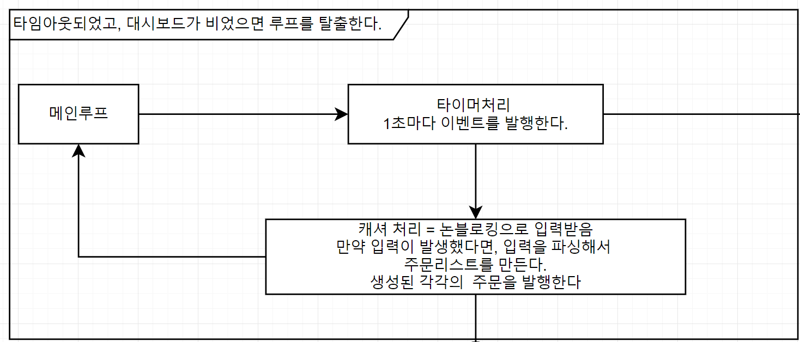
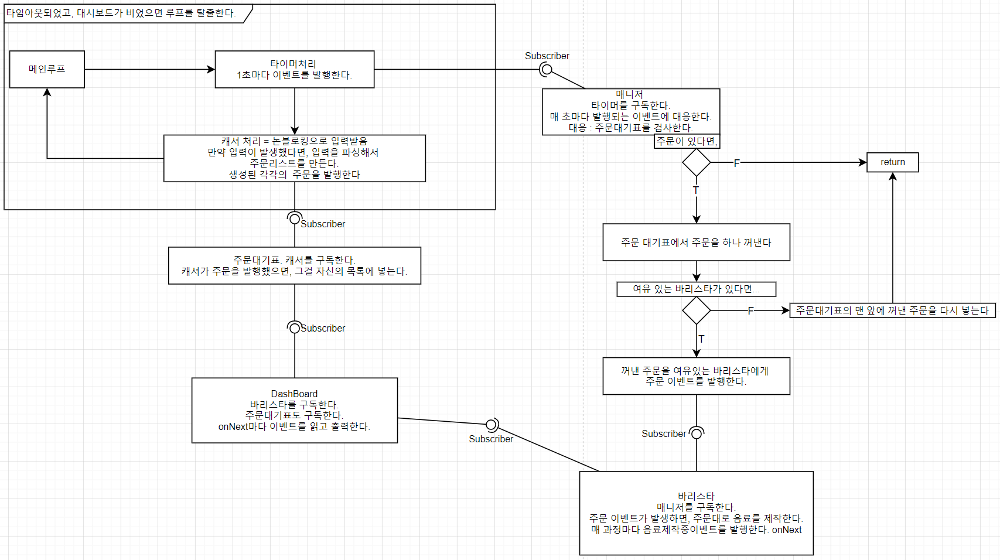

# 오늘 할 일

- [x] 구현한 프로그램 테스트할 것
- [x] 동기, 비동기, 블록,논블로킹의 정의에 대해 정리해보기
- [x] 배운 내용 정리할 것

# 오늘 배운 내용  

## 작업의 완료에 따른 구분

내 생각엔, 동기함수와 비동기함수의 차이점은, **요청한 작업의 완료**에 대한 **처리방식**인 것 같다.

### Synchronous : 작업요청의 완료를 동기적으로 처리한다

요청한 작업이 완료될때까지 **기다린다**. 완료되면 리턴된 결과를 받아서 **완료에 대한 처리작업**을 한다.

### Asynchronous : 작업요청의 완료를 비동기적으로 처리한다.

작업을 **요청만 하고 다른 작업을 처리**한다. **나중에 요청한 작업이 완료되면,** 그때가서 완료에 대한 처리작업을 한다.

```note
동기 비동기 개념이 왜 필요할까?

어떤 작업을 누군가에게 요청했다고 치자. 요청된 작업이 완료되었을 때, 어떻게 처리할까? 그 작업이 완료되었다는걸 어떻게 해야 알 수 있을까?

첫번째 방법 : 그 작업이 완료되기를 기다린다. 완료되어 결과가 리턴되면 그걸 받아서 처리한다.
이 경우가 동기적인 함수라고 생각한다.

근데 이 방법은 한가지 문제가 있다. 만약 그 작업이 오래 걸리는 작업이라면? 

네트워크 요청이나 시간이 좀 걸리는 연산작업이 있다고 치자. 이게 다 끝날때까지 기다린다면, 그 시간만큼 그 스레드는 블로킹된다. 처리할 작업이 많은 상황에서 이렇게 놀고있으면 괜찮은걸까? 안괜찮다. 아무것도 안하고 기다린다는건 그만큼 CPU를 놀게 만든다는걸 의미한다. CPU는 계속해서 쉬지않고 의미있는 일을 해야 한다. 우리는 절대 CPU가 노는 꼴을 볼 수 없다.

그래서 비동기 처리를 위해 필요한건, 시간이 걸리는 작업은 요청만 해야 한다는것이다. 요청만 하고, 다른 작업을 계속 처리해야 한다. 나중에 가서 요청작업이 완료되었을 때, 그때가서 완료에 대한 처리를 해주면 된다.

근데 그 완료는 어떻게 알까? 동기적인 요청은 완료할때까지 기다리면 되는거였으니까 쉽다. 근데 이건? 완료를 어떻게 알지? 아무래도 비동기처리의 어려운 점은 이 부분이 아닐까 라는 생각이 든다. 비동기 작업의 완료를 어떻게 알고, 그 시점에 딱 맞춰서 완료에 대한 처리작업을 해줄 수 있을까?

비동기 작업을 하고 있는 애는 이 작업의 완료를 알 수 있다. 애초에 얘가 일하고 있는거니까, 그 작업의 완료를 알 수 있다. 그러니 얘한테 작업완료시 실행할 콜백함수를 넘기면 되는게 아닐까?
```

## Non-Blocking과 Asynchronous에 대한 내 생각

### non-blocking

논블로킹은 기다리지 않을 뿐이다. 요청을 해도 거의 즉시 결과를 리턴한다. 그럼 시간이 오래걸리는 작업은 어떻게 하라는걸까? 

요청에 대한 결과에 "아직 안끝났음"을 추가하면 된다.

##### 예제 : 편지함에 편지가 왔을까?

블로킹 방식이면 이렇게 된다. 

```
--->(블로킹)편자함에 편지가 올때까지 기다린다...---10년째 기다림...---편지들어옴--->편지를 읽는다
```

편지함에 편지가 들어오지 않으면 저기서 계속 블로킹되어있다. 대기중인 것이다. 10년동안 밥도 못먹고 편지함만 봐서 배가 너무 고프다.

반면 논블로킹 방식이면 이렇게 된다.

```
--->(논블로킹)편지함을 확인한다---안왔네---밥먹어야지---편지함확인---안왔네---밥먹---편지함확인---왔네---편지일기---밥먹---~~
```

편지함을 확인하지만, 블로킹되지 않는다. 논블로킹이니까. 편지없다는 결과가 바로 리턴된다. 그럼 다른 일을 한다. 그 다음에 또 편지함을 확인한다. 논블로킹이니까 즉시 안왔다는 결과가 리턴된다. 다른일을 한다... 이렇게 해서 어떤 작업때문에 블로킹되지 않고 다른 작업도 처리할 수 있다.

### 그러면 비동기는 왜있는걸까? 둘의 차이점은 뭐지?

내 생각엔, 효율의 문제가 아닐까 라는 생각이 든다. 작업의 완료(편지함에 편지가 들어왔다)를 알아채기 위해 끊임없이 확인해야 한다. 프로그래밍으로 치면, 계속해서 루프를 돌면서 넌블로킹 함수를 호출해야 한다. 만약 1억번을 호출했는데 그 중 단 한번을 제외한 모든 경우가 "아직 안끝났다"는 결과라면, 그만큼 CPU를 낭비한 셈이 된다. 대신 비동기 함수를 쓰면, 그 작업이 완료되었을 때 콜백함수가 호출되어 처리해주기 때문에, 논블로킹처럼 매우 잦은 함수호출이 필요없다. 이 점이 비동기함수의 강점이 아닐까 라는 생각이 든다.

### 비동기는 언제 쓸까?

##### 네트워크 요청 

통신은 시간이 오래 걸린다. 그래서 멍때리면서 응답을 기다릴 수 없다. 기다리지 말고 다른 작업을 하고 있어야 한다.

##### 오래 걸리는 작업

현재 스레드에서 안하고 다른 스레드에게 위임한다. 완료되면 그때가서 처리할 수 있도록 한다.

##### 멀티스레드 개선

적은 스레드로 효율적으로 프로그래밍하기 위해 사용. 블로킹 방식의 개선이 필요할 때. 적절한 스레드 개수를 유지하면서 개발해야 하기 때문이다.

## 타이머 트리거 구현해보기



### 메인

메인의 역할은 딱 세가지이다.

* 필요한 인스턴스를 생성하고 초기화한다.

* 타이머 클래스를 통해 매 루프마다 시간이 얼마나 지났는지 측정하는 메서드를 호출한다. 만약 1초가 지났다면 이벤트를 발행한다
* 논블로킹으로 입력을 받는다. 입력받고 인스턴스를 만들면, 이벤트를 발행한다.

```java
initObjects(timer, cashier, orderList, dashBoard, manager, baristars);//인스턴스 초기화
long timeout = refreshTimeout();
//타이머 처리와 캐셔로 입력받는 부분
while (System.currentTimeMillis() <= timeout || !dashBoard.isEmpty()) {
    boolean isInputed = cashier.getInput();
    if (isInputed)//입력하면 타임아웃 초기화함. 다시 센다.
        timeout = refreshTimeout();
    timer.checkTimeOut();
}
br.close();//bufferedReader close
dashBoard.releaseThreadPool();//대시보드와 바리스타 인스턴스들의 스레드풀 종료 : ExecutorService::shutdown()
baristars.forEach(Baristar::releaseThreadPool);
```

### 논블로킹 IO

```java
public boolean getInput() throws IOException {
    if(br.ready()){
        execOrder(br.readLine());
        return true;
    }
    return false;
}
```

캐셔의 getInput메서드를 이용해서 입력을 받는다.

근데 입력받을 내용이 없다면? 바로 false를 리턴한다. 입력받을 내용이 있다면, 그때가서 입력을 받으면 된다. 읽을 내용이 있으니 그리 오래 기다리진 않는다. 물론 이 결과가 리턴될때까지 기다리니까 블로킹이라고 할 수 있을 것 같은데, 그 시간이 그렇게 길지 않다. 애초에 입력에서 블로킹되어있는 이유는, 사용자가 언제 입력하고, 끝낼지를 모르기 때문이다. 근데 이미 입력이 끝났으면 바로 읽어갈 수 있으니, 얼마 걸리지 않는다. 

그래서 getInput메서드는 결과를 거의 즉시 리턴한다. 성공했던 실패했던, 바로바로 결과를 알려주기 때문에, 논블로킹으로 동작한다고 표현할 수 있을 것 같다.

### 리액티브

캐셔, 주문대기표, 매니저, 바리스타, 대시보드 객체는 서로가 발행하는 이벤트에 대응(React)하는 구조로 동작한다.

아래의 코드는 메인의 initObjects()메서드의 내용이다.

```java
public static void initObjects(MyTimer timer, Cashier cashier,
                                   OrderList orderList, 
                                   DashBoard dashBoard, Manager manager,
                                   ArrayList<Baristar> baristars){
    //주문리스트는 캐셔를 구독한다. 주문 이벤트가 발행되면, 여기에 대응해서 새로 받은 주문을 대기표에 추가하고 싶기 때문이다.
    cashier.subscribe(orderList);
    //매니저는 타이머를 구독한다. 매 초마다 발행되는 타이머 이벤트에 대응해서 주문대기표를 확인한다.
    timer.subscribe(manager);
    //바리스타는 매니저를 구독한다. 매니저가 일을 시키기 때문이다. 일 시킬 때 이벤트를 발행하니, 이걸 받기 위해 구독한다.
    for (Baristar baristar : baristars)
        manager.subscribe(baristar);

    //대시보드는 주문리스트를 구독한다. 주문추가 이벤트에 대응해서 대시보드에 최신화해줘야 하기 때문이다.
    orderList.subscribe(dashBoard);
    //대시보드는 모든 바리스타를 구독한다. 작업경과 이벤트에 대응해서 대시보드에 최신화해줘야 하기 때문이다.
    for (Baristar baristar : baristars)
        baristar.subscribe(dashBoard);
}
```

각각의 객체들은 위와 같은 이유로 서로가 발행하는 이벤트에 대응(React)한다. 그래서 어떤 작업이 완료되면 이걸 처리하는 함수들이 호출된다. 예를들면, 주문이 언제 들어올 지 아무도 모른다. 하지만 캐셔가 주문을 받으면 주문대기표가 대응하기 때문에 바로바로 대기표에 주문을 추가할 수 있다.

```note
여담

제목은 리액티브라고 쓰긴 했는데, 이걸 리액티브 프로그래밍이라고 말할 수 있는지는 잘 모르겠다. 아닐 것 같다. 이것보다 더 어렵고 복잡한 내용인 것 같았다. 아직 공부가 더 필요하다.
```

### 발행자-구독자 모델

자바9에 추가된 Flow API를 쓰면 될 것 같긴 하지만, 일단 이해해보고 싶어서 직접 인터페이스를 직접 만들었다. 사실상 거의 배꼈다.

```java
public interface MySubscriber<T> {
    public void onNext(T t);
}
```

```java
public interface MyPublisher<T> {
    public void subscribe(MySubscriber<? super T> subscriber);
}
```

어떤 이벤트를 발행하고 싶다면, MyPublisher인터페이스를 구현하면 된다. 이 인터페이스를 구현하게 되면, 자신을 구독하는 인스턴스를 관리할 수 있게 되며, 구독자들에게 이벤트의 발생을 통지(notify)할 수 있다.

구독하는 기능은 subscribe로 하면 된다고 치자. 이벤트의 발생은 어떻게 할까

##### 타이머 클래스의 이벤트 발행

```java
public void checkTimeOut(){
    long currTime = System.currentTimeMillis();
    if(currTime - prevTime >= 1000){//1초가 지났다면 이벤트를 발행한다.
        prevTime = currTime;
        subscribers.forEach( (subscriber)->subscriber.onNext(true) );//구독자들의 onNext메서드를 이용해서 이벤트의 발생을 알린다.
    }
}
```

구독자들은 MySubscriber인터페이스를 구현한 상태이다. 그리고 이벤트가 발생하면 해야 하는일을 onNext()메서드에 정의해뒀다. 덕분에 타이머클래스를 구독중인 매니저 클래스는 매초마다 onNext메서드가 호출된다. 그리고 여기서 주문대기표를 확인하고 바리스타한테 이벤트를 발행하는 것이다.

### 바리스타 클래스에서 비동기로 음료 만들기

매니저한테 일을 받으면, 음료를 만들어야 한다. 음료를 만드는 일은 ExecutorService에게 submit한다. 이 스레드풀은 스레드가 2개 있다.

```java
Baristar(String name){
    /*...*/
    hands = Executors.newFixedThreadPool(2);//스레드 2개짜리 풀 생성.
}
@Override
public void onNext(DrinkOrder order) {
    setNumberOfProgress(numberOfProgress + 1);
    hands.submit(()->{
        try {
            makeDrink(order);
            setNumberOfProgress(numberOfProgress - 1);
        }catch (Exception ex){
            ex.printStackTrace();
        }
    });
}
private boolean makeDrink(DrinkOrder drinkOrder) throws InterruptedException {
        int time = 0;
        drinkOrder.madeBy = name;
        drinkOrder.state = OrderState.processing;
        subscribers.forEach((subscriber)->subscriber.onNext(drinkOrder.clone()));//이벤트 발행
        /*...*/
        Thread.sleep(time);
        drinkOrder.state = OrderState.completed;
        subscribers.forEach((subscriber)->subscriber.onNext(drinkOrder.clone()));//이벤트 발행
        return true;
    }
```

onNext에선 ExecutorService에 작업만 제출하고 끝난다. 그래서 음료가 다 만들어질때까지 기다리지 않고 다음 작업을 처리할 수 있다.  음료를 만들면서, 각 과정마다 음료제작에 관한 이벤트를 발행한다. 시작할때랑, 다 만들었을 때 발행해준다. 대시보드는 해당 이벤트에 대응해서 출력한다.

#### 대시보드

```java
@Override
public void onNext(DrinkOrder order) {
    threadPool.submit(()->{
        execDrinkOrder(order);
    });
}
```

대시보드도 스레드풀을 이용해서 주문현황을 출력한다. 

위의 설명을 그림으로 그리면 이렇다



#### 매니저가 바리스타들에게 작업을 나눠주는 과정

```java
@Override
public void onNext(Boolean aBoolean) {
	/*...*/
    for (MyBaristarSubscriber subscriber : subscribers){//자신을 구독중인 바리스타들을 검사한다.
        if(subscriber.isReady()){//주문을 처리할 준비가 되었다면,
            subscriber.onNext(drinkOrder.clone());//주문을 넘긴다.
            return;
        }
    }
    //여기까지 넘어와서 실행된다는건, 그 어떤 바리스타도 처리할 수 없었다는것을 의미한다. 다들 열일중이라서 그렇다.
    //다시 주문리스트의 맨 앞에 넣자.
    orderList.addOrderAtFirst(drinkOrder);
}
```

이렇게 해서 주문을 처리할 여력이 없는 바리스타에겐 일을 건네지 않는다. 

#### 아쉬운점

##### 바리스타에게 일을 분배하는 부분

뒤에 있는 바리스타들은 일을 거의 안하게 된다. 1,2번 바리스타가 충분히 처리할 만하면 애초에 3번까지는 작업이 가지 않기 때문이다. 작업을 고르게 분배해줄 수 있는 방법은 어떤게 있을까? 나중에 이걸 좀 더 공부해보면 좋을 것 같다.

##### Race Condition에 대한 대비가 미흡

바리스타 클래스에서 커피만드는 일을 ExecutorService로 처리하는 바람에 동시성이 생긴 것 같다. 이로 인해 대시보드의 orders나, 바리스타의 numberOfProgress가 공유자원이 되었다. 동시접근하는 상황이 나올 수 있어서 위험할 것 같다. 근데 아직 자바에서 동기화하는 방법을 잘 몰라서 제대로 처리하지 못했다. 이 부분도 나중에 제대로 공부해놔야겠다.

# 코딩일일결산

#### 내일의 나에게 보내는 전달사항

* 코테공부하기

#### GOOD

* 리액티브 프로그래밍에 대해 아주아주아주 조금 알게 된 기분이 든다.
* 동기와 비동기, 그리고 논블로킹에 대해 설명할 수 있을 것 같은 기분이 든다.

#### BAD

* 시간분배를 거의 포기한 느낌이다.

