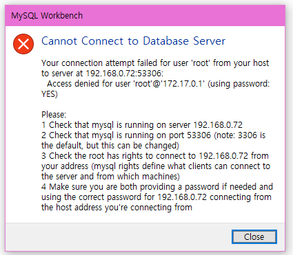

# 오늘 할 일

- [x] 루카스 미션 풀기
- [ ] 코테공부하기

# 오늘 배운 내용  

## 도커에 MySQL 5.7설치

### 설치

도커에 MySQL 57 컨테이너 생성하고 환경변수를 설정해주자

### 설정

##### 환경변수 설정

MYSQL_ROOT_PASSWORD를 추가해줘야 한다. 

##### 터미널에서 도커 실행후 쉘 실행. 데이터베이스 가동상태 확인

```shell
skynet@SKYNET_MK2:/$ sudo docker exec -it CS10_8_MySQL57 /bin/bash

root@CS10_8_MySQL57:/# service mysql status
[info] MySQL Community Server 5.7.9 is running.
```

##### 저장소 변경

기본 저장소는 좀 느릴 수 있으니, 바꿔주는 편이 좋을 것 같다

[데비안 저장소 변경](http://gwisin.blogspot.com/2016/01/debian-82-jessie.html)

##### 터미널에서 sql에 접속

```shell
root@CS10_8_MySQL57:/etc/mysql# mysql -u root -p
Enter password:
Welcome to the MySQL monitor.  Commands end with ; or \g.
Your MySQL connection id is 10
Server version: 5.7.9 MySQL Community Server (GPL)

Copyright (c) 2000, 2015, Oracle and/or its affiliates. All rights reserved.

Oracle is a registered trademark of Oracle Corporation and/or its
affiliates. Other names may be trademarks of their respective
owners.

Type 'help;' or '\h' for help. Type '\c' to clear the current input statement.

mysql>
```

### 인코딩 설정

##### latin1 to utf로 mysql 인코딩 변경

[환경변수 설정 참조](https://beanbroker.github.io/2019/07/07/docekr_encode/)

collation-server = utf_unicode_ci

character-set-server = utf8 

character encoding 설정에 관한 환경변수 추가해준다.

```shell
mysql> status

mysql  Ver 14.14 Distrib 5.7.9, for Linux (x86_64) using  EditLine wrapper

Connection id:          2
Current database:
Current user:           root@localhost
SSL:                    Not in use
Current pager:          stdout
Using outfile:          ''
Using delimiter:        ;
Server version:         5.7.9 MySQL Community Server (GPL)
Protocol version:       10
Connection:             Localhost via UNIX socket
Server characterset:    utf8
Db     characterset:    utf8
Client characterset:    utf8
Conn.  characterset:    utf8
UNIX socket:            /var/run/mysqld/mysqld.sock
Uptime:                 35 sec

Threads: 1  Questions: 5  Slow queries: 0  Opens: 105  Flush tables: 1  Open tables: 98  Queries per second avg: 0.142
--------------
```

utf-8로 설정된 것 확인 가능하다.

만약 client나 다른 부분의 인코딩 설정이 안바뀌었다면, /etc/mysql/my.cnf파일을 수정하자.

[추가 참조](https://ra2kstar.tistory.com/97)

해당 링크대로, 설정파일을 수정했다.

vim설치가 안되어있어서 패키지 매니저 업데이트하고 업그레이드 함. 그런 다음 vim 설치

```shell
apt-get update
apt-get upgrade
apt-get install vim

[mysqldump]
quick
quote-names
max_allowed_packet = 16M
default-character-set=utf8
[mysql]
default-character-set=utf8

[client]
port            = 3306
socket          = /var/run/mysqld/mysqld.sock
default-character-set = utf8

[mysqld]
character-set-server = utf8
init-connect='SET NAMES utf8'
collation-server = utf8_unicode_ci
```

### 로케일 설정

[참조](https://www.44bits.io/ko/post/setup_linux_locale_on_ubuntu_and_debian_container)

MySQL에서 확인해보면 초기상태는 아마도 en_US이다. 

```shell
mysql> select @@lc_time_names;
+-----------------+
| @@lc_time_names |
+-----------------+
| en_US           |
+-----------------+
1 row in set (0.00 sec)

```

일단 DB가 설치된 컴퓨터의 로케일을 확인해보자

```shell
root@CS10_8_MySQL57:/etc/mysql# locale
LANG=
LANGUAGE=
LC_CTYPE="POSIX"
LC_NUMERIC="POSIX"
LC_TIME="POSIX"
LC_COLLATE="POSIX"
LC_MONETARY="POSIX"
LC_MESSAGES="POSIX"
LC_PAPER="POSIX"
LC_NAME="POSIX"
LC_ADDRESS="POSIX"
LC_TELEPHONE="POSIX"
LC_MEASUREMENT="POSIX"
LC_IDENTIFICATION="POSIX"
LC_ALL=
```

LANG, LANGUAGE, LC_ALL이 비어있다. 나머지는 POSIX로 설정되어있다 이러면 한글 입력을 할 수 없다고 한다

지금 쓸 수 있는 로케일을 확인하자.

```shell
root@CS10_8_MySQL57:/etc/mysql# locale -a
C
C.UTF-8
POSIX
```

그냥 C.UTF-8을 쓰면 된다. 환경변수 추가하고, 확인해보자

 

LANG랑 LANGUAGE를 설정해주면 되겠다.

```shell
root@CS10_8_MySQL57:/# locale
LANG=
LANGUAGE=
LC_CTYPE="C.UTF-8"
LC_NUMERIC="C.UTF-8"
LC_TIME="C.UTF-8"
LC_COLLATE="C.UTF-8"
LC_MONETARY="C.UTF-8"
LC_MESSAGES="C.UTF-8"
LC_PAPER="C.UTF-8"
LC_NAME="C.UTF-8"
LC_ADDRESS="C.UTF-8"
LC_TELEPHONE="C.UTF-8"
LC_MEASUREMENT="C.UTF-8"
LC_IDENTIFICATION="C.UTF-8"
LC_ALL=C.UTF-8
root@CS10_8_MySQL57:/# 가나다라
bash: 가나다라: command not found
```

이제 한글을 출력할 수 있게 되었다.

#### 타임존 설정

한국으로 바꿔주자. 안해주고 now()썼을 때 다른 나라 시각으로 나오게 된다.

[참조](https://jwkim96.tistory.com/23)

```sql
mysql> select @@global.time_zone, @@session.time_zone
    -> ;
+--------------------+---------------------+
| @@global.time_zone | @@session.time_zone |
+--------------------+---------------------+
| SYSTEM             | SYSTEM              |
+--------------------+---------------------+
1 row in set (0.00 sec)

```

나도 설정을 안했기에 저렇게 뜬다.

```sql
mysql> set global time_zone='Asia/Seoul';
mysql> set time_zone='Asia/Seoul';

mysql> select @@global.time_zone, @@session.time_zone;
+--------------------+---------------------+
| @@global.time_zone | @@session.time_zone |
+--------------------+---------------------+
| Asia/Seoul         | Asia/Seoul          |
+--------------------+---------------------+
1 row in set (0.00 sec)

```


#### 유저설정

루트는 외부접속이 되면 안된다. 반면 다른 사용자는 외부접속이 가능해야 한다. 일단 일반사용자로 접속하게 만들자.

##### 유저 생성

```sql
#유저 생성
select * from user where user='MisterX';
#생성된거 확인
select user, host from user;
#권한 부여. 새로 생성한 데베에 대한 모든 권한을 미스터X에게 준다.
GRANT ALL privileges ON MYDB.* TO 'MisterX'@'%';
```

##### 생성한 유저로 연결하기

 

연결 성공, 사용 가능한 스키마를 보자

 

MYDB에 대한것만 있다. sys스키마는 없다.

그리고 루트 유저의 외부접속을 막으면 된다.

 

외부에선 접속이 안되지만, 로컬에선 할 수 있게 되었다.

```shell
root@CS10_8_MySQL57:/# mysql -u root -p
Enter password:
Welcome to the MySQL monitor.  Commands end with ; or \g.
Your MySQL connection id is 3
```


## 데이터베이스 연결

### 워크벤치로 SQL작성하고 실행하기

편하게 작업하고 싶으니까 MySQL 워크밴치를 작업용 컴퓨터에 설치하고 연결해서 쓰자.

아래의 쿼리를 이용해서 user_log 테이블을 만들고 레코드를 입력해보자.

```sql
create table user_log
(
	nickname varchar(64),
	money dec(10, 2),
	last_visit datetime
)
insert into user_log values('doctor', 1000, '2021-01-28');
insert into user_log values('맥밀란', 2000, '2021-01-28');
commit;
select * from user_log;
```

 

워크벤치에서 확인이 가능하다.

```shell
mysql> use MYDB
Reading table information for completion of table and column names
You can turn off this feature to get a quicker startup with -A

Database changed
mysql> select * from user_log;
+-----------+---------+---------------------+
| nickname  | money   | last_visit          |
+-----------+---------+---------------------+
| doctor    | 1000.00 | 2021-01-28 00:00:00 |
| 맥밀란    | 2000.00 | 2021-01-28 00:00:00 |
+-----------+---------+---------------------+
2 rows in set (0.00 sec)
```

터미널에서도 잘 나오는걸 알 수 있다. 한글도 잘 나온다.

### 자바에서 데이터베이스 연동하기

[참조](https://hsunnystory.tistory.com/158?category=791615)

jdbc를 쓰면 된다. 우선 커넥터를 받자

[링크](https://dev.mysql.com/downloads/connector/j/)

들어가서 플랫폼 인디펜던트를 선택하고 받자

받았으면 프로젝트 폴더 어딘가에 잘 넣고, IDE 설정을 하자

[참조](https://whitepaek.tistory.com/18)

 
IDEA 우상단을 보면 폴더모양 버튼이 있다. 눌러서 Project Structure창을 키자.

 
누르자.

 고르자.

##### 데베 연결을 위한 레퍼런스 변수를 선언하고, 설정값을 준비한다.

```java
Connection con = null;

String server       = "192.168.0.72:53306"; // MySQL 서버 주소
String database     = "MYDB"; // MySQL DATABASE 이름
String user_name    = "MisterX"; //  MySQL 서버 아이디
String password     = "1q2w3e4r!Q"; // MySQL 서버 비밀번호
```

드라이버를 불러온다

```java
// 1.드라이버 로딩
try {//cj.jdbc여야 한다. 안그러면 deprecated되었다는 에러가 출력된다
    Class.forName("com.mysql.cj.jdbc.Driver");//
} catch (ClassNotFoundException e) {
    System.err.println(" !! <JDBC 오류> Driver load 오류: " + e.getMessage());
    e.printStackTrace();
}
```

##### DriverManager를 이용해서 연결한다

```java
// 2.연결
try {
    con = DriverManager.getConnection( "jdbc:mysql://"
                                	+ server + "/"
                                	+ database 
        							+ "?useSSL=false", user_name, password);
    System.out.println("정상적으로 연결되었습니다.");
} catch(SQLException e) {
    System.err.println("con 오류:" + e.getMessage());
    e.printStackTrace();
}
```

##### 데베에 쿼리를 전송하고, 결과를 받아온다.


##### 마지막으로 연결을 해제한다.

```java
// 3.해제
try {
    if(con != null)
        con.close();
} catch (SQLException e) {
    e.printStackTrace();
}
```

### 쿼리 처리하기

* PreparedStatement로 쿼리문을 만든다.
* 쿼리의 패러미터는 ?로 작성한다. ex) insert into table values (?, ?, ?)
* setXXX 메서드로 쿼리의 패러미터를 채운다
* executeQuery로 실행한다.
* 여러개의 퀄리를 한번에 실행하는 경우, addBatch()로 추가하고 executeBatch()로 한번에 실행한다.
* Select의 결과는 ResultSet으로 받아볼 수 있다.

#### select

```java
public List<UserLogData> getDateList(){
    PreparedStatement preparedStatement;
    ArrayList<UserLogData> logDataList = new ArrayList<UserLogData>();
    try {
        preparedStatement = con.prepareStatement(sqlGetUserLog);
        ResultSet resultSet = preparedStatement.executeQuery();
        while (resultSet.next()){
            logDataList.add( new UserLogData(
                resultSet.getString("nickname"),
                resultSet.getInt("money"),
                resultSet.getDate("last_visit")));
        }
    } catch (SQLException throwables) {
        throwables.printStackTrace();
    }
    return logDataList;
}
```

#### insert

```java
public void insertData(String name, int money, String strDate) throws SQLException {
    PreparedStatement preparedStatement;
    try {
        preparedStatement = con.prepareStatement(sqlInsertUserLog);
        preparedStatement.setString(1, name);
        preparedStatement.setInt(2, money);
        preparedStatement.setDate(3, java.sql.Date.valueOf(strDate));

        preparedStatement.executeUpdate();
        con.commit();
    } catch (SQLException throwables) {
        throwables.printStackTrace();
        con.rollback();
    }
}
```

#### multiple insert

```java
public void insertData(ArrayList<UserLogData> logData) throws SQLException {
    PreparedStatement preparedStatement;
    try {
        preparedStatement = con.prepareStatement(sqlInsertUserLog);
        for (int i = 0; i < logData.size(); i++) {
            UserLogData currObj = logData.get(i);
            preparedStatement.setString(1, currObj.name);
            preparedStatement.setInt(2, currObj.money);
            preparedStatement.setDate(3, currObj.date);
            preparedStatement.addBatch();
        }

        preparedStatement.executeBatch();
        con.commit();
    } catch (SQLException throwables) {
        throwables.printStackTrace();
        con.rollback();
    }
}
```

## 미션 1

#### 성능최적화

##### executeBatch()를 쓰자

여러개를 insert해야하니까, 하나하나 executeQuery()로 실행하지 말고, addBatch()로 작업묶음을 만든다음 executeBatch()로 한번에 실행하는편이 더 낫다. java프로그램과 데베 사이를 왔다갔다 하는 일이 줄어드니까 성능이 향상된다.

##### AutoCommit을 끄고 내가 커밋을 제어하자

JDBC를 쓰면 기본상태가 오토커밋모드이다. 매 쿼리마다 커밋을 하기보다 다 한 다음에 커밋을 하면 훨씬 빨리 끝난다. 그래서 setAutoCommit(false)로 해준다음 executeBatch()가 끝난 다음 커밋해주면 좀 더 낫다.

```note
근데 왜???
나중에 데이터베이스를 좀 더 공부하면서 그 이유를 찾아봐야겠다.
```

##### 프로그래스 바 구현

1,000,000개를 하나씩 보내면 35분 정도 걸린다. 끔찍하다.


1,000,000개를 하나로 묶어서 executeBatch()로 보내면 어떨까?

일단 한가지 문제가 생긴다. 작업이 하나로 묶이는 바람에 얼마나 진행되었는지 알 방법이 없다. 그래서 프로그래스 바 처리하기가 너무 곤란해진다.

 

그래도 속도는 매우 단축되었다. 대략 4분에서 5분사이의 시간이 나왔다.

그럼 10,000개씩 끊어서 보내면 어떨까? 그러면 딱 100회 나뉘어 보내니까 프로그래스바 처리하기도 좋겠다.


 성능도 나쁘지  않다. 약간 느려지긴 했지만 그래도 5분정도 걸린다. 우선 작업의 진행상황을 알 수 있으니까 답답하지 않아서 좋다.

## 미션 2

### new 기능 구현


저런 방식으로 진행된다.

ssn은 selectedSeatNumber를 줄인건데, 실제 구현에선 selectedSeat로 바뀌었다.

### stop 기능 구현


### 데모

```
빈 자리는 다음과 같습니다
[1, 2, 3, 4, 5, 6, 7, 8, 9, 10, 11, 12, 13, 14, 15, 16]
자리 예약 : new  당신의 아이디
자리 반납 : stop 당신의 아이디
>>> 
new 3
3번 자리에 않으세요
빈 자리는 다음과 같습니다
[1, 2, 4, 5, 6, 7, 8, 9, 10, 11, 12, 13, 14, 15, 16]
자리 예약 : new  당신의 아이디
자리 반납 : stop 당신의 아이디
>>> 
new 6
2번 자리에 않으세요
빈 자리는 다음과 같습니다
[1, 4, 5, 6, 7, 8, 9, 10, 11, 12, 13, 14, 15, 16]
자리 예약 : new  당신의 아이디
자리 반납 : stop 당신의 아이디
>>> 
new 9
7번 자리에 않으세요
빈 자리는 다음과 같습니다
[1, 4, 5, 6, 8, 9, 10, 11, 12, 13, 14, 15, 16]
자리 예약 : new  당신의 아이디
자리 반납 : stop 당신의 아이디
>>> 

```

 

데베에도 잘 들어간다.

```
stop 9
이제7번 자리가 비었습니다
빈 자리는 다음과 같습니다
[1, 4, 5, 6, 7, 8, 9, 10, 11, 12, 13, 14, 15, 16]
자리 예약 : new  당신의 아이디
자리 반납 : stop 당신의 아이디
>>> 
stop 6
이제2번 자리가 비었습니다
빈 자리는 다음과 같습니다
[1, 2, 4, 5, 6, 7, 8, 9, 10, 11, 12, 13, 14, 15, 16]
자리 예약 : new  당신의 아이디
자리 반납 : stop 당신의 아이디
>>> 
stop 3
이제3번 자리가 비었습니다
빈 자리는 다음과 같습니다
[1, 2, 3, 4, 5, 6, 7, 8, 9, 10, 11, 12, 13, 14, 15, 16]
자리 예약 : new  당신의 아이디
자리 반납 : stop 당신의 아이디
>>> 
```

 

종료결과 레코드의 endTime컬럼 값이 변경되었음을 확인할 수 있다.

그리고 빈 자리를 보여줄 때 반납된 자리가 추가되는걸 확인할 수 있다.

### 아쉬운 점

* 예외처리를 거의 못했다. 금요일날 차근차근 해보는게 좋겠다.
* 성능최적화가 약간 아쉽다. 더 좋은 방법이 있을 것 같다. Stored Procedure를 쓰면 좀 낫지 않을까?

# 코딩일일결산

#### 내일의 나에게 보내는 전달사항

* "스프링 입문을 위한 자바 객체지향의 원리와 이해" 라는 책을 빌리던가 사도록 하자.

#### GOOD

* 힘들다

#### BAD

* 힘들다

 