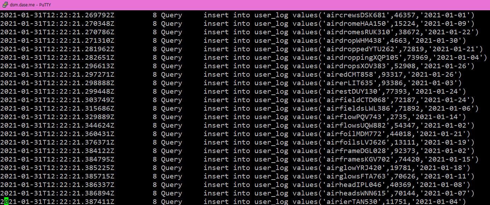
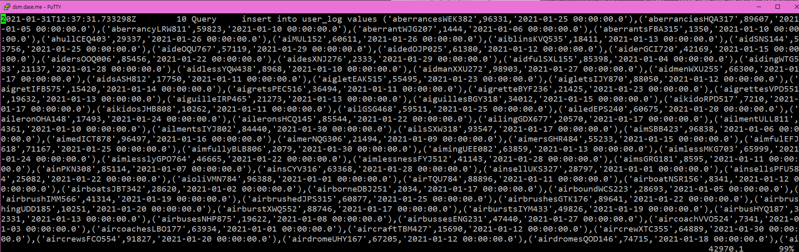
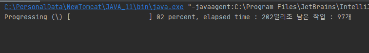

# 오늘 할 일

- [x] 다이나믹 프로그래밍 공부하기
- [x] 시간배분을 어케할지 고민해보기
- [x] 토끼책 읽기
- [x] SQL책 읽기

# 오늘 배운 내용  

#### 다이나믹 프로그래밍 공부

* 1,2,3 더하기 : BOJ 9095
* 카드 구매하기 BOJ 11052
* 카드 구매하기2 BOJ 16194
* 1,2,3 더하기 5 BOJ 15990
* 쉬운 계단수 BOJ 10844

#### 시간배분을 잘하기 위한 노력

* 매일 30분씩 토끼책이랑 SQL책 읽고 공부하기
* 조금 읽어도 괜찮으니, 제대로, 내 생각을 정리해가면서 읽자. 
* 조금씩 해도 괜찮으니, 매일 하자. 안하는 것보다 꾸준히 하는게 좋지 않을까 라는 생각이 든다.
* 읽으면서 정리한건 각각의 페이지에 하고, 다 했으면 TIL에 짧게 요약해보자.

#### 토끼책 읽기

* 토끼책을 읽고 내 생각을 정리했다.
* 저자 아저씨는 클래스도 물론 중요하지만 진짜 중요한건, 자율성을 가진 객체들이 서로 공동체를 이루고, 서로 메세지를 주고받으며 협력해서 어렵고 커다란 문제를 쉽게 해결하는게 중요한 거라고 하셨다. 클래스는 이러한 객체들의 협력관계를 소스코드로 표현하는 도구일 뿐이라서, 객체들이 공동체를 이루고, 각자 역할을 맡고 자신의 책임을 자율성을 가지고 완수해서 서로 잘 협력한다는 개념에 집중하라고 하셨다.

#### SQL책 읽기

* 데이터는 컴퓨터에 저장된 0101같은 자료뭉치를 말한다. 데이터베이스는 이러한 자료의 집합이다.

* DBMS는 DB를 관리하는 프로그램으로, 생산성과 기능성을 향상시키고, 신뢰성을 확보하는데 도움을 준다.

  데이터베이스에 대한 CRUD를 개발자가 일일히 구현할 필요 없이, DBMS가 대신해줄 수 있기 때문이고, 또한 어떤 데이터를 빠르게 찾는다거나, 하나의 데이터베이스를 여러 사용자가 공유해서 쓸 수 있도록 도와준다. 그리고 로드밸런싱을 해주거나 백업,복구기능을 지원해서 신뢰성을 확보할 수 있게 해준다.

#### JDBC 공부

슬랙에서 파이로님이 쓴 글을 읽고 충격받았다.

난 addBatch하면 bulkInsert하는건줄 알고 있었는데 아니라고 하신다.

그래서 DB에서 쿼리 로그를 찾아보았다.

[MySQL에서 쿼리 로그 확인하기](http://blog.plura.io/?p=4493)

아......

진짜 반성 많이해야 한다. 또 멋대로 착각하고 말았다.

왜 좀 더 꼼꼼하게 찾아보지 않은걸까......

bulkInsert는 insert into Table values(asdf), (asdf); 이런식으로 ()가 중첩되어야 하는데, 위의 이미지를 보면 그냥 엄청 많은 insert쿼리의 묶음이었다.

난 진짜 바보다.

더 찾아보니, 이런것도 있더라. [SQL Server 2019의 useBulkCopyForBatchInsert](https://docs.microsoft.com/ko-kr/sql/connect/jdbc/use-bulk-copy-api-batch-insert-operation?view=sql-server-ver15)

여하튼 파이로님의 코드를 참조해서 프로그램을 고쳐보았다. 

이제서야 DBMS에 bulk insert로 쿼리가 도착했다. 

 

진짜진짜 반성 많이해야겠다. 왜 제대로 찾아보고 공부하지 않았을까.

앞으로는 진짜 이런일이 없도록 해야겠다. 잘못된 지식을 전달해서 같은 팀원들한테도 너무 미안하다.

# 코딩일일결산

#### 내일의 나에게 보내는 전달사항

* 코드플러스 알고리즘 기초 1/2 이친수부터 들으면 됨.
* 토끼책이랑 SQL책 이어서 읽기.

#### GOOD

* 오늘도 열심히 살았다.

#### BAD

* 제대로 공부하자.

 

