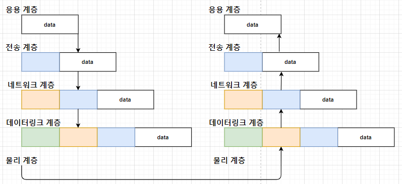
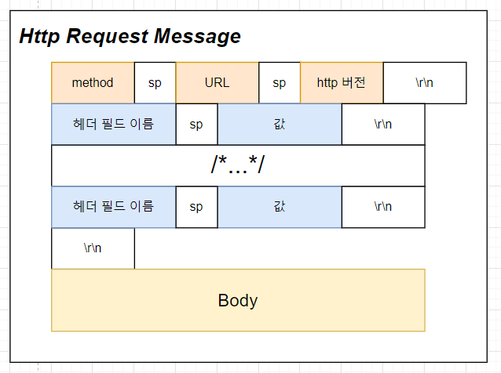
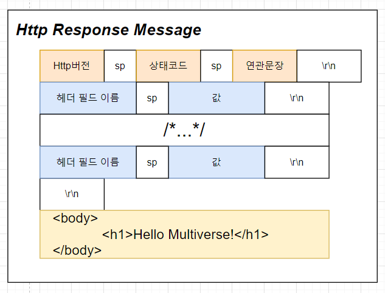

# 오늘 할 일

- [x] 네트워크 계층에 대해 학습한다.
- [x] 서버클라 구조랑 URL과 DNS에 대해 공부하기
- [x] HTTP에 대해 공부하기
- [x] 공부한 내용을 가지고 실습하기

# 오늘 배운 내용  

### 오늘의 목표

* URL에 대해 공부하고, 구조를 이해한다
* HTTP프로토콜에 대해 공부하고, 패킷의 구조를 이해한다
* DNS를 통해 문자 이름으로 IP주소를 획득하는 과정에 대해 공부한다.
* 자바를 이용한 소켓프로그래밍을 공부한다.

### 오늘의 계획

* URL에 대해 공부한다
* HTTP 프로토콜에 대해 공부한다
* JAVA에서 소켓 프로그래밍하는걸 공부한다
* URL과 HTTP프로토콜에 대해 배운걸 가지고 JAVA프로그램으로 구현해본다.

### 키워드

* 자바 API. java.net.InetAddress
* 자바 소켓 java.net.Socket

## 네트워크 기초

> **참조한 책 : TCP-IP가 보이는 그림책. 성안당, 글쓴이 : ANK CO.,Ltd 저**

#### 네트워크를 계층(Layer)으로 나누는 이유 : 계층화를 하는 이유

네트워크 통신은 정말 어렵다. 출발지부터 목적지까지 데이터를 보내는 일만 잘 하면 되는데, 이걸 잘 하는게 정말 어렵다. 어디 한군데라도 문제가 생기면 아예 안돌아가기 쉽다. 그래서 똑똑한 사람들은 네트워크 통신이라는 크고 복잡한 문제를 분할해서 정복하기로 했다.

그래서 5계층으로 나뉘었다. 각 계층은 자신들에게 주어진 역할만 완벽하게 수행하면 된다. 그리고 각각의 계층들이 서로 협력해서 네트워크 통신이라는 크고 복잡한 문제를 보다 쉽게 처리할 수 있는 것이다.

```note
계층화 안된 경우
어라, 문제가 생겼네? 근데 어디서 생긴거지??? 아...... 하나씩 다 봐야겠다......
계층화가 된 경우
야 응용프로그램은 문제없니? 없다구?
그럼 전송계층쪽 문제인가? 없다구?
그럼 네트워크계층쪽 문제인가? 아 여기서 문제가 생겼네! 그럼 여기에 해당하는 장비에 문제가 있는지 살펴보자! 와!
```

보통 이걸 OSI 7계층으로 나누는 경우도 있는데, 5계층으로 좀 더 쉽게 나누는 경우도 있다. 일단 5계층으로 추상화한걸 공부하려고 한다.

#### 네트워크 계층과 통신

네트워크 통신을 쉽게 하기 위해 여러 계층으로 분할했다. 각각의 계층이 자신의 역할을 잘 하고 있다면, 그 다음으로 할일은 계층끼리 협력하는 일이다. 각 계층은 자신의 책임을 다하고, 그 결과를 다음 계층에게 전달해야 한다. 마치 이어달리기하는 것 처럼, 데이터를  인접한 계층에게 넘기는 일을 반복해서 목적지까지 데이터가 잘 도착할 수 있게 한다.

#### 데이터가 전송되고 수신되는 과정

##### 응용 계층 : 애플리케이션 레이어 ( HTTP, SMTP 프로토콜, 그 외에도 엄청 많음)

응용계층부터 시작한다. 얘는 우리가 만드는 프로그램이다. 상대 측 응용 프로그램에게 어떤 데이터를 보내려고 한다. 이걸 프로토콜에 맞게 잘 만들어서 전송한다. 그러면 전송계층에게 전달된다.

##### 전송계층 : 트랜스포트 레이어 ( TCP, UDP 프로토콜 )

전송계층은 서로 다른 컴퓨터에서 동작하는 응용끼리 논리적으로 통신할 수 있도록 도와주는 역할을 맡는다. 전송에도 여러가지 방법이 있다. 어떤 경우엔 신뢰성이 있는 전송이 필요할 수 있고, 어떤 경우엔 신뢰성은 좀 포기하더라도 속도가 우선되는 경우도 있다. 전자는 TCP, 후자는 UDP라는 전송계층의 프로토콜이다. 따라서 응용프로그램을 만드는 개발자는 신뢰성 있는 통신이 필요하다면, TCP프로토콜을 쓰면 된다. 그러면 신뢰성있는 통신을 할 수 있다.

신뢰성있는 통신을 하거나 속도 우선의 통신을 하는 등의 논리적인 통신을 도와주는 역할은 전송계층이 맡았다. 그럼 이제 뭘 해야 할까? 수신측에게 데이터를 전송해야 한다. 근데 수신측이 어디있는지 알고 보낼까? 우리는 수신측까지의 경로를 찾고, 거기까지 데이터를 전달하는 역할을 맡아줄 계층이 필요한데, 그게 네트워크 계층이다.

##### 네트워크 계층 : 네트워크 레이어 ( IP프로토콜 )

송신측으로 부터 수신측까지 데이터를 전달하기 위해서, 경로를 찾고 패킷을 전달하는 역할을 맡는다. 경로가 있으려면 일단 송신측이랑 수신측이랑 연결되어 있어야 한다. 그러면 인터넷을 쓰면 된다. 전 세계의 거의 대부분의 컴퓨터는 인터넷을 통해 네트워크에 연결되기 때문이다. 그래서 **인터넷 프로토콜(IP프로토콜)**을 써서 수신측, 즉 목적지까지의 경로를 결정하고 전달하면 된다. 그러면 인터넷이라는 거대한 네트워크에서 목적지까지 경로를 잘 찾아서 전달될 것이다.

물론 내 컴퓨터에서 목적지까지의 경로를 싹 다 찾아서 전달할 수 없다. 네트워크는 수많은 라우터들로 구성되어 있고, 네트워크의 끝자락에는 송신측과 수신측 컴퓨터가 있다. 목적지까지의 경로를 찾는다는건, 어떤 라우터들을 거쳐야 안전하고 빠르게 갈 수 있는지를 찾는것이다. 

네트워크 계층은 경로를 찾아서 결정하고 전달하는 역할을 맡았다. 이제 남은건 물리적으로 데이터를 전송하는 일이다. 컴퓨터와 라우터, 라우터와 라우터간에 데이터를 주고 받으려면 일단 서로 연결이 되어 있어야 한다.  이 역할은 데이터링크 계층에서 맡는다.

##### 데이터링크 계층 : 데이터링크 레이어

기기들을 연결하는것도 여러 방법이 있다. 그래서 기기마다 여러 방법으로 연결되어 있다. 방법이 다양한 만큼, 각각의 연결마다 어떠한 차이점이 생길 수 있다. 근데 이런 차이가 상위계층에 영향을 준다면 정말정말 프로그래밍하기 끔찍하겠다. 그치만 걱정할 필요가 없는게, 데이터링크 계층은 상위계층이 다양한 연결방식에 따른 차이를 의식하지 않고 작동할 수 있게 도와준다. 그래서 네트워크 계층과 물리계층간의 중계자 역할을 한다고 볼 수 있다.

장치간 연결하는 방법을 제공하는 역할은 데이터링크계층이 맡았다. 여기까지 오는데 획득한걸 정리해보자

* 전송할 데이터를 만들었다.
* 전송방식을 정했다. 신뢰성 우선, 또는 속도를 우선하는 전송방식을 할 수 있게 되었다.
* 목적지까지의 경로를 찾고 결정하고, 내보낼 수 있게 되었다.
* 장치 간 연결을 할 수 있게 되었다.

이제 물리적으로 보내야 한다. 데이터는 이진수로 되어 있고, 이걸 물리적으로 잘 전달하고 받을 수 있어야 한다.

##### 물리계층 : 하드웨어 레이어

물리적인 데이터 전송을 위해 비트열과 신호의 변환을 통해 데이터를 주고 받는다. 이 방법은 기기가 갖고 있는 성질에 의존하기 때문에 정해진 프로토콜도 없는데다가, 다른 계층과 성질이 달라서 데이터링크계층의 일부로 생각하거나 TCP/IP계층에서 제외하기도 한단다.

 

그림으로 표현하면 이렇다. 데이터를 전송하면 각 계층을 타고 내려가면서 헤더가 붙는다. 각 계층마다 자신의 책임을 다하기 위해 붙이는 것이다. 하위로 내려갈수록 헤더가 붙고, 상위로 올라갈 수록 헤더를 까서 먹는다. 헤더에 기록된 내용대로 수신된 패킷을 처리하는 것이다. 처리하고 나면 더이상 필요없으니까 헤더를 때어준다.

## 서버-클라이언트 구조와 URL

### 서버-클라이언트 구조

네트워크 프로그램을 만들면 어떤 구조가 생기는데, 그 중 하나가 서버 클라이언트 구조이다. 서비스를 제공하는 서버와, 서비스를 제공받는 클라이언트로 나뉘는 구조이다. 웹의 기준으로 본다면, "어떤 페이지를 주세요" 하고 서비스를 요청하는 웹브라우저가 클라이언트가 되고, 이 요청을 받아서 웹페이지를 응답해주는 웹 **서버**가 있다.

그러면 클라이언트는 서버에게 요청을 할 수 있어야 한다. 가령, 위키에서 "행복"이라는 문서를 보고 싶다. 그러면 이 문서를 요청해야 한다. 어떻게 해야 요청할 수 있을까?

### URL : Uniform Resource Locator

[추가참조](https://developer.mozilla.org/ko/docs/Web/HTTP/Basics_of_HTTP/Identifying_resources_on_the_Web)

URL을 쓰면 네트워크 상에서,  어떤 자원의 위치를 표시할 수 있다. 그래서 URL을 이용해서 서버에게 어떤 자원을 요청할 수 있다.

URL은 아래와 같이 표현된다

```
[Scheme][Domain_Name][:PortNumber]/this/is/my/path/something.ext
예시
http://www.disney.co.kr/home/index.jsp
```

##### 스킴 : Scheme OR 프로토콜 : Protocol

스킴이라고 하거나, 프로토콜이라고도 부르는 이것은, 해당 자원을 요청하기 위해 써야 하는 프로토콜을 말한다. http라면 http프로토콜을 써야하고, ftp면 ftp를 써야 한다.

##### 도메인 이름 ( Domain Name )

서버를 나타낸다. 그래서 IPv4주소를 대신 넣어도 되긴 된다. 다만, 불편하니까 도메인 이름으로 쓴다.

##### 포트번호

애플리케이션 프로토콜을 식별할 수 있는 번호이다. 근데 http는 보통 80포트를 쓰고 https는 443포트를 써서, 안써도 프로토콜을 가지고 판단한다. http를 썼는데 포트번호 안쓰면 당연히 80포트겠지 하고 80포트로 요청한다.

##### 경로

서버상에서 파일이 있는 경로이다.

##### 파일명

그 경로에 있는 파일의 이름이다. 생략가능하다고 한다.

## 도메인 네임 시스템 | DNS

참고자료

> [도메인 네임 시스템](https://ko.wikipedia.org/wiki/%EB%8F%84%EB%A9%94%EC%9D%B8_%EB%84%A4%EC%9E%84_%EC%8B%9C%EC%8A%A4%ED%85%9C)   [네임서버](http://www.ktword.co.kr/abbr_view.php?nav=2&m_temp1=1486&id=1071)   [최상위 도메인](https://ko.wikipedia.org/wiki/%EC%B5%9C%EC%83%81%EC%9C%84_%EB%8F%84%EB%A9%94%EC%9D%B8#%EA%B5%AD%EA%B0%80_%EC%BD%94%EB%93%9C_%EC%B5%9C%EC%83%81%EC%9C%84_%EB%8F%84%EB%A9%94%EC%9D%B8%28ccTLD%29)   [2단계 도메인](https://ko.wikipedia.org/wiki/2%EB%8B%A8%EA%B3%84_%EB%8F%84%EB%A9%94%EC%9D%B8) [TLD와 TLD Name서버](https://dnsmap.io/articles/what-are-top-level-domain-(tld)-name-servers)	
>
> [생활코딩 도메인과 네임서버](https://opentutorials.org/module/288/2802)

### 요약

* 네임서버는 도메인에 대한 IP를 알려준다.
* 네임서버는 한대가 아니다. 수많은 네임서버가 존재한다
  * 몇십억개나 되는 IP주소를 한대의 네임서버에서 전부 관리할 수 없다.
  * 그래서 도메인 네임을 계층구조로 분산시켰다.
* 네임서버들은 서로 계층관계를 형성하고 있다.
* 예외인 네임서버도 있다. 로컬네임서버는 계층구조에 속해있지 않는다.

### 네임서버

* 루트 네임서버

  * DNS를 총괄하는 네임서버이다.
  * Top Level Domain을 담당하는 네임서버의 네트워크 주소를 알고 있고, 요청하면 알려준다.

* Top Level Domain 네임서버

  * 도메인 네임의 마지막에 오는 도메인을 담당하는 네임서버이다.

  * Top Level Domain에는 kr, jp, com등이 있다.

  * 도메인 kr의 아래에는 co(기업), go(정부기관), ac(대학)과 같은 도메인이 있다.

    그래서 kr 네임서버는 co, go, ac등의 도메인을 담당하는 네임서버의 네트워크 주소를 알고 있다.

### 어떤 도메인의 IP주소를 찾는 과정

* www.mafra.go.kr로 접속하고 싶다.

* 클라이언트는 로컬 네임서버한테 이 도메인의 IP주소를 아냐고 물어본다.

  알면 바로 IP주소를 응답해준다.

* 모른다면, 로컬네임서버는 루트 네임서버한테 kr의 네임서버가 어딨는지 물어본다.

  kr 네임서버가 어딨는지 알게 되었다.

* 그 다음, kr을 담당하는 네임서버한테 go.kr네임서버가 어딨는지 물어본다.

  go.kr네임서버가 어딨는지 알게 되었다.

* go.kr네임서버한테 mafra.go.kr네임서버가 어딨는지 물어본다.

  mafra.go.kr네임서버가 어딨는지 알게 되었다.

* mafra.go.kr네임서버한테 www.mafra.go.kr의 IP주소를 물어본다.

  찾고자 하는 도메인 네임의 IP주소를 알게 되었다

* 클라이언트한테 찾은 IP주소를 알려준다.

* 클라이언트는 받은 IP주소로 접속한다.

## HTTP 프로토콜

### 특징

* 응용계층의 프로토콜이다
* 전송계층의 프로토콜은 TCP를 쓴다.
* 어떤 요청(Request)을 하면 해당하는 결과를 응답(Response)한다.
  * 그래서 HTTP는 패킷이 요청메세지와 응답메세지로 나뉜다.
* 메세지가 일반 ASCII 텍스트로 쓰여 있다.

### 패킷의 구성

##### 요청 메세지

  

* 요청메세지의 첫 줄은 요청라인(Request Line)이라고 한다.
* 요청라인은 메서드, URL, HTTP버전 필드를 갖는다. 각각의 필드는 공백으로 구분된다.
* 각각의 라인은 \r\n으로 구분된다.

* 요청 헤더 
  * 클라이언트의 정보가 여기에 담긴다. 처리가능한 파일의 종류나 문자코드, 언어등이 포함된다.
* 헤더와 본문은 공백 라인(\r\n)으로 구분된다. 그래서 \r\n이 연속으로 나오면, 헤더와 바디의 경계인 것이다.
* 본문(Body)
  *  Post메서드로 요청하는 경우, 서버에 보내는 데이터는 여기에 내장된다.

##### 응답 메세지

   

* 상태 라인
  * 클라이언트 요청에 대한 처리 결과이다. 정상적으로 처리되었다면 200번대의 숫자이다.
  * 요청라인처럼 상태라인도 3개의 필드이지만, 구성은 다르다
  * 연관문장은 상태코드와 연관된 문장이다. 404 not found 같은거다.
* 응답 헤더
  * 클라이언트한테 전달할 데이터에 관한 정보이다.
* 헤더와 본문은 \r\n, 공백라인으로 구분한다.
* 본문(Body)
  * 클라이언트한테 전달할 데이터이다.

### 컨텐츠 협상

참조 : [HTTP 헤더](https://developer.mozilla.org/ko/docs/Web/HTTP/Headers)   [컨텐츠 협상](https://developer.mozilla.org/ko/docs/Web/HTTP/Content_negotiation)   [블로그 정리글](https://velog.io/@devapploper/http-Content-Negotiation)

#### 동일한 URI로 요청해도, 클라이언트한테 맞춤서비스를 제공하자

동일한 URI라도, 서로 다른 버전의 리소스를 서비스해줘야 한다. 어떤 사용자의 클라이언트는 어떤 문서를 쓰지 못할 수 있고, 또는 언어가 다를수도 있다. 한국에서 접속하면 한국어로, 일본에서 접속하면 일본어로 보여주고 싶다면? 이때 필요한게 컨텐츠 협상이다.

#### HTTP/1.1 표준에서의 서버 주도 협상을 시작하는 표준 헤더

*  Accept, Accept-Charset, Accept-Encoding, Accept-Language

컨텐츠 협상에는 두가지 방법이 있다. 서버 주도적이냐 아니면 에이전트 주도적이냐의 차이가 있다. 서버 주도적인 협상의 경우, HTTP/1.1 표준의 Accept헤더등을 이용해서 서버한테 자신이 선호하는 컨텐츠의 형식을 알려주고, 서버는 요청패킷의 헤더에 있는 클라이언트의 선호하는 컨텐츠를 보고, 내부적인 알고리즘을 써서 최적의 컨텐츠를 제공한다. 근데 에이전트 주도적 협상은 뭔지 아직 잘 모르겠다.

```note
에이전트 주도적 컨텐츠 협상이 뭔지 공부해보자.
```


### 요청방식

* Post
  * 서버에 보내는 데이터가 Entity Body형식에 내장되어 전송된다
* Get
  * 서버에 보내는 데이터가 쿼리 스트링에 붙어서 전송된다

## 자바로 네트워크 프로그래밍하기

##### URL

아예 URL 처리하라고 클래스까지 지원해준다.

```java
//http://www.hani.co.kr
URL url = new URL(strUrl);
System.out.println(url.getHost());
/* output
www.hani.co.kr
*/
```

#### InetAddress

IP주소를 다루기 위한 클래스이다.

도메인 네임을 통해 IP주소를 얻을 수 있다.

```java
//"http://www.hani.co.kr",
InetAddress ip = InetAddress.getByName(url.getHost());
System.out.println(Arrays.toString(ip.getAddress()));
/****output
[14, 0, 113, -49]
*/
```

#### TCP 소켓

```java
Socket socket = new Socket(ip, port);

DataInputStream dis = new DataInputStream(socket.getInputStream());
DataOutputStream dos = new DataOutputStream(socket.getOutputStream());

MyHttpRequest request = new MyHttpRequest(MyHttpRequest.GET, url, MyHttpRequest.HTTP1_1);

dos.writeBytes(request.toMessage());
```

생성자에 InetAddress랑 port번호를 넣어서 소켓을 생성할 수 있다.

소켓으로 부터 입력, 출력 스트림을 얻을 수 있다. 입력은 recv, 출력은 send로 생각하면 된다.

InputStream과 OutputStream은 Data스트림을 이용하면 편하게 읽을 수 있다.

어떤 문자열을 전송하고 싶다면, writeBytes()메서드를 쓸 수 있다.

## 마스터즈 클래스

유닉스의 탄생이라는 책이 재밌다고 마스터께서 말씀하셨다.

소켓통신을 통해서 입력한 도메인 네임의 IP주소를 획득하고, 그 주소로 요청해서 페이지를 받아와야 한다.

# 코딩일일결산

#### 내일의 나에게 보내는 전달사항

* 월요일에 배운 내용 정리하기
* 토끼책이랑 코플듣기

#### GOOD

* 

#### BAD

* 

 

