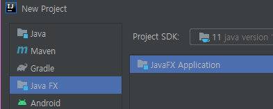
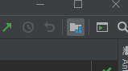
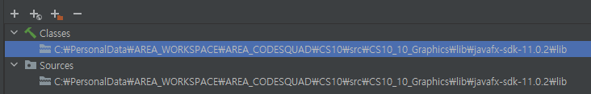
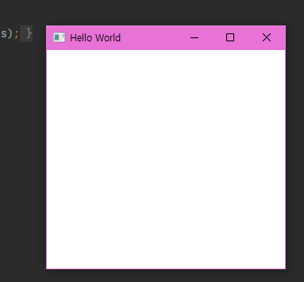
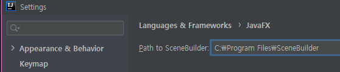
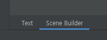
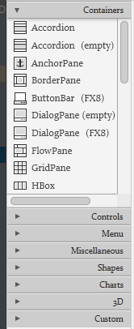
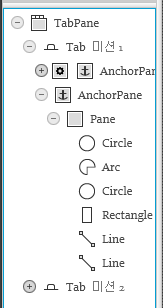

# 오늘 할 일

- [ ] JavaFX에 대해 공부하기
- [ ] 토끼책 읽기
- [ ] SQL책 읽기

# 오늘 배운 내용  

## JavaFX를 배워보자

### 설정

##### 모듈 설치 및 라이브러리 등록

 프로젝트 생성은 JetBrains IDE의 도움을 받았다

[일단 모듈을 설치하도록 하자](https://gluonhq.com/products/javafx/)

 요기로 들어가서

 라이브러리를 추가해주자

 

그럼 이렇게 추가된다

##### 실행 설정

[참조](https://www.jetbrains.com/help/idea/javafx.html#vm-options)

```
--module-path C:\PersonalData\AREA_WORKSPACE\AREA_CODESQUAD\CS10\src\CS10_10_Graphics\lib\javafx-sdk-11.0.2\lib --add-modules javafx.controls,javafx.fxml 
```

이런 설정을 넣어줘야 한다. 이때, javafx의 lib를 넣어줘야 하는데, 절대경로로만 해야 하는지는 모르겠으나, 절대경로로 성공했다.

##### 실행

```java
package sample;

import javafx.application.Application;
import javafx.fxml.FXMLLoader;
import javafx.scene.Parent;
import javafx.scene.Scene;
import javafx.stage.Stage;

public class Main extends Application {

    @Override
    public void start(Stage primaryStage) throws Exception{
        Parent root = FXMLLoader.load(getClass().getResource("sample.fxml"));
        primaryStage.setTitle("Hello World");
        primaryStage.setScene(new Scene(root, 300, 275));
        primaryStage.show();
    }


    public static void main(String[] args) {
        launch(args);
    }
}
```

 이렇게 뜬다.

### 구조

### Main클래스

* javaFX 애플리케이션을 시작시키는 메인 클래스가 필요하다. 얘는 javafx.application.Application을 상속받고 start메서드를 오버라이드해야 한다. 이걸 실행하면 GUI프로그램이 실행되는데, 그렇다고 이걸 호출하는게 아니라, launch()메서드를 호출해야한다. 애초에 Main클래스가 Application클래스를 상속받았기 때문에 호출할 수 있다.
* 추가로, public static void main의 args 아규먼트를 launch메서드의 아규먼트로 넘겨야 한다. 이걸로 라이브러리를 로드하는 모양이다.

#### 동작순서

* Application.launch(). 메인 메서드에서 launch()메서드를 호출한다
* 기본 생성자가 호출된다
* 그 다음 init메서드가 호추로디어 초기화를 한다. 메인클래스의 실행 매개값을 얻어 애플리케이션을 이용할 수 있게 해준다
* 그 다음 start메서드를 호출해서 윈도우가 실행된다.
* 애플리케이션을 종료하려면, 윈도우의 우상단 닫기버튼을 누르거나 자바코드로 프로그램을 종료시키면 된다.

#### JavaFX Application Thread

* **JavaFX Application Thread**는 UI작업, 입력이벤트 처리등의 화면 처리에 대한 책임을 지는 역할이 있다.

* 다른 스레드가 UI에 접근하면 예외가 발생한다. JavaFX API는 스레드 안전하지 않기 때문이다.

#### 생명주기

* 앞서 언급하였듯, Init, Start, Stop의 생명주기가 있다. 각각의 사이클에 호출되는 콜백함수를 오버라이드할 수 있다.

```java
@Override
public void start(Stage primaryStage) throws Exception{
    Parent root = FXMLLoader.load(getClass().getResource("sample.fxml"));
    primaryStage.setTitle("Hello World");
    primaryStage.setScene(new Scene(root, 300, 275));
    primaryStage.show();
}

@Override
public void init() throws Exception {
    super.init();
}

@Override
public void stop() throws Exception {
    super.stop();
}
```

### 화면 구성하기

#### 스테이지와 씬

* JavaFX의 세계에서는 윈도우를 스테이지라고 표현한다.
* 스테이지에 표현할 장면은 씬이라고 표현한다.
* 메인 윈도우는 start()의 primaryStage 아규먼트로 전달된다고 한다. 그러나, 씬 자체는 직접 만들어야 한다.
* 씬은 javafx.scene.Parent를 써서 만들 수 있다고 한다. UI의 루트컨테이너라고 한다.

```note
Root Container가 뭘까?
```

* UI의 루트 컨테이너인 Parent클래스는 추상클래스라서, 하위클래스로 객체를 생성해야 한다.
* javafx.scene.layout패키지의 컨테이너를 쓰면 된다.
* 그래서 JavaFX로 개발하면 아래와 같은 구성이 된다고 한다.

```
Stage
  |___Scene
  	    |____Parent(UI Root Container)
  		   		|____Label( UI Control )
  		   		|____Button
```

#### 레이아웃 구성하기

* UI를 Java같은걸로 하드코딩하는건 정말 끔찍하다. 너무 싫다.
* FXML 레이아웃이 있다. 태그로 선언할 수 있다
* JavaFX Scene Builder라는걸 써서 편하게 작업할 수 있다.
* [링크](https://www.jetbrains.com/help/idea/opening-fxml-files-in-javafx-scene-builder.html)

##### Scene Builder 설정

* [다운로드는 여기서 받자](https://gluonhq.com/products/scene-builder/)

* Scene Builder 설치프로그램을 실행해서 깔자.
*  
  * 프로그램 실행파일을 등록하자
* fxml파일을 열면 이런 탭이 생긴다
  *  
* 뭔가 필요한 플러그인이 없으면 설치를 요구한다. 클릭만 하면 jetbrain이 해주니까 누르자.

#### SceneBuilder로 화면 그리기

 대충 이런 메뉴가 있는데, 필요한거 가져다가 쓰면 된다

 각각의 컴포넌트는 이런 계층으로 구성된다.

나는 드래그앤 드랍으로 만들었지만, 실제로는 FXML코드로 작성된다. 

```xml
<Circle layoutX="144.0" 
        layoutY="105.0" 
        radius="64.0" 
        stroke="BLACK" strokeType="INSIDE" />
```

이런 식으로 된다.


# 코딩일일결산

#### 내일의 나에게 보내는 전달사항

* 컴퓨터의 클록에 대해 공부하기
* 토끼책 읽기
* SQL책 읽기
* 코플 듣기. 합분해파트에서 합분해 문제부터 들으면 됨

#### GOOD

* 

#### BAD

* 

