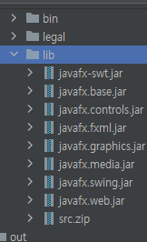

# 오늘 할 일

- [x] JavaFX에 대해 공부하기
- [x] 토끼책 읽기
- [x] SQL책 읽기

# 오늘 배운 내용  

## JavaFX를 배워보자

### 설정

##### 모듈 설치 및 라이브러리 등록

 프로젝트 생성은 JetBrains IDE의 도움을 받았다

[일단 모듈을 설치하도록 하자](https://gluonhq.com/products/javafx/)

 요기로 들어가서

 라이브러리를 추가해주자

 

그럼 이렇게 추가된다

##### 실행 설정

[참조](https://www.jetbrains.com/help/idea/javafx.html#vm-options)

```
--module-path \javafx-sdk-11.0.2\lib --add-modules javafx.controls,javafx.fxml 
```

이런 설정을 넣어줘야 한다. 이때, javafx의 lib를 넣어줘야 하는데, 절대경로로만 해야 하는지는 모르겠으나, 절대경로로 성공했다.

##### 실행

```java
package sample;

import javafx.application.Application;
import javafx.fxml.FXMLLoader;
import javafx.scene.Parent;
import javafx.scene.Scene;
import javafx.stage.Stage;

public class Main extends Application {

    @Override
    public void start(Stage primaryStage) throws Exception{
        Parent root = FXMLLoader.load(getClass().getResource("sample.fxml"));
        primaryStage.setTitle("Hello World");
        primaryStage.setScene(new Scene(root, 300, 275));
        primaryStage.show();
    }


    public static void main(String[] args) {
        launch(args);
    }
}
```

 이렇게 뜬다.

### 구조

### Main클래스

* javaFX 애플리케이션을 시작시키는 메인 클래스가 필요하다. 얘는 javafx.application.Application을 상속받고 start메서드를 오버라이드해야 한다. 이걸 실행하면 GUI프로그램이 실행되는데, 그렇다고 이걸 호출하는게 아니라, launch()메서드를 호출해야한다. 애초에 Main클래스가 Application클래스를 상속받았기 때문에 호출할 수 있다.
* 추가로, public static void main의 args 아규먼트를 launch메서드의 아규먼트로 넘겨야 한다. 이걸로 라이브러리를 로드하는 모양이다.

#### 동작순서

* Application.launch(). 메인 메서드에서 launch()메서드를 호출한다
* 기본 생성자가 호출된다
* 그 다음 init메서드가 호추로디어 초기화를 한다. 메인클래스의 실행 매개값을 얻어 애플리케이션을 이용할 수 있게 해준다
* 그 다음 start메서드를 호출해서 윈도우가 실행된다.
* 애플리케이션을 종료하려면, 윈도우의 우상단 닫기버튼을 누르거나 자바코드로 프로그램을 종료시키면 된다.

#### JavaFX Application Thread

* **JavaFX Application Thread**는 UI작업, 입력이벤트 처리등의 화면 처리에 대한 책임을 지는 역할이 있다.

* 다른 스레드가 UI에 접근하면 예외가 발생한다. JavaFX API는 스레드 안전하지 않기 때문이다.

#### 생명주기

* 앞서 언급하였듯, Init, Start, Stop의 생명주기가 있다. 각각의 사이클에 호출되는 콜백함수를 오버라이드할 수 있다.

```java
@Override
public void start(Stage primaryStage) throws Exception{
    Parent root = FXMLLoader.load(getClass().getResource("sample.fxml"));
    primaryStage.setTitle("Hello World");
    primaryStage.setScene(new Scene(root, 300, 275));
    primaryStage.show();
}

@Override
public void init() throws Exception {
    super.init();
}

@Override
public void stop() throws Exception {
    super.stop();
}
```

### 화면 구성하기

#### 스테이지와 씬

* JavaFX의 세계에서는 윈도우를 스테이지라고 표현한다.
* 스테이지에 표현할 장면은 씬이라고 표현한다.
* 메인 윈도우는 start()의 primaryStage 아규먼트로 전달된다고 한다. 그러나, 씬 자체는 직접 만들어야 한다.
* 씬은 javafx.scene.Parent를 써서 만들 수 있다고 한다. UI의 루트컨테이너라고 한다.

```note
Root Container가 뭘까?
```

* UI의 루트 컨테이너인 Parent클래스는 추상클래스라서, 하위클래스로 객체를 생성해야 한다.
* javafx.scene.layout패키지의 컨테이너를 쓰면 된다.
* 그래서 JavaFX로 개발하면 아래와 같은 구성이 된다고 한다.

```
Stage
  |___Scene
  	    |____Parent(UI Root Container)
  		   		|____Label( UI Control )
  		   		|____Button
```

#### 레이아웃 구성하기

* UI를 Java같은걸로 하드코딩하는건 정말 끔찍하다. 너무 싫다.
* FXML 레이아웃이 있다. 태그로 선언할 수 있다
* JavaFX Scene Builder라는걸 써서 편하게 작업할 수 있다.
* [링크](https://www.jetbrains.com/help/idea/opening-fxml-files-in-javafx-scene-builder.html)

##### Scene Builder 설정

* [다운로드는 여기서 받자](https://gluonhq.com/products/scene-builder/)

* Scene Builder 설치프로그램을 실행해서 깔자.
*  
  * 프로그램 실행파일을 등록하자
* fxml파일을 열면 이런 탭이 생긴다
  *  
* 뭔가 필요한 플러그인이 없으면 설치를 요구한다. 클릭만 하면 jetbrain이 해주니까 누르자.

* 근데 JetBrains의 탭에 있는 씬 빌더를 쓰기 보다, 새로 씬 빌더 윈도우를 켜서 작업하는게 나은 것 같다. 왜 그런지는 모르겠지만 컨트롤러 설정 탭이 뜨지를 않는다. 내가 뭔가 실수한것일 수 있다.

### 컨트롤러 등록하기

* 씬빌더를 키면 컨트롤러를 등록하는 부분이 나온다
*  이런식으로 내 프로젝트의 클래스가 뜬다. 
* 원하는 클래스를 등록하면 된다. 단 클래스에 FXML 어노테이션을 넣어주어야 뜨는 것 같다.

```java
public class MyController implements Initializable {
    @FXML
    private Button loadCsvFileButton;
```

* 이런식으로 작성해두면, 씬 빌더에도 뜬다. 마치 유니티에서 스크립트 변수에 오브젝트를 매팽하는것처럼 하면 된다.
*  이렇게 해서 변수를 바인딩하면 된다.

### 비동기작업 처리하기

* 절대로 JavaFX Application Thread에서 시간이 걸리는 작업을 하면 안된다. 얘는 UI스레드라서 얘가 멈추면 화면이 멈추는거랑 똑같기 때문이다.
* 따라서 시간이 걸리는 작업은 새로운 스레드를 만들어서 비동기로 처리하게 해야 한다.
* 비동기작업이 완료되면 이를 처리하는 CompletionRoutine만 작성하면 된다.

#### Service : javafx.concurrent.worker

* 얘가 바로 비동기 작업을 처리할 워커스레드이다.
* 약간 얘때문에 어려워 지는 부분이 많은 것 같다. 얘가 내부적으로 해주는게 너무 많다보니까 뭐가 어떻게 돌아가는건지 잘 파악하기가 어렵기 때문인 것 같다. 적어도 난 그렇게 느낀다.
* 여하튼 이걸 상속받아서 구현하면 비동기처리 클래스가 생긴다.

```java
class FileLoadService extends Service<ParsedSuveyData> {
    @Override
    protected Task<ParsedSuveyData> createTask(){/**/}
    @Override
    protected void succeeded(/**/)
}
```

* createTask는 비동기로 처리할 작업을 만들어서 리턴하는 메서드이다.
* succeeded는 비동기작업이 끝나면 호출되는 콜백메서드이다. 진짜 제일 중요한게 뭐냐면, succeeded를 실행하는건 JavaFX Application Thread이다. 그래서 스레드 관련 문제가 없다는 것이다.
* 다만 succeeded가 어떤 과정을 거쳐서 호출되는지는  잘 모르겠다. 

#### service 실행

```java
if(fileLoadService.isStarted)
    fileLoadService.restart();
else
    fileLoadService.start();
```

* 이미 시작해서 끝난 서비스는 succeeded상태이다. 여기서 또 start를 호출하면 예외가 발생한다. 따라서 이 경우엔 restart를 해줘야 한다. 이렇게 플래그변수로 처리하는게 맞는지는 모르겠는데, 일단 이렇게 했다.
* start는 상속받은거 쓰면 된다. 오버라이드 할 필요 없다.

#### 프로그래스 바 처리

```java
updateProgress(step, sizeOfFile);
```

* sizeOfFile부분은 전체 작업량을 말한다
* step은 처리된 작업량을 말한다. 이렇게 넘겨주면 알아서 프로그래스바를 그려준다.

## 토끼책

* 객체는 상태와 행동을 가진 식별가능한 존재이다. 
* 또한 상태는 변할 수 있으며, 그 행동은 상태에 영향을 받는다.
* 어떤 객체의 행동의 결과를 예측하기 위해선, 무엇이 필요할까?
* 그 객체의 과거를 전부 알고 있다면 예측은 할 수 있다. 근데 모든 과거를 기억할 수 있을까?
* 그래서 상태를 기억하는 것이다. 어떤 행동을 예측하기 위한 필수적인 상태만 유지하고 있다면, 모든 과거를 기억하지 않아도 행동을 예측할 수 있다.
* 그래서 객체는 상태를 가진다. 객체의 행동의 결과를 쉽게 예측하기 위해서이다. 필수적인 상태를 유지한다면, 모든 과거를 기억하지 않아도 된다.

## SQL첫걸음

* RDBMS는 SQL명령어를 이용해서 DB를 조작하도록 설계된 프로그램이다.
* 근데 DBMS마다 기능확장이 이루어지다보니, 추가적인 SQL이 생겨버렸다. 이를 고유 방언이라고 표현할 수 있겠다.
* 그 예시로는, 키워드 생략이 있다. Oracle이나 SQL Server에서는 Delete 뒤에 from을 생략해도 되지만, DB2나 MySQL등에서는 생략할 수 없다.
* 또한 외부결합을 할때도 DB별로 차이가 있다고 한다.
* 많은 RDBMS 제조사는 SQL표준화에 동참했고, 그 덕택에 SQL의 표준화는 많이 진행되었다고 한다.

# 코딩일일결산

#### 내일의 나에게 보내는 전달사항

* 컴퓨터의 클록에 대해 공부하기
* 토끼책 읽기
* SQL책 읽기
* 코플 듣기. 합분해파트에서 합분해 문제부터 들으면 됨

#### GOOD

* 

#### BAD

* 착각하고 초대형 삽질을 했다. 문제를 좀 더 꼼꼼히 읽고 풀도록 하자.

