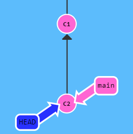

# 오늘 할 일

- [x] 깃에 대해 공부하기
- [x] JUnit에 대해 공부하기
- [x] 직접 Gradle을 설정해서 JUnit5를 불러와서 테스트해보기
- [x] 운동
- [ ] 토끼책 읽기
- [ ] SQL책 읽기

# 오늘 배운 내용  

# Git

### Git을 쓰면 할 수 있는 것. Git을 쓰는 이유

* 버전관리
* 백업
* 협업

깃은 파일에 대한 버전을 관리해준다. 버전마다 어떤 차이가 있는지, 어떤 내용이 다른지 볼 수 있다. 또한 버전을 업데이트할때마다 어떤 수정을 했는지 메세지를 작성할 수 있다. 그래서 시간이 많이 흘러도, 깃을 보면 어떤 파일이 어떤 버전에서 어떠한 이유로 이런 변경이 되었는지 볼 수 있어서 좋다.

작업 디렉토리에 여러개의 다양한 종류의 파일이 많이 있고, 얘들 중 일부를 수정하더라도, 깃은 각각의 파일에 대해 버전을 관리해주고, 각 버전마다 어떤 차이가 있는지 보여주기때문에 너무 좋다. 또, 언제든지 예전 버전으로 돌아갈 수 있는 기능을 제공해주는점도 정말 좋다

깃으로 관리되는 로컬의 저장소를 원격의 저장소에 업로드할 수 있다. 이렇게 해서 깃 저장소를 백업할 수 있다.

원격저장소를 이용하면 협업하기에도 좋다. 원격저장소의 내용을 로컬저장소로 가져와서 로컬에서 작업하다가, 나중에 동료들과 공유하는 원격저장소에 푸시해서 내 작업내용을 발행(Publish)할 수 있다. 그러면 원격저장소에 내 작업이 반영되고, 동료들은 이 내용을 볼 수 있다. 근데 이렇게 같은 저장소에서 협업하다보면, 같은 파일에 대해 작업할 수 있다. 이렇게 해서 충돌이 발생하는 경우, 깃은 서로의 버전에서 어떤 부분이 충돌하는지도 상세히 보여준다. 그럼 이걸 가지고 충돌난 부분을 사람이 잘 해결해서 푸시할 수 있다.

이처럼, 깃을 쓰면 버전관리도 좋고, 백업이라는 장점도 챙기면서 협업하기도 정말 편해진다. 그래서 우리는 깃을 써야 한다.

### Git 배울때 좋은 링크

* [도움이 되는 링크](https://learngitbranching.js.org/?locale=ko)

## Git의 사용법

### 커밋

* 우리가 작업하는 공간을 워크트리라고 부른다.
* 커밋을 실행하기 전의 저장소와, 작업 트리 사이에는 어떤 공간이 존재하는데, 이를 인덱스라고 부른다.
*  
* 작업트리의 변경내용을 저장소에 기록하기 위해선, 기록하고자 하는 모든 변경사항이 인덱스에 존재해야 한다. 이를 위해 인덱스에 기록하려는 모든 파일의 상태를 기록해야 하는데, 이를 스테이징이라고 부른다. 
* 저장소에 기록할 모든 변경사항을 인덱스에 기록했다면(스테이징), 커밋을 해서 저장소에 기록하면 된다.

### 브랜치

* 브랜치는 특정 커밋에 대한 참조(Reference)이다. 
* 많이 만들어도 메모리나 디스크 공간에 큰 부담이 되지 않는다.

* 브랜치는 하나의 커밋과 그 부모 커밋들을 포함하는 작업내역이라고 할 수 있다.

### Merge : 내가 있는 브랜치에다가 합쳐라.

* 브랜치는 머지 명령어로 합칠 수 있다.

* 머지 명령어로 두개의 부모를 가리키는 특별한 커밋을 만들어 낸다.
* 이 커밋은, 자신의 두 부모의 작업내역을 포함한다. 또한, 이 부모들의 부모의 작업내역까지 포함한다.

##### 예제

* 현재 *표시되어 있는 브랜치에 있는 상황이다.
* git merge bugfix를 하면, bugfix브랜치를 main브랜치에 합치게 된다.

 

* 그러면 아래와 같이, main브랜치는 머지를 통해 만든 새로운 커밋(c4)을 가리키게 된다.

 

* 여기서 bugFix브랜치로 이동한다음, bugFix브랜치에 main 브랜치를 병합하면?
* bugFix브랜치는 c4커밋을 가리키게 된다. 애초에 c4의 부모중 하나가 bugFix가 가리키던 c2이기 때문이다.

### 리베이스

* 브랜치끼리의 작업을 접목하는 두번째 방법이다.
* 현재 브랜치의 커밋들을 모아서 복제하고, 패러미터로 받은 브랜치의 밑에 붙인다.
* 커밋의 흐름을 보기좋게 한줄로 만들 수 있다.

 

* 이 상황에서 git rebase main명령을 실행하면 어떻게 될까? 내 생각엔, 현재 내가 위치한 브랜치인 bugFix가 c3커밋을 가리키고 있으니, 이 커밋의 복사본이 main 브랜치가 가리키는 커밋 c2 밑에 붙을 것 같다.

* 실행결과, bugFix가 가리키던 c3커밋은 남아있는체로, c3'라는 복사본 커밋이 main위에 올려진다.

 

* 다만 main은 아직 그대로 남아있는 상태이다. 그럼 여기서 main으로 이동한 다음, git rebase bugFix명령어를 실행한다면? 그러면 main브랜치가 가리키는 커밋을 복사해서 bugFix밑에 붙이라는게 된다. 

  그러면 c2->c3'->c2'->c3''이 될까?

 

* 그렇게 되지 않는다. main브랜치는 bugFix브랜치가 가리키는 c3'의 조상이라서, 그냥 main브랜치가 bugFix브랜치가 가리키는 c3'커밋으로 이동하게 될 뿐, 커밋의 복사가 발생하지 않는다.

### 커밋트리

#### HEAD의 존재

* 우리의 프로젝트는 커밋트리로 표현된다
* HEAD는 현재 체크아웃된 커밋을 가리킨다. 그래서 얘는 항상, 작업트리상에서 가장 최근의 커밋을 가리킨다.
* HEAD는 브랜치의 이름을 가리키고 있다.
* 커밋을 하면 브랜치의 상태가 바뀌는데, 이때의 변경은 HEAD를 통해서 알 수 있다. 가령, main브랜치가 c2커밋을 가리키고 있었다고 치자. 이때 커밋을 해서 c3커밋이 만들어지고, main브랜치가 c3를 가리키게 되었다. 그러면 HEAD도 이러한 변경을 따라서 움직인다.

 

* HEAD를 분리한다는건, 얘를 브랜치 대신에 커밋에 직접 붙인다는걸 의미한다.
* 위의 그림과 별개로, main이 c1을 가리키고 있었다면, HEAD -> main -> C1 이렇게 연결이 형성된 상태이다.
* 근데 여기서 git checkout C1을 실행한다면, HEAD를 분리해서 커밋에 붙이게 된다.
* 그러면, HEAD -> C1 이렇게 된다.


#### 상대참조(Relative Ref)

* 커밋은 해시로 구분하고 사용할 수 있긴 한데, 해시는 너무 길다. fe142414~~~~ 너무 길다.
* 상대참조를 쓰면, 현재 우리가 있는 위치인, HEAD에서 출발해서, 커밋트리의 다른 지점에 도달할 수 있다.

```
한 커밋 위로 움직이기 : ^ // ^는 캐럿 연산자라고 부른다.
ex : git checkout main^ // 이러면 main브랜치가 가리키는 커밋의 부모커밋으로 체크아웃하게 된다.
여러 커밋 위로 움직이기 : ~num // ~는 틸드 연산자라고 한다. num 만큼 올라간다.
git checkout main~3 //이러면 main브랜치가 가리키는 커밋에서 3번만큼 올라간다.
```

* 브랜치를 다른 커밋으로 강제로 옮길 수 있다. "git branch -f <재지정할 브랜치> <원하는커밋>" 이렇게 하면 된다. 이때, 상대참조를 써서 옮길 수 있다.

```
git checkout -f main HEAD~2 
//이러면 HEAD가 가리키는 커밋의 위로 두번째 커밋으로 main브랜치를 재지정 할 수 있다.
```

* 물론 상대참조 대신 해시로 지정할 수 있다.

### 작업 되돌리기

* reset과 revert를 이용해서 변경한 내용을 되돌릴 수 있다.

#### git reset

* 현재 브랜치가 예전의 커밋을 가리키도록, 브랜치를 이동시킨다. 
* 이는 히스토리를 고쳐쓴다고 할 수 있다. 이 점 때문에, 로컬브랜치의 경우엔 리셋을 써도 좋지만, 여럿이서 같이 쓰는 리모트 브랜치의 경우엔 쓰기 어렵다.
*  
* 이런식으로, main브랜치는 예전의 커밋인 c1을 가리키게 되었다. 히스토리를 고쳐쓴 것이다.

```
git reset HEAD~1 
// 현재 브랜치가 한단계 이전의 커밋을 가리키게 고쳐쓴다.
```

#### git revert

* 변경한걸 되돌리고, 이렇게 되돌려진 내용을 다른 사람들과 공유하려면 git revert를 쓰면 된다.
* reset은 현재 브랜치가 이전 커밋을 가리키게 이동시킨거였다면, revert는 현재 커밋에 반대되는 내용을 가진 새로운 커밋을 만들고, 얘를 가리키게 하는 방식이다. 새로운 커밋을 만든만큼, 되돌렸다는 작업을 다른 사람들과 공유할 수 있다. 어떻게 하냐면, 그냥 revert로 만들어진 새로운 커밋을 푸시해주면 된다.
*  
* revert를 하면, 요렇게 c2'라는 커밋이 생긴다. 얘는 c2커밋에서 한 내용을 되돌린 내용을 담고 있는 커밋이다.

```
git revert HEAD
//이렇게 하면, HEAD가 가리키는 커밋 c2에 반대되는 커밋인 c2'가 생성된다.
//이걸 push를 해서 다른 사람들과 공유할 수 있다.
```

## Git Remote

* 원격저장소는 백업으로서의 역할을 수행한다. 로컬 깃 저장소가 날아가더라도, 원격저장소에 백업해놨다면, 백업해놓은걸로 복사본을 만들어서 다시 작업할 수 있다.
* 원격저장소를 통해 다른사람과 협업할 수 있다. 다른 사람의 프로젝트에 쉽게 기여할 수 있다.

### git clone

* 원격 저장소의 복사본을 로컬에 생성한다.
* clone을 해서 원격저장소의 복사본을 생성하게 되면, origin/main 이라는 브랜치가 생긴다. 이 브랜치는 원격 브랜치라고 부른다.

### 원격 브랜치

* 원격 브랜치는 원격 저장소의 상태를 반영한다. 로컬에서의 작업과, 공개적으로 되고 있는 작업의 차이라고 보면 된다. 아무래도, 클론떠서 내 로컬 저장소에 생긴 브랜치는, 내가 로컬에서 하고있는 작업에 관한 것이고, 원격의 브랜치는 다른사람들과 공유해서 하고있는 작업을 말하는 것 같다.
* 원격 브랜치에서 직접 작업할 수 없다. 그래서 체크아웃을 하면 분리된 HEAD모드로 가게 된다. 즉 실제로는 원격저장소의 브랜치와 다른 곳에서 작업을 하게 되고, 나중에 이걸 다같이 공유해서 작업하는 원격저장소에 반영하는 작업을 해줘야 한다는 것 같다.

```
<원격저장소 이름><브랜치 이름>
o/main이면, 브랜치명은 main, 원격 저장소의 이름은 o이다. 보통 원격저장소는 origin이라고 명명하는 경우가 많아서, origin/branchName 이렇게 되는 경우가 많다.
```

* 원격 브랜치로 체크아웃하게 되면, GIT에 의해 분리된 HEAD모드가 된다고 한다. 그래서 새 커밋을 추가해도 o/main을 수정하지 않는다고 한다. 얘는 원격저장소가 갱신될때만 갱신된다고 한다.

 

* main브랜치에 있다가 git commit을 해서 c3커밋이 생겼다. main브랜치는 c3를 가리키고 있게 되었다.
* 이때, o/main으로 체크아웃해보자. 평범한 브랜치였다면, 그냥 *o/main 이렇게 되었겠지만, 얘는 원격브랜치라서, 분리된 HEAD모드로 동작하게 된다. 그래서 위와 같이 분리된 HEAD로서 c1커밋을 가리키게 되었다.

### Git Fetch

* git의 원격작업은, 원격 저장소와 데이터를 주고 받는 것이라고 한다.
* 원격 저장소의 데이터를 가져와서, 로컬 저장소의 내용을 업데이트해주어야 한다.
* 원격 저장소와 작업을 해서 상태가 변한다면, 원격 브랜치도 그 변경을 반영한다. 더 정확히 표현하면 아래와 같다.
  * 원격저장소에는 있지만 로컬에는 없는 커밋을 다운받음
  * 우리가 가지고 있는 원격 브랜치를 원격저장소가 알고있는 최신의 상태로 업데이트 해준다.
* 즉 , 로컬에 있는 원격저장소에 대한 상태정보를 실제 원격저장소의 데이터를 이용해서 동기화해준다고 할 수 있다.
* 원격 저장소에 대한 상태정보를 동기화 해줄 뿐이다. 우리의 로컬브랜치에 대해선 업데이트해주지 않는다. fetch를 해도 자신의 로컬작업은 변경되지 않는다.

```
git fetch
```

### Git Pull

* fetch를 통해 원격저장소로 부터 받은 최신의 데이터를 우리의 로컬 작업에 반영하고 싶다.
* 여러 방법으로 할 수 있다. 로컬에 새 커밋을 내려받았다면, 이걸 일반적인 커밋처럼 쓰면 되기 때문이다.
* merge도 되고, rebase도 되고, cherry-pick도 된다. 
* 근데 보통 merge를 하기 때문에, Git은 fetch받고 merge까지 하는 명령인 pull 명령을 제공한다.

```
git fetch;
git merge o/main
```

### Git Push

* 원격 저장소에 내 작업을 업로드하고 싶다. 왜냐하면, 다른 사람들과 나의 작업을 공유하고 싶기 때문이다.

```
git push
```

* 로컬의 변경을 원격저장소에 업로드 한다. 그러면 원격저장소는, 이 데이터를 받고, 합쳐서 업데이트한다.
* 이렇게 해서 원격저장소가 업데이트 되었다면, 다른 사람들은 원격저장소에서 fetch받아서 내가 업로드한 작업을 내려받을 수 있다.

### 엇갈린 작업

* 월요일에 원격저장소를 clone받아서 기능을 구현했다.
* 금요일이 되어 내 작업을 push하려고 했다
* 그런데 동료들이 어떤 작업을 해서 이미 원격저장소에 push해놨다.
* 내 작업은 예전 버전의 원격저장소를 기반으로 한 작업이다. 이렇게 작업이 엇갈려버리면, git은 push를 막는다. 애매모호하기 때문이다. 변경한 부분이 겹친다면, 누구의 내용을 우선해서 반영할지 판단할 수 없다.
* 그래서 Git은, 작업을 공유하기(push)전에, 원격저장소의 최신상태와, 자신의 작업을 합치도록 강제한다.

#### 작업이 엇갈렸을 때, 최신상태의 커밋과 내 작업을 합치는 방법

##### 리베이스를 하면 된다.

*  
* 내 작업은 c3커밋이다. 이때 fetch를 받으면, c2커밋을 다운로드 받게 된다. 이때, o/main은 c2커밋을 가리키게 된다. 왜냐하면, 원격져장소의 최신 내용은 c2커밋을 가리키고 있는거라 그렇다.
*  
* 그러면 내 작업인 c3커밋을 c2커밋 밑에 리베이스하자. 
*  
* 그러면, c3커밋을 복제해서 c2커밋 밑에 재배치한다. 그게 c3'이다.
* 그 다음, push를 하면 된다.
*   

#### 물론 merge를 해도 된다.

#### 아니면 그냥 git pull --rebase 명령을 실행해도 된다.

* 우선 fetch가 실행된다. 원격저장소로부터 데이터를 다운받는다.
* 현재 로컬main브랜치의 커밋을 복제해서, main원격브랜치 커밋 밑에 붙인다.

#### pull받고 push한다.  fetch하고 merge한담에 push하는거라 역시 된다.

### 원격 저장소 거부 ( Remote Rejected! )

* 보통 main이나 마스터 브랜치는 잠겨있다.
* 변경사항을 적용하고 싶다면, pull request과정을 거쳐야 한다.
* 이런 상황에서 main 로컬브랜치에서 커밋하고 push하게 된다면, 거부되었다는 에러메세지를 받게 된다. 잠겨있기때문에 그렇다. 이런식으로 원격 저장소에 대한 직접적인 커밋을 제한한다.
* 근데 만약에, 내가 깜빡하고  main에서 브랜치를 따로 만들어서 작업하지 않았다면? 그래서 main에서 직접 커밋을 한 상황이라면? 그럼 변경사항을 push하지 못하고 있다면?
* 그럴땐, 우선 새로운 브랜치를 만들자. 그리고 로컬의 main브랜치는 reset해서 되돌리자. 그리고 push하면 된다.

#### 작업 브랜치(Feature 브랜치)

* 작업은 main브랜치가 아닌, 작업브랜치에서 한다.
* 작업 브랜치란, 작업을 위해 임시로 만든 브랜치를 말한다. feature브랜치라고도 한다.

#### 왜 Merge안해요?

* 강의사이트에선 작업을 합칠때, rebase를 열심히 썼다. 근데 작업을 합치면 되는거라서 merge도 쓸 수 있다. 근데 왜 자꾸 rebase만 쓰는가?
* 그냥 rebase를 쓰면, 커밋트리를 깔끔하게 볼 수 있어서 좋을 수도 있다. 하지만, 커밋트리상에서 보이는 히스토리부분을 수정하는꼴이라서 선호하지 않을 수 있다. 둘 다 작업을 합치는건 문제 없으니까, 선호하는 방법을 쓰면 된다고 한다.

### 원격 추적 브랜치

* git은 main브랜치와 원격브랜치인 o/main이 연관되어있다는걸 안다.
* pull을 하면, o/main의 새로운 데이터가 다운로드되고, 최신상태로 업데이트된다. 그리고 로컬브랜치인 main과 o/main브랜치가 merge된다.
* 또한 push 작업 도중, main브랜치의 작업은, o/main으로 표현되는 원격브랜치에 push된다.
* 이는 브랜치의 원격 추적 속성때문에 그렇다. main브랜치는 o/main브랜치를 추적하도록 설정되어 있기 때문에, merge랑 push할 내재된 목적지가 있게 된다.
* 저장소를 clone할때, 이 속성이 자동으로 설정된다. 그래서 따로 지정해주지 않았는데도 설정되어있는 것이다.
* 직접 원격추적 속성을 바꿔줄 수 있다. 그러면 등록한 브랜치를 push랑 merge의 내재된 목적지로 쓰게 된다.

##### 원격 추적 브랜치 설정방법 첫번째

* 지정한 원격 브랜치를 참조해서 새로운 브랜치를 생성하고 체크아웃하기

```
git checkout -b foo o/main
```

* 이러면 원격 브랜치를 참조해서 새로운 브랜치인 foo를 생성하고 여기로 체크아웃한다.
* 이러면 foo브랜치는 o/main브랜치를 추적하게 된다. 

 

* 근데 이러면, 로컬의 main브랜치는 갱신되지 않는다.

##### 원격 추적 브랜치 설정방법 두번째

* -u옵션을 쓰기.

```
git branch -u o/main foo
//이러면, 브랜치 foo는 원격 브랜치 o/main을 추적하게 된다.
git commit;
git push
//이러면 foo 브랜치에 커밋하고 푸시하게 된다. 내재된 목적지가 o/main이라서, 원격저장소의 main브랜치가 업데이트된다.
```

## Git을 이용한 코드리뷰

[정말 좋은 강의](https://www.youtube.com/watch?v=a5c9ku-_fok&feature=youtu.be)

* 원격저장소에 내 브랜치를 생성해달라고 요청한다.
* 프로젝트를 내 계정으로 fork한다. 그 다음, fork한 프로젝트를 내 컴퓨터로 clone뜬다. 이때, 내 브랜치만 clone할 수 있도록 한다.
* 그러면 로컬저장소가 생겼다. 이제 기능구현을 위한 작업 브랜치를 생성하고  이동하자.
* 기능을 다 구현했다면, 모든 변경사항을 인덱스에 올리자. 스테이징을 다 했다면, 커밋해서 로컬저장소에 스냅샷을 기록하자. 커밋 메세지는 상세히 적도록 한다.
* 내 원격 저장소에 올리도록 한다. 다같이 공유하는 원격 저장소가 아니라, 내 원격저장소에다 올린다.
* github 서비스에서 pull request를 보내자. pull request를 통해 피드백을 받으면, 코드를 수정하고, 같은 브랜치에 커밋하고 푸시하자.
* 리뷰가 다 끝났다면, 마지막으로, 리뷰어가 다같이 쓰는 원격저장소로 merge한다.
* merge완료 통보를 받게되면, 나는 작업브랜치를 삭제한다. 삭제하기 싫으면 안해도 된다.
* 다같이 공유해서 쓰는 원격저장소와 내 저장소를 동기화해야 한다. 리뷰어가 병합해서 업데이트 된 내 브랜치의 데이터를 가져오고 싶기 때문이다.
* 이때, 다 같이 공유해서 쓰는 원격저장소를 UpStream이라고 하는 것 같다.
* 여하튼 UpStream저장소를 추가한다. 이건 최초 1회만 한다. remode add upstream
*  fetch를  통해 내 브랜치를 가져온다. fetch upstream. 이걸 통해서 내 원격저장소로부터 가져왔던 내 이름의 브랜치를 업데이트 해준다.
* 그 다음 작업을 한다면, 내 이름의 브랜치에서 작업브랜치를 만들고 앞의 작업과정을 반복하면 된다

## JUNIT

* [JUnit5로 단위테스트하기](https://junit.org/junit5/docs/current/user-guide/)

### 설정하기

* [Junit5 설정 예제](https://github.com/junit-team/junit5-samples/tree/r5.7.1/junit5-jupiter-starter-gradle)
* 위의 링크가 가리키는 저장소를 참조해서 설정하도록 한다.
* 우선 build.gradle파일을 참조해서 내 프로젝트도 비슷하게 설정하도록 한다.
* 그 다음, Reload All Gradle Projects를 실행시킨다
*  IDEA 우상단에 GRADLE 탭이 있는데, 거기 있다.
*  
* 그럼 위와 같이 필요한 라이브러리를 불러올 수 있다.

### 사용하기

* @Test 어노테이션으로 메서드가 테스트 메서드임을 나타낼 수 있다.
* @DisplayName 어노테이션으로 테스트 메서드에 대한 이름을 붙여줄 수 있다.
* 그 외에도 다양한 어노테이션이 많다. [더 알아보기](https://junit.org/junit5/docs/current/user-guide/#writing-tests-annotations)

```java
import static org.junit.jupiter.api.Assertions.*;
/*static import로 가져오면, public static으로 선언된 필드나 메서드를 
  클래스명을 안쓰고 바로 접근할 수 있게 된다.
  이렇게 하면 assertEquals()메서드를 바로 호출할 수 있다.
*/
import org.junit.jupiter.api.DisplayName;
import org.junit.jupiter.api.Test;

public class TestMyClass {
    @Test
    @DisplayName("생성자에서 부여한 이름을 가져올 수 있어야 합니다.")
    public void testGetName(){
        MyClass myClass1 = new MyClass("asdf");
        assertEquals("asdf", myClass1.getTitle());
    }
}
```

* 만약, 테스트가 틀렸다면, 이렇게 출력된다.

 

* 성공했다면, 이렇게 된다

 


# 코딩일일결산

#### 내일의 나에게 보내는 전달사항

* JUnit5로 테스트하는걸 좀 더 공부해보기
* 토끼책 읽기
* SQL책 읽기

#### GOOD

* Gradle을 이용해서 직접 JUnit5를 추가해서 쓸 수 있게 되었다.
* 운동은 했다.

#### BAD

* 토끼책이랑 SQL책을 읽지 못했다.

