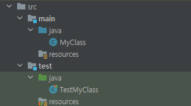
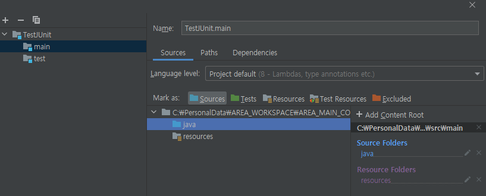
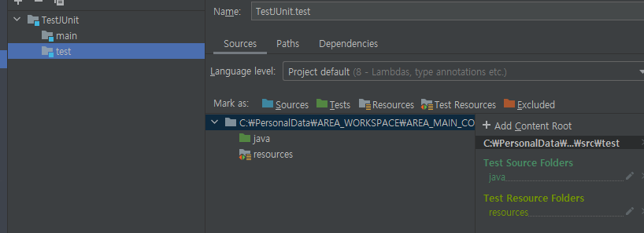

# 오늘 할 일

- [x] JUnit에 대해 공부하기
- [x] Gradle에 대한 공부하기
- [ ] 운동
- [ ] 토끼책 읽기
- [ ] SQL책 읽기

# 오늘 배운 내용  

## IntelliJ에서 JUnit5 재설정하기

#### 프로덕션 코드와 테스트 코드

* 프로젝트에는 두가지 종류의 소스코드가 있다. 첫째는 프로덕션 코드, 둘째는 테스트 코드이다.
* 프로덕션 코드는 우리가 어떤 프로그램을 구현하기 위해 만든 소스코드이다.
* 테스트 코드는 프로덕션 코드를 테스트하는 소스코드이다.

#### 내가 겪은 시행착오

* 프로덕션 코드는 src/main/java 밑에 작성하고, 테스트 코드는 src/test/java 밑에 배치하지 않았다.
* 프로덕션 코드가 있는 패키지에 test라는 패키지를 만들고, 여기에 테스트 코드를 작성했다.
* 그렇게 하니까 알수없는 버그가 생겼다. 
* 테스트코드에서 build.gradle에서 compile()로 추가한 JUnit 라이브러리를 찾지 못했다.
* 또한 한가지 걱정거리가 생겼다. 애초에 JUnit을 쓰는 이유 중 하나는, 프로덕션코드와 테스트코드를 분리하기 위해서이다. 그런데 프로덕션 코드와 테스트코드가 같은 패키지 밑에 있다면, 나중에 릴리즈 버전을 빌드할때 매우 귀찮아질 것 같았다. 테스트코드는 릴리즈 버전에서 제외되어야 할텐데, 같은 패키지에 있다면 잘 제외할 수 있을까? 할 수 있다고 해도 매우 힘들지 않을까? 라는 고민이 생겼다.
* 그래서 Jetbrains IDEA의 프로젝트 설정에서 특정 폴더를 테스트로 mark하기로 했다. 하지만 잘 되지 않았다. 내가 하지 않아도 자꾸 test라는 모듈이 생겼다. 거기다가 존재하지도 않는 경로를 자신의 Content Root로 가지고 있었다. 이 모듈은 아무리 지워도 계속 재성성되었다.
* 계속 해매다가 결국 다른걸 따라해보기로 했다.

#### Gradle 프로젝트를 직접 생성해보고, 그 구조를 따라해보기

* IDEA로 새로운 Gradle프로젝트를 생성하고, 기본으로 생성되는 구조를 따라하기로 했다.

#### 디렉토리 구조

 

* 소스코드는 src/main/java
* 테스트코드는 src/test/java
* 그래서 내 프로젝트도 위와 같은 구조로 변경했다. 
* 프로덕션 코드쪽은 그대로 두고, 테스트 코드를 src 밑에 test/java라는 폴더를 만들었다.

#### 프로젝트 설정

##### main 모듈

* 소스코드는 src/main/java밑에 배치된다. 그러므로, java 디렉토리를 소스로 Mark as해준다.

 

##### test 모듈

* 테스트 코드는 src/test/java 밑에 배치된다. 따라서 여기의 java는 Tests로 Mark as 해준다.

 

#### 결과

* 그제서야 build.gradle에서 정의한대로 추가되었던 JUnit라이브러리를 쓸 수 있게 되었다.
* 만약 뭔가 잘 안된다면, 해당하는 프레임워크를 쓰는 프로젝트를 생성하는 starter같은걸 이용해서 한번 만들어보자
* 그런 다음 내 프로젝트와 starter로 생성된 프로젝트를 비교해서, 서로 다른점을 찾다보면 해결책을 찾을 수 있을지도 모른다.

## 자바 공부

#### Enum

오늘 팀원분들이 Enum에 대해 많이 가르쳐주셨다. enum쓰면 정해진 범위안에서만 쓰도록 강제된다. 그래서 enum에 있는 값만 가지고 어떤 기능을 처리하게 되면, enum에 있는 값만 입력으로 들어가기 때문에, 예상치 못한 값이 입력으로 들어가서 문제가 생기는 일을 피할 수 있다.

우선 Enum은 열거타입이라고 할 수 있다. Enum안의 요소들은 열거상수라고 표현한다.

```java
public enum MyEnum{
    WHITE,
    BLACK,
    RED,
    BLUE
}
```


#### final

값을 변경할 수 없게 만드는 키워드이다.

final ArrayList arr = new ArrayList() 이라고 선언하게 되면, arr이라는 레퍼런스 변수는 처음에 생성한 ArrayList인스턴스의 레퍼런스만 가질 수 있다. 나중에 다른 인스턴스의 레퍼런스를 arr에 저장할 수 없다.


### 추가로 알게 된 사실

* github action은 auto deployment를 위해 쓴다고 파이로님이 가르쳐주셨다.


## JUnit 추가학습

### 어노테이션

#### BeforeEach

* @Test메서드가 실행되기 전에 호출되는 메서드라고 나타내는 어노테이션이다.

#### AfterEach

* @Test메서드가 실행된 후에 호출되는 메서드라고 나타내는 어노테이션이다.

#### Test

* 테스트 메서드라고 나타내는 어노테이션이다.

# 코딩일일결산

#### 내일의 나에게 보내는 전달사항

* JUnit5로 테스트하는걸 좀 더 공부해보기
* 토끼책 읽기
* SQL책 읽기

#### GOOD

* JUnit 어노테이션에 대해 조금 더 알게 되었다.
* 

#### BAD

* 토끼책이랑 SQL책을 읽지 못했다.
* 운동도 안했다.

