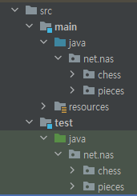
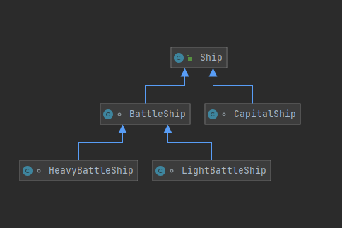

# 오늘 할 일

- [ ] 토끼책 읽기
- [ ] SQL책 읽기

# 오늘 배운 내용  

## JUnit을 쓸 때의 패키지 구조

* 프로덕션 코드와 테스트 코드는 같은 패키지 구조를 가지는게 좋다.

 

* 그러면, 테스트코드에선 테스트 대상 클래스를 import하지 않아도 된다는 장점이 있다.

## Java 공부. 제네릭의 와일드 카드

### 특징

* ?이 바로 제네릭의 와일드 카드이다.
* 구체적인 타입 대신, 와일드카드를 타입으로 대신 쓸 수 있다.
* 리턴타입이나 패러미터 타입에 와일드카드를 쓸 수 있다.

### 와일드카드의 세가지 형태

* ?
* ? extends MyUpperClass
* ? super MyLowerClass

### 예제

#### wildcard의 사용

```java
void testWildcard(){
    wildcard1(Ship.class);
    wildcard1(BattleShip.class);
    wildcard1(HeavyBattleShip.class);
    wildcard1(CapitalShip.class);
}

private void wildcard1(Class<?> param){
    System.out.println(param.getName());
}
/*** output
MyGeneric.Ship
MyGeneric.BattleShip
MyGeneric.HeavyBattleShip
MyGeneric.CapitalShip
*/
```

* 이러면 ```public final class Class<T>```의 T부분에 어떤 클래스이던 다 넣을 수 있다.

#### ? extends MyUpperClass

* 와일드카드에 올 수 있는 클래스는 MyUpperClass를 상속받았어야 한다고 제한을 건다.
* 예를들어, ? extends BattleShip이라고 지정했다면, 와일드카드로 올 수 있는 타입은 BattleShip을 extends했어야 한다.
* 아래의 다이어그램과 같은 상황에서, 와일드카드를 쓰는 예제이다.

 

```java
void testWildcard2() {
    wildcard2(BattleShip.class);
    wildcard2(HeavyBattleShip.class);
    wildcard2(LightBattleShip.class);
    wildcard2(Ship.class);
    wildcard2(CapitalShip.class);
}

private void wildcard2(Class<? extends BattleShip> param) {
    System.out.println(param.getName());
}
/*** compile error 1 : Ship.class
incompatible types: java.lang.Class<MyGeneric.Ship> cannot be converted to java.lang.Class<? extends MyGeneric.BattleShip>
*/

/*** compile error 2 : CapitalShip.class
java: incompatible types: java.lang.Class<MyGeneric.CapitalShip> cannot be converted to java.lang.Class<? extends MyGeneric.BattleShip>
*/
```

* Ship과 CapitalShip은 BattleShip을 상속받지 않았기 때문에, 쓸 수 없게 된다.

#### ? super MyLowerClass

* 와일드카드에 올 수 있는 클래스는 MyLowerClass의 super클래스여야 한다고 제한을 건다.
* 그래서 와일드카드에 올 수 있는건, MyLowerClass자신과, 이 클래스가 extends한 super클래스뿐이다.

```java
void testWildcard3() {
    wildcard3(Ship.class);
    wildcard3(BattleShip.class);
    wildcard3(CapitalShip.class);
    wildcard3(HeavyBattleShip.class);
    wildcard3(LightBattleShip.class);
}
private void wildcard3(Class<? super BattleShip> param) {
    System.out.println(param.getName());
}
```

* 그래서 이 경우엔 CapitalShip, Heavy, Light BattleShip클래스를 쓸 수 없다. 캐피탈쉽은 애초에 BattleShip과 super클래스만 같을 뿐, BattleShip클래스의 super클래스도, sub클래스도 아니다
* Heavy,Light BattleShip클래스는 BattleShip클래스를 extends한, 즉 상속받은 클래스이다. super클래스가 아니므로, 쓸 수 없다.
* 그래서 BattleShip, 자기 자신과, Super클래스인 Ship클래스만 쓸 수 있다.

### 오늘 푼 BOJ문제

* boj 9465 스티커문제


# 코딩일일결산

#### 내일의 나에게 보내는 전달사항

* 

#### GOOD

* 

#### BAD

* 

