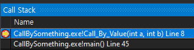
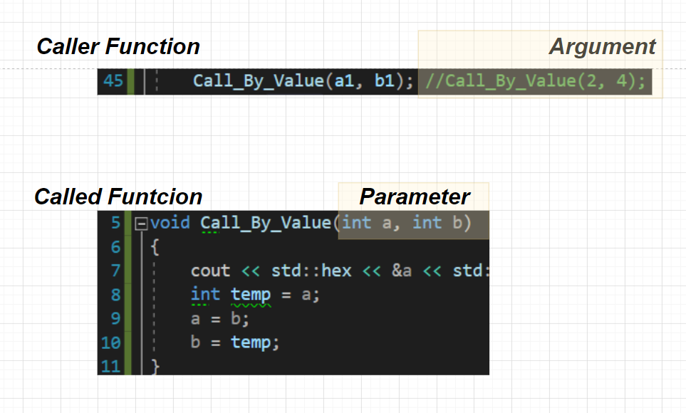
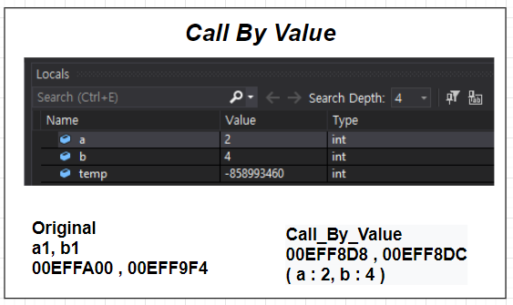
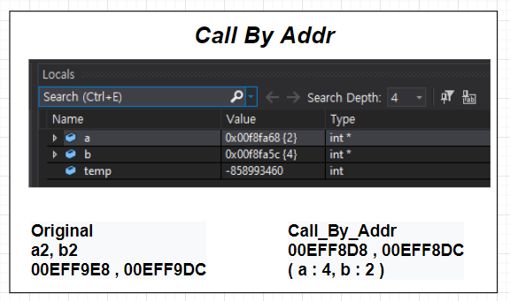
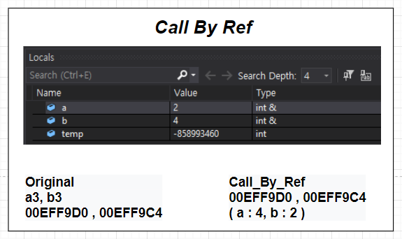

# 오늘 할 일

- [x] Call By Value, Addr, Ref에 대해 정리하기
- [ ] 코테문제풀기
- [ ] 토끼책 읽기
- [ ] SQL책 읽기

# 오늘 배운 내용  


## Call By Something

[예제 코드 cpp](https://gist.github.com/Malloc72P/571cde825ebe68b9cf0e7166cdf4da07)

### 함수와 스택. 그리고 지역변수

함수를 호출하면 콜스택이 쌓인다. 프로그램을 시작하면 main함수가 콜스택에 쌓인다. main에서 다른 함수를 호출하면, 그 함수가 콜 스택에 쌓인다. 아래의 사진처럼 동작한다.

 

위의 사진처럼, 호출한 순서대로 스택처럼 쌓인다. 

함수는 어떤 요청을 받고, 그 요청을 처리한 다음 결과를 반환해줄 책임이 있다. 이때 요청을 받기 위해서, 호출하는 함수로부터 어떤 값을 넘겨받을 필요가 있을 수 있다.

이때, 함수를 호출할때 넘기는 값을 아규먼트라고 부른다. 이 아규먼트를 저장받는 호출된 함수의 변수를 패러미터라고 부른다.

 

### 아규먼트와 패러미터 ( Argument & parameter )

함수를 호출할 때, 넘기는 값을 아규먼트라고 한다. 패러미터는 함수에서 아규먼트를 받기 위해 만드는 지역변수를 패러미터라고 한다. 이때, 패러미터의 타입에 따라 함수호출방식을 구분할 수 있다.

* Call By Value
* Call By Address
* Call By Reference

### Call By Value

넘기는 값은 int와 같은, 주소값이 아닌 일반적인 값이다. 따라서 패러미터의 타입도 int와 같은 일반적인 값을 담을 수 있는 타입이다.

 

Original에 있는 변수 a1과 b1의 값을 아규먼트로 넘겼다. 이때, Call By Value방식으로 동작하는 함수는, 아규먼트를 받아서 쓰기 위해, 패러미터를 만들고, 여기에 아규먼트 값을 넣어서 쓴다. 그렇다보니, 아규먼트를 넘길때 쓴 변수 a1, b1과, 함수의 패러미터 변수는 값만 같을 뿐, 서로 다른 변수이다. 그래서 두 변수는 주소값이 다르다.

### Call By Address

넘기는 값은 int와 같은 일반적인 값이 아니다. int변수의 주소를 담고있는 int*, 즉 포인터변수의 값이다. 값 대신 주소값을 아규먼트로 넘길 뿐이다. 이걸 받아 쓰기 때문에, 포인터타입의 패러미터를 만들고, 여기에 주소값을 저장해서 쓰게 된다. 

 

따라서, 변수 a2, b2의 주소값과 패러미터 변수의 주소값은 서로 다른걸 알 수 있다. 다만, 패러미터 변수에는 a2, b2변수의 주소값이 저장되어 있다. 주소값을 참조해서 값을 수정할 수 있기 때문에, 호출쪽의 지역변수인 a2, b2변수의 값을 바꿀 수 있다. 

### Call By Reference

* ***참고한 책 : C++ 기초 플러스 6판. Stephen Prata 지음. 476p, 함수 매개변수로서의 참조***

패러미터변수가 `참조형`이다. C++의 경우, 패러미터를 참조형으로 선언할 수 있다. 이렇게 하면, 변수는 하나인데, 두개의 이름으로 이 변수에 접근할 수 있다. 다시말해서, 아규먼트로 값을 넘길때 쓸 지역변수 a3, b3에 대해서, 두개의 이름을 부여하고 쓰겠다는 것이다. 이름만 하나 더 늘어난거니까, Call By Value나 Call By Address처럼 새로운 변수를 할당하고 값을 복사하지 않는다. 

 

그래서 아규먼트로 쓸 호출측의 지역변수 a3, b3와, Call By Reference방식으로 동작하는 함수의 패러미터는 같은 주소값을 가지고 있는 것이다. 여기서의 참조형 패러미터는 a3, b3와 같은 변수를 의미하므로, 

```c++
void Call_By_Ref(int &a, int &b)
{
	int temp = a;
	a = b;
	b = temp;
}
```

위와 같이 작성해도, 호출측의 지역변수 a3, b3에 대해서 SWAP을 할 수 있다.

### 정리

* Call By Value와 Address방식은 둘 다 값을 넘긴다. 다만 그 값이 int와 같은 일반적인 값이냐, 아니면 주소값이냐 라는 차이가 있다.

* Call By Address와 Call By Reference 둘 다 자신을 호출한 함수의 지역변수의 값을 바꿀 수 있다. 다만 이게 가능한 이유가 서로 다르다. Call By Address는 바꾸려는 호출측의 지역변수의 주소값을 복사해서 포인터 타입의 패러미터 변수에 복사해서 가능한 것이다.

  Call By Reference의 경우, 호출측의 지역변수 a에 대해 참조형 패러미터 refA를 만들어서 가능하게 한다. 따라서, 변수는 a 하나뿐인데, 이 변수에 대해 이름을 하나 더 지어줘서(refA) 참조해서 쓸 수 있게 하는 것이다.

### 자바의 경우

[해당 내용에 대한 Stack Overflow 링크](https://stackoverflow.com/questions/40480/is-java-pass-by-reference-or-pass-by-value)

자바는 언제나 Pass By Value라고 한다. C++처럼 참조형 패러미터가 없는 것이다. 어떤 변수에 대해 두개의 이름을 지어줘서 c++의 참조형 패러미터처럼 쓸 수 없다.

다만, 자바에는 레퍼런스 타입은 있다. 힙에 할당된 어떤 인스턴스 a가 있을 때, a를 가리키는 레퍼런스값을 레퍼런스 타입의 변수에 저장할 수 있다.

어떤 메서드를 호출할 때, `3`, `6` `32.41`등의 값을 아규먼트로 넘길 수 있다. 이 뿐만 아니라, 힙에 할당된 어떤 인스턴스를 가리키는 레퍼런스값을 아규먼트로 넘길 수 있다. 다만, 이걸 패러미터로 받을 때, C++의 참조형 패러미터처럼 받지 않는다. 그냥 Call By Address처럼, 새로운 레퍼런스 변수를 만들고, 여기에 아규먼트로 받은 레퍼런스값을 저장하고 참조해서 쓰는 것이다.

```java
class BattleStar {
    public String name;

    public BattleStar(String name) {
        this.name = name;
    }
}
```

이런 코드가 있다고 했을 때, 다음과 같이 메서드를 호출한다고 치자.

```java
public class PassBySomething {
    public static void main(String[] args) {
        BattleStar galactica = new BattleStar("Galactica");
        passByValue(galactica);
        System.out.println(galactica.name);
    }

    static void passByValue(BattleStar pegasus) {
        System.out.println(pegasus.name);
        pegasus = new BattleStar("Pegasus");
        System.out.println(pegasus.name);
    }
}
```

메인에서 passByValue메서드를 호출한다. 지역변수 galatica에 저장된 레퍼런스 아규먼트로 넘긴다. passByValue메서드에선 이 아규먼트를 받아서 패러미터인 `Battlestar pegasus`에 저장한다.

따라서, 변수 `galactica`랑 `pegasus`는, 같은 레퍼런스를 가지고 있을 뿐이다. 둘은 엄연히 다른 변수이다. 그런 이유로, `pegasus = new Battlestar("Pegasus")`를 해도, main의 `galactica`에는 영향이 없다.


## Git Remote의 커밋 되돌리기

### 혼자 쓰는 저장소인 경우

1. 리모트에서 되돌리고 싶은 브랜치를 A라고 하자.
2. A에 대응하는 로컬 브랜치a를 A와 동기화한다. 그러면 리모트의 상태를 불러와서 a에 저장한다.
3. 로컬 브랜치 a에 대해서, 되돌리고 싶은 위치까지 reset으로 되돌린다.
4. 그 다음, ` git push -f 리모트저장소 대상_브랜치명`으로 푸시한다
5. 끝

### 같이 쓰는 저장소인 경우

* 위의 방법은 흔적도 없이 원격의 변경사항을 날려버린다.
* 같이 쓰는 저장소에서 이러면 문제가 될 수 있다. 
* 그러니 revert를 써야 한다고 한다. 근데 아직 이건 해보지 않아서 잘 모르겠다. 기회가 되면 실습해보자.


# 코딩일일결산

#### 내일의 나에게 보내는 전달사항

* git 커맨드로 업스트림 저장소에서 특정 브랜치만 fetch받는 방법 재정리하기
* TIL에 쓴 내용 정리해서 카테고리화 하기

#### GOOD

* Call By XXX들에 대해 좀 더 이해가 높아진 기분이 든다.

#### BAD

* 

