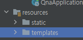

# 오늘 할 일

- [x] 코테문제풀기

# 오늘 배운 내용  

### 스프링 프레임워크

* 객체지향 자바 프레임워크이다. 
* 모든 사람이 자바 프로그래밍을 객체지향적으로 쉽고 빠르게 할 수 있게 도와준다.
* 웹만을 개발하는 도구가 절대 아니다.
* 예전에는 EJB라는 자바 프레임워크가 있었다. 근데 너무 복잡했다
* 나중에 스트러츠라는 프레임워크가 나왔다. EJB보다 덜 복잡했다.
* 스트러츠랑 스프링이랑 경쟁하다가, 결국 스프링이 살아남았다.
* 근데 그 스프링마저도 복잡했다. 특히 설정하는게 정말 복잡했다.
* 그러다가 루비 온 레일즈가 나왔다. 정말 간단했다. 스프링측은 이걸 보고 우리도 이런거 있어야 겠다고 해서 스프링부트가 나왔다.

### 시작하기

* Spring Initializer로 시작한다. 2.4.3으로. 
* 설정다하고 나면 jar이나 war파일을 받을 수 있다. 이걸 풀고 작업하면 된다.
* 또한, 그레이들이 프로젝트에 들어가있다. 이걸 깃에 안올리면 안된다. 이게 있어서 그레이들이 컴퓨터에 안깔려있어도 그레이들을 쓸 수 있게 된다.

### 그레이들

* 빌드 자동화 도구
* build.gradle파일에 정의된 대로, 의존관계에 맞는 것을 다운받고 빌드를 자동으로 해준다.
* 이게 없으면, 직접 jar파일 다운받고 path등록해주고 빌드해야 쓸 수 있었다.
* 지금은 빌드 자동화 도구가 있으니까 쓰고싶은것만 써주면 자동으로 다운받고 빌드까지 해주니까 정말 좋은 것 같다.

### 웹 프로그램?

* 근데 위의 방법으로 그냥 생성하면, 스프링 자바 프로그램이 생성될 분이라서, 웹 서버가 생성되지 않는다.
* 그래서 의존성에 Spring WEB을 추가해야 한다. 그러면 웹서버가 생성된다.

### MVC

* 데이터를 담는게 모델
* 화면구현을 하는게 뷰
* 로직을 처리하는게 컨트롤러이다.

### @Controller?

* 해당 클래스를 내가 관리하지 않고 스프링이 관리하게 한다.
* 클래스에 붙일 수 있는 어노테이션이다.
* 프로그램이 돌아갈때까지 유지를 하라. `Retention(RetentionPolicy.RUNTIME)`
* 스프링의 컴포넌트이다. @Component
* `public @interface Component`

### 템플릿엔진

* 타임리프라는 템플릿엔진이 있는데, 이거 많이 쓴다고 한다.
* 핸들바라는것도 많이 쓴다고 한다.

### URL

* 네트워크 상에서 어떤 자원을 식별하기 위한 주소를 말한다.
* 도메인과 포트 뒤에 붙는걸 쿼리스트링이라고 한다.

### Logger

* 이걸로 로그출력을 하면 된다. 
* 스프링에서 제공하는 로거를 쓸 수 있다.
* LoggerFactory.getLogger();를 하면 된다.

### Heroku

* 저장소를 여러개 둘 수 있다. 업스트림, 오리진, 그리고 히로쿠 저장소
* 히로쿠 저장소에 푸시해서 배포할 수 있다.
* 그러면 그레이들을 자동으로 감지하고 자동 빌드한다.


## Spring Boot 시작하기

#### 스프링 프로젝트 생성하기

* [Spring Initializr](https://start.spring.io/)를 이용해서 초기설정이 완료된 스프링 프로젝트를 생성한다.

#### 컨트롤러 만들기1

```java
import org.slf4j.Logger;
import org.slf4j.LoggerFactory;
import org.springframework.stereotype.Controller;
import org.springframework.ui.Model;
import org.springframework.web.bind.annotation.GetMapping;

@Controller
public class MyHello {
    Logger logger = LoggerFactory.getLogger(MyHello.class);

    @GetMapping("/hello")
    public String helloMethod(String arg1, int arg2, Model model) {
        logger.info("called : helloMethod");
        logger.info("name : " + arg1);
        logger.info("age : " + arg2);
        model.addAttribute("name", arg1);
        model.addAttribute("age", arg2);
        return "hello";
    }
}
```

* 컨트롤러 클래스를 생성한다.
* `@Controller`어노테이션을 이용해서 해당 클래스를 컨트롤러 클래스로 만든다.
* 메서드에 `@GetMapping`어노테이션을 붙여서 해당 요청이 들어오면 해당 메서드가 호출되도록 매핑한다.

#### 템플릿 엔진 사용하기

* 핸들바 라는 템플릿 엔진을 사용해본다.
* 우선 `build.gradle`에 핸들바를 추가한다.

```groovy
dependencies {
	implementation 'org.springframework.boot:spring-boot-starter-web'
	testImplementation 'org.springframework.boot:spring-boot-starter-test'
	compile "pl.allegro.tech.boot:handlebars-spring-boot-starter:0.3.2"
}
```

* `compile "pl.allegro.tech.boot:handlebars-spring-boot-starter:0.3.2"`이 추가되었다.
* 그레이들을 통해 필요한 파일을 자동으로 다운받고 빌드할 수 있다.
* 템플릿 파일은 `src/main/resources/templates` 밑에 생성한다.

#### 템플릿엔진 설정하기

* `src/main/resources/application.properties`파일을 수정해서 핸들바 설정을 추가할 수 있다.

```groovy
handlebars.suffix=.html
handlebars.cache=false
```

* 위와 같이 설정하면 핸들바 템플릿의 확장자로 html을 쓸 수 있다.

#### 컨트롤러 만들기2

* 어떤 요청이 들어왔을때, 호출되는 컨트롤러 메서드는 `@GetMapping`어노테이션을 주어서 등록할 수 있다.
* 컨트롤러에서는 로직을 처리한다.
* 화면처리는 뷰에서 한다. 근데 뷰를 동적으로 만들고 싶다면, 뷰에 변수값을 넘길 수 있어야 한다.
* 이는 `org.springframework.ui.Model;`를 통해서 하면 된다.
* 모델에서 `addAttribute("key", value)`를 해서 템플릿에 데이터를 넘길 수 있다.
* 뷰에서는 아래와 같이 넘겨받은 데이터를 쓸 수 있다.

```html
<body>
    <h1>Hello My Friend!</h1>
    <h4>{{name}}</h4>
    <h4>{{age}}</h4>
</body>
```

#### 템플릿 사용하기

##### 경로설정

* 정적 페이지는 `static`폴더 밑에, 동적 페이지는 `templates`밑에 배치한다.
*  
* `css`와 `js`는 static폴더 밑에 배치한다.
* 경로를 지정할 때, `/css/myCss.css`이렇게 한다면, `resoureces/static`에서 찾는다. 따라서, `templates`밑에 있는 템플릿 파일에서 경로를 설정한다면, 그냥 `/css/myCss.css`로 하면 된다. 단, 이 경우에 있어서 `css`폴더는 `static`밑에 있어야 한다.

##### 배열 전체출력

* 모델로 배열이나 List컬렉션을 넘길 수 있다.
* 배열이나 List안의 모든 요소를 전부 출력하고 싶다면, 다음과 같이 작성하면 된다

```handlebars
<ul>
    {{#myList}}
	    <li>title : {{title}}</li>
    {{/myList}}
</ul>
```

#### 컨트롤러 만들기3

##### `@PathVariable` 사용하기

* 요청메서드 방식에 따라 같은 url에 대해 다른 메서드가 호출되도록 지정할 수 있다.

```java
@PostMapping("users")
public String onRegister(String userId, String password, String name, String email) {
	/*...*/
}
@GetMapping("users")
public String onList(Model model) {
    /*...*/
}
```

* 같은 Get방식의 요청메서드여도, 쿼리스트링을 가지고 구분할 수 있다.

```java
@GetMapping("users")
public String onList(Model model) {
    /*...*/
}
@GetMapping("users/{userId}")
public String onUserProfile(@PathVariable("userId") String userId, Model model) {
    /*...*/
}
```

* 둘 다 GET방식의 요청을 하지만, `onUserProfile`의 경우, `/{userId}`가 하나 더 붙는다.
* 요청할 때는 `http://localhost:8080/users/malloc72p` 이렇게 하지만, 위와 같이 어노테이션을 작성하면, `malloc72p`를 패러미터로 쓸 수 있다. 이를 위해서는 `@PathVariable`어노테이션을 쓰면 된다.


## Upstream저장소 이용하기

* Upstream저장소를 내 계정으로 fork한다. 이 저장소를 오리진이라고 하자.
* fork한 저장소를 clone해서 내 작업PC에 로컬저장소를 만든다.
  * 이때, `--single-brnach`옵션을 주어서 특정 브랜치만 받을 수 있다.
  * 예시

```shell
git clone -b Malloc72P --single-branch https://github.com/Malloc72P/spring-boot-qna.git
```

* 작업할 기능에 해당하는 브랜치를 생성하고, 작업한다.
* 작업이 끝나면 오리진 저장소에 작업한 브랜치를 푸시한다.
* github웹페이지상에서, 작업한 브랜치를 가지고 Pull Request를 한다.
* Pull Request가 approved되면 UpStream저장소의 특정 브랜치에 Merge시킨다.


# 코딩일일결산

#### 내일의 나에게 보내는 전달사항

* TIL에 쓴 내용 정리해서 카테고리화 하기

#### 특이사항

* 

