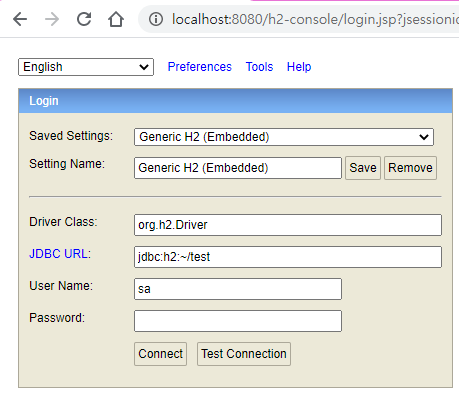
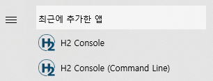
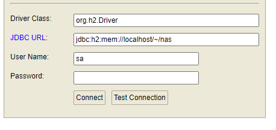
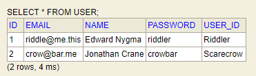
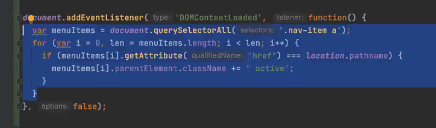

# 오늘 할 일

- [ ] 코테문제풀기

# 오늘 배운 내용  

### 배스천 호스트 (Bastion Host)

* [출처](https://velog.io/@makeitcloud/%EB%9E%80-Bastion-host-%EB%9E%80)
* [추가 출처](https://galid1.tistory.com/365)
* 내부 네트워크와 외부 네트워크 사이의 게이트웨이이다.
* 배스천 호스트를 통해서 내부 네트워크를 보호한다.
* 아직은 배스천 호스트가 어떻게 내부 네트워크를 보호한다는건지 잘 모르겠다. 근데 대충 봤을 때, 외부에는 배스천 호스트를 두고, 얘를 통해 접근하게 만드는 것 같다. 그리고 실제 사용하는 인스턴스는 내부 네트워크에 숨겨서 보호하는 것 같다.
* 내부에 숨겨놓은 서버에 접속하고 싶다면 배스천 호스트를 경유해서 접근해야 하는 것 같다.

## JAVA LocalDate

* [출처](https://jeong-pro.tistory.com/163)

### Date클래스가 불편한 이유

* Date는 불변객체가 아니라서 임의로 값을 바꿀 수 있다
* Date는 1월을 0으로 쓰는게 불편하다
* 년/월/일 계산은 캘린더 객체를 생성해야 할 수 있는점도 불편하다

* 그래서 Java8의 LocalDateTime을 쓴다고 한다. 실제로 어떤 점이 편한지는 플젝을 진행하면서 정리해보자.

## 스프링 따라하기 

### 그레이들로 H2 Database 추가하기

* [출처](http://homoefficio.github.io/2019/10/09/IntelliJ%EC%97%90%EC%84%9C-H2-%EC%97%B0%EA%B2%B0%ED%95%98%EA%B3%A0-JPA-Console-%EC%82%AC%EC%9A%A9%ED%95%98%EA%B8%B0/)

* [출처2](https://www.youtube.com/watch?v=F3koiTIJCwM)
* `build.gradle`에 다음을 추가한다

```groovy
runtimeOnly 'com.h2database:h2'
```

* `application.properties`에 다음을 추가한다

```groovy
spring.h2.console.enabled=true
spring.h2.console.path=/h2-console

spring.datasource.driverClassName=org.h2.Driver
spring.datasource.url=jdbc:h2:mem://localhost/~/nas;DB_CLOSE_ON_EXIT=FALSE
```

* 여기서 주의할 점이 하나 있는데, mvcc라는 옵션을 넣으면 안된다. 예전에는 괜찮았는데 버전 올라가면서 바뀌었다는 것 같다. [참고링크](https://www.inflearn.com/questions/16222)
* 서버주소가 `localhost:8080`이라면, 패스로 `/h2-console`을 입력하고 접속하면 h2-database콘솔에 접속된다.

 

* connect해서 안되면 h2데이터베이스를 따로 설치해줘야 한다
* [다운로드 받는 곳](http://h2database.com/html/main.html)
* 받은담에 h2콘솔을 실행하고 접속테스트하면 된다
*  
* 이걸로 H2데이터베이스를 생성한 다음, 작업도구모음에서 해당 앱을 종료한다
* 그 다음 `localhost:8080/h2-console`로 해당 데이터베이스에 접속하면 된다.

* `application.properties`에 유저이름과 패스워드를 넣는다.

```groovy
spring.datasource.username=sa
spring.datasource.password=
```

* 앱서버를 통해 h2-console에 진입한다
* JDBC URL에 `application.properties`에 썼던 url을 넣는다. (`spring.datasource.url`)
*  

### 그레이들로 JPA를 추가하기

* [출처](https://www.youtube.com/watch?v=69tNvDm-iiI)
* 아래를 `build.gradle`에 추가한다

```groovy
implementation 'org.springframework.boot:spring-boot-starter-data-jpa'
compile group: 'javax.persistence', name: 'javax.persistence-api', version: '2.2'
```

* 유저객체에 @Entity를 추가한다. 만약 자동완성이 안된다면, IntelliJ를 재시작하자.
* Id는 `@Id`로, 자동증가는 `GeneratedValue`로 주면 된다.
* 컬럼은 `@Column`으로 주면 된다. 컬럼의 속성은 어노테이션의 괄호안에 넣으면 된다.
* 어떤 속성이 있는지 보고 싶다면 Column어노테이션이 선언된 파일을 보면 알 수 있다.

### UserRepository 추가하기

* ```java
  public interface UserRepository extends JpaRepository<User, Long> {
      
  }
  ```
  
* 인터페이스다. 클래스가 아니다.

* 그 다음, UserController에서 `AutoWired`로 UserRepository를 넣어준다.

* 의존성 주입에 대해서는 나중에 공부해보도록 하자.

* UserRepository로 데이터를 관리하자. 기존에 List<>로 관리하던걸 바꿔주자

```java
@PostMapping("users")
public String createUser(String userId, String password, String name, String email) {
    User createdUser = new User(userId, password, name, email);
    //userList.add(createdUser);
    userRepository.save(createdUser);
    return "redirect:/users";
}
```

 

* 그럼 이렇게 저장되는걸 확인할 수 있다.

### Form태그로 PUT메서드 사용하기

* `<input type="hidden" name="_method" value="PUT"/>`
* 이런 꼼수를 쓰면 된다.

### 커맨드 객체 매핑

* 컨트롤러의 메서드에서 매개변수를 여러개 나열하기보다, 그냥 클래스 하나만 적으면, 여러개의 매개변수를 이용해서 객체를 생성해준다.
* 제약조건이 있는 것 같은데 나중에 공부해보도록 하자

### RequestMapping 적용

* 컨트롤러 자체에도 주소를 붙여줄 수 있다.

### JS



* 해당 코드는 파이로님이 짜주신 자바스크립트 코드이다
* 현재 주소를 이용해서 매칭되는 네비바의 탭에 active클래스를 부여해줄 수 있다.


# 코딩일일결산

#### 내일의 나에게 보내는 전달사항

* TIL에 쓴 내용 정리해서 카테고리화 하기

#### 특이사항

* 
