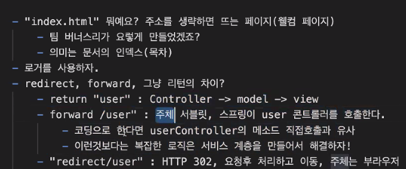
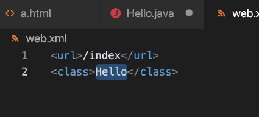
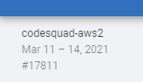
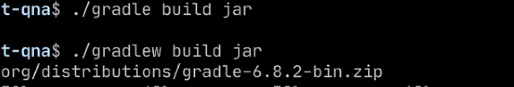
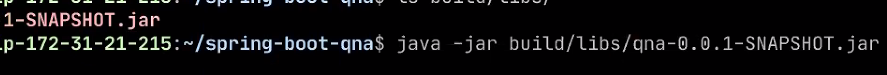
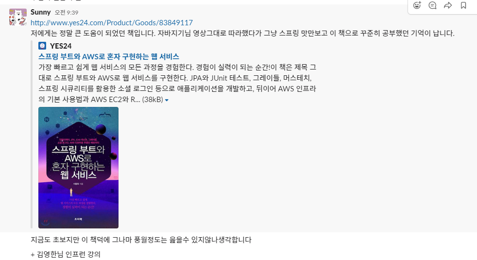

# 오늘 할 일

- [x] 코테문제풀기

# 오늘 배운 내용  

### CodePlus : 백트래킹

* boj 14889 스타트와 링크


### 리뷰 반영

- [x] 서로 관계가 없는 필드는 떼어주는 편이 가독성이 좋습니다.
- [x] length 20이면 contents로 충분할까요?
- [x] 'suggested'는 조금 맞지 않는 단어가 아닌가 싶어요.
- [x] 객체를 직접 전달해줄 수 있으면 속성을 전달하기 보다는 객체를 전달해줍시다.
- [x] 혹은 `createdDateTime`이 무난한 형태입니다.
- [x] `@AutoWired`대신 다른 방식으로 주입하기(스프링의 인젝션)
  - [x] [필드 인젝션 피해라](https://yaboong.github.io/spring/2019/08/29/why-field-injection-is-bad/)
- [ ] 중복된 코드가 등장했습니다. 어떻게 해결해 줄 수 있을까요?
  - [ ] AnswerController 43라인
- [ ] 왠만하면 id를 최 상단에 두고, 적절히 필드 배치를 하시길 추천드립니다
- [ ] `orElse(null)` 은 좋지 않은 패턴입니다.
- [ ] `Controller`가 가지기에는 너무 큰 책임입니다.
  - [ ] Answers 34라인
- [ ] ...그 외의 부분은 너무 길어서 다 담지 못했다.


* logging.level.root=Error에 대해 알아봐라
* 리다이렉트, 포워드, 리턴의 차이?
* 301하면 캐싱될 확률이 크다? 리다이렉트?
* 컨트롤러의 리턴은, 모델을 담아서 뷰를 랜더링하라는 것?

 

 

* 그러면 매핑된 서블릿이 실행된다.
* 헤드 퍼스트 서블릿?
* 최범균의 JSP책?
* 톰캣 자체가 웹서버이면서 서블릿 컨테이너임. web.xml을 읽고 적당한 java메서드를 호출한다.
  * 이는 톰캣에 내장된 기능이다.
* 한 컨트롤러에서 다른 컨트롤러의 메서드를 호출하는건 잘하는 걸까? 안티패턴이라고 한다.
  * 서로 두번 포워드라도 하면 무한루프이다.
* DomainDrivenDesign DDD? 여기서 도메인, 엔티티, 서비스, 리포지토리가 나왔다고 한다
* Optional.get은 피하는게 좋다
* crontab guru


### AWS

* IAM으로 계정설정
* EC2 생성
* 보안에서 인바운드 규칙 작성 : 웹서버 만든다면 HTTP 열어줄 것
* 빌딩블록?

```shell
sudo ./gradlew build jar
java -jar build/libs/qna-0.0.1-SNAPSHOT.jar
```

 

 

 


# 코딩일일결산

#### 내일의 나에게 보내는 전달사항

* 오늘 너무 이것저것 난잡하게 건드렸다. 정리하는건 내일의 나에게 맡긴다
* 내일은 오늘 풀었던 문제 한번 더 풀고, 리뷰받은거 반영하는것만 하자.
* 다 했다면 호눅스님의 AWS강의를 들어라.
* 이것도 다 했다면 오늘 배운걸 정리해라. 근데 이건 주말의 내게 맡긴다.
* 로거 레벨에 대해 공부하기
* [Pyro님 블로그 보고 공부하기](https://www.notion.so/REST-4cebf855900b4b0496acce657b5c8104)
* 김영한님 스프링강의는 꼭 듣는다.
* 아래의 저 책을 사서 읽어본다.

#### 특이사항

* 
