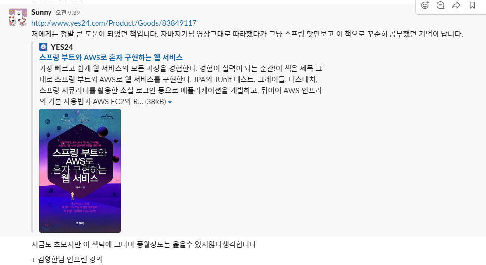

# 오늘 할 일

- [x] 코테문제풀기

# 오늘 배운 내용  

### CodePlus : 백트래킹

* boj 14889 스타트와 링크 다시 풀어봄

### 그 외의 시간엔 코드리뷰 받은 내용을 반영하였다.

# 코딩일일결산

#### 내일의 나에게 보내는 전달사항

* 오늘 너무 이것저것 난잡하게 건드렸다. 정리하는건 내일의 나에게 맡긴다
* 내일은 오늘 풀었던 문제 한번 더 풀고, 리뷰받은거 반영하는것만 하자.
* 다 했다면 호눅스님의 AWS강의를 들어라.
* 이것도 다 했다면 오늘 배운걸 정리해라. 근데 이건 주말의 내게 맡긴다.
* 로거 레벨에 대해 공부하기
* [Pyro님 블로그 보고 공부하기](https://www.notion.so/REST-4cebf855900b4b0496acce657b5c8104)
* 김영한님 스프링강의는 꼭 듣는다.
* 아래의 저 책을 사서 읽어본다.

#### 특이사항

* 
