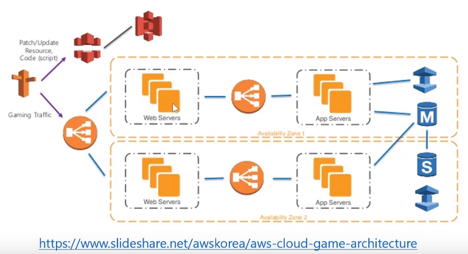

# 오늘 할 일

- [x] 코테문제풀기

# 오늘 배운 내용  

### Java Exception : Checked vs Unchecked

[참고링크 spring.io](https://spring.io/blog/2013/11/01/exception-handling-in-spring-mvc)

[Baeldung](https://www.baeldung.com/java-checked-unchecked-exceptions)

* Exception을 사용해서 에러처리 코드를 컨트롤러와 같은 일반적인 코드로부터 분리하라
* 어떤 타입의 예외를 발생시킬 것인지 결정하라
* Exception에는 Checked와 Unchecked 두 종류가 있다.
* Checked는 컴파일 시점에서 체크할 수 있는 예외이다. 반면 Unchecked는 컴파일시점에서는 체크할 수 없고, 런타임 시점에서 체크할 수 있는 예외이다.

## AWS 

### S3 사용하기

* 정말 높은 내구성을 자랑한다.(일레븐 나인)
* 버킷을 만든다. 버킷은 S3의 최상위 컨테이너이다
* 파일을 담는 그릇이라고 생각하자
* 그러면 버킷에 폴더를 만든다. 사실 폴더가 아니라 prefix이지만, 폴더라고 생각해도 무방하다고 한다.
* 추가로 여기에 파일을 업로드할 수 있다.
* 업로드된 파일을 공유할 수 있다.
* S3는 서비스 개발을 위한 다양한 기능이 있다. 퍼블릭으로 설정하는 등, 다양한 기능을 이용할 수 있다.
* S3의 파일은 객체라고 부른다. 객체는 인터넷상의 주소인 URL이 있다.(네트워크상에서 유일하게 식별할 수 있어야 객체를 찾을 수 있다)

### 네트워크와 인터넷

* 인터넷이란 TCP/IP프로토콜을 통해 전 세계가 연결된 네트워크를 말한다.
* IP는 네트워크 통신을 위해 필요한 주소이다. 이게 있어야 네트워크상에서 상대방의 컴퓨터까지 찾아간다.
* URL은 네트워크상에서 어떤 자원을 유일하게 식별할 수 있는 주소이다.
* DNS는 사람이 쓰는 도메인 주소를 IP주소로 변환해주는 시스템이다. 도메인 주소를 물어보면 IP주소로 변환해서 알려주는 일은 네임서버가 담당한다

### 주소창에 `www.naver.com`을 입력하면

* URL을 입력한다
* 입력한 URL에 해당하는 IP를 네임서버가 알려준다
* 획득한 IP를 가지고 네이버의 웹서버한테 웹페이지를 달라는 요청을 전송한다
* 네이버의 웹서버는 해당하는 페이지를 브라우저에게 응답해준다
* 브라우저는 응답받은 웹페이지를 화면에 출력한다
* 사용자가 행복해한다

### Route 53와 VPC

* AWS에서 제공하는 DNS서비스이다
* 우리가 웹서비스를 운용한다면, 우선 내부 네트워크를 구축해야 한다.
* 웹서버, DB, 파일서버 등의 다양한 서버를 연결해주는 네트워크가 내부 네트워크가 된다
* 이때, 일부 네트워크는 외부망과 연결된다. 인터넷과 직접 연결되어 있는 부분을 DMZ라고 한다.
* AWS에는 VPC라는게 있다. Virtual Private Cloud의 약자이다.
  * AWS의 가상 사설 네트워크쯤으로 생각하자
  * VPC를 용도에 따라 더 작은 서브넷으로 나눌 수 있다.
  * 서브넷에는 웹서버, DB, 파일서버 등이 연결될 수 있다.
  * public subnet에는 인터넷과 연결되는 서버가 위치한다.(웹서버, 메일서버)
  * private subnet에는 DB같은게 위치한다.

### 3-Tier 웹 어플리케이션 아키텍쳐

*  
* 인터넷 사용자는 라우트53을 통해 들어온다
* 웹서버가 맨 앞에 있다. 여기가 public subnet이다.
* private subnet에는 WAS(App Server), DB가 있다.
* 여하튼 일케해서 웹서버, 앱서버, DB를 3 티어라고 한다.
* 여하튼 저기서 노란색 점선을 VPC라고 생각하면 된다. 그 VPC를 서브넷으로 쪼갠게 검은색 점선이라고 생각하면 된다.
* 정리하면, 웹 서비스를 위해선 여러대의 서버를 내부망으로 연결해야 한다. AWS의 VPC를 쓰면 이런 내부망을 구축할 수 있고, 이 망을 서브넷으로 쪼개서 쓸 수 있다.

### 간단한 웹서버 만들기

* EC2를 생성
* 초기엔 디폴트 VPC라는, AWS에서 리전마다 우리를 위해 만들어준걸 쓸 수 있다. 아니면 우리가 직접 VPC를 만들어서 쓸 수 도 있다.
* `VPC는 서브넷으로 나뉜다`를 기억하자
* 보안그룹을 추가해주자. 보안그룹이름은 따로 수정해주는 편이 좋을 것 같다
* ssh로 접속하고, apache2를 설치해서 웹서버를 만들자
* 웹페이지는 `/var/www/html`에 있을거다. 아마도...
* S3도 사용해보자
* 버킷을 만들고, 파일을 업로드한 다음, 퍼블릭으로 설정하자. 그러면 외부에서 이 객체에 접근할 수 있다.
* `index.html`에 S3로 업로드한 이미지를 추가하자.
*  웹페이지에 이미지를 추가할 수 있다.

### 그 외

* LightSail이란게 있는데, AWS의 미니멀버전? 같은거라고 한다. 작은 트래픽이 발생한다면 이거 쓰면 좋을거라고 한다.

# 코딩일일결산

#### 내일의 나에게 보내는 전달사항

* 오늘 너무 이것저것 난잡하게 건드렸다. 정리하는건 내일의 나에게 맡긴다
* 내일은 오늘 풀었던 문제 한번 더 풀고, 리뷰받은거 반영하는것만 하자.
* 다 했다면 호눅스님의 AWS강의를 들어라.
* 이것도 다 했다면 오늘 배운걸 정리해라. 근데 이건 주말의 내게 맡긴다.
* 로거 레벨에 대해 공부하기
* [Pyro님 블로그 보고 공부하기](https://www.notion.so/REST-4cebf855900b4b0496acce657b5c8104)
* 김영한님 스프링강의는 꼭 듣는다.
* 아래의 저 책을 사서 읽어본다.

#### 특이사항

* 

