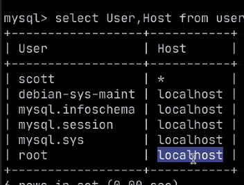

# 오늘 할 일

- [x] 코테문제풀기

# 오늘 배운 내용  

## 디비

* VPC를 배우고, 네트워크를 배우고 디비를 설치해보자

### 디비 설치

* EC2 암거나 선택
* 보안그룹 구성, 3306 열어라
  * 0.0.0.0은 나쁜 버릇
  * 웹서버는 DMZ에 놓는애니까 그렇다 쳐도
  * 데베는 그러면 안됨. 데베는 외부망에 연결시키지 않도록 되어있음. 쓸 일도 없고, 보안상 막아야 함. 오직 앱서버만이 데베서버에 접속해야 함.
  * DBA조차 데베서버에 직접접근하면 안됨
  * SSH로 접근해서 한번 거쳐서 가거나, 아니면 배스쳔을 거쳐서 들어가야 함. 다이렉트로는 절대 열어두면 안된다.
* z라는 명령어는 이전에 갔던 디렉토리로 가게 해준다?
* 정상적인 회사는...
  * 백엔드 개발자는 필드 값을 볼 수 없다. 개인정보는 보호되어야 한다.
  * 오직 sql짜는 권한만 있다. 테이블 접근권한만 있다. 스키마는 DBA가 짜주거나 한다.
* 로케일이 뭘까?
  * 로케일은 사용자의 언어, 국가뿐 아니라 사용자 인터페이스에서 사용자가 선호하는 사항을 지정한 매개변수의 모임이다.
  * 로케일에는 시간, 화폐, 날짜, 언어등에 대한 매개변수가 포함된다.
  * 근데 시간은 UTC를 쓴다. UTC는 협정세계시로서, 국제 표준시라고도 한다.
  * UTC를 쓰면 코딩할때 한가지 안좋은 점이 있는데, 이걸 쓰면 로컬타임에 맞게 변환해줘야 한다. 
  * 럼에도 불구하고 UTC를 쓰는 이유는 국제서비스를 하게 되었을 때 편하기 때문이다.
* 처음엔 랭귀지 팩을 설치한다
* 로케일 젠으로 설정한다
* my-sql 서버를 설치한다
* sudo를 쓰면 루트사용자는 패스워드 설정 없이 로그인이 되는데, 그 이유는?
* my-sql은 루트 패스워드가 아예 없는게 더 안전함. my-sql서버의 루트 사용자만이 접근할 수 있는거라서 그렇다.
* 데이터베이스의 자기기술성?
  * 데베의 정보가 데베에 저장되는것
  * self-describing
*  
  * 이게 기본상태인데, 이래야 루트유저의 외부접속이 안된다
  * root의 Host를 localhost외에 다른걸로 하는 일이 없도록 하자
  * 참고! 위의 사진에서 한가지 잘못된 점이 있을 수 있다. scott의 Host가 아스테리스크인데, 이게 잘못되었을 가능성이 있다. 생성할때 `scott@%`였어야 하는데, 아스테리스크를 주었고, 그 결과 로컬접속도 안됐다. `%`으로 하니까 잘 되었는데, 문제는 이때 위의 사진과 같은 쿼리를 입력했을 때, scott의 Host가 뭔지 잘 모르겠다. 안해봤어서 그렇다. 오늘은 너무 늦었으니 언젠가 해보도록 하자.

* 외부접속을 했는데 즉시 실패응답이 온다면, 그건 적어도 포트가 열려있다는 것일 확률이 크다
  * 즉시 안오고 시간이 걸린다면, 열려있지 않아서 그럴 확률이 크다.
* mysql서버에서도 bind-address설정을 수정해줘야 외부접속이 허용이 된다. AWS에서 포트설정을 한다고 끝나지 않는다
* 설정을 바꾸고 나면 재시작을 해줘야 한다.
* 외부접속할때도 SSH프로토콜로 연결해주자. SSH로 한번 접속을 해서 로컬로 접속하는게 좋다. 이는 SSH 터널링이라고 부른다.
  * 근데 이렇게 하면 JDBC 테스트하는게 불편해진다고 한다.

* SQL Injection
  * 필드값에 쿼리를 넣어서 공격하는 것
* 그냥 Statement로 쿼리를 날리면 매번 쿼리를 컴파일한다. 반면 PreparedStatement를 쓰면 쿼리가 캐싱이 되어서 매번 컴파일 하지 않는다고 한다.

### 관계형 데이터베이스

* 관계형 모델을 표현하는 데이터베이스
* 테이블 구조로 데이터를 저장한다
* 관계형 데이터베이스 실전 입문을 읽어보도록 하자. 언젠가는...

### Stored Procedure

* 코드가 잘못되었다면 깃으로 롤백하면 된다
* 근데 디비의 내장함수에서 문제가 생겼다면 어떻게 할까?
* 프로시저가 업데이트되었는데, 반영을 안했다면 문제가 된다.
* 디비에서 이런걸 유지관리하는 기능이 따로 없다고 한다. 그래서 유지보수가 나쁘단다
* 성능상의 이점이라던가 좋은점이 많지만, 위와 같은 문제때문에 안쓴다고 한다.
* 그래서 마이바티스를 쓴다고 한다. SQL을 날리면 매퍼라는 클래스가 있어서 이걸 써서 개발한다고 한다.
* 쿼리는 XML파일에 작성해두고 매핑해서 쓴다. 책임분리가 확실하게 된다는 장점이 있다.
* 다만 특정 디비에 종속되고, 쿼리 종속적으로 짤 수 밖에 없는 단점이 있다고 한다.

### 정리

* 순수 JDBC를 쓰다가 Spring JDBC 라이브러리를 쓰게 되었다
* 그러다가 마이바티스를 이용해서 개발하는 방식으로 변경되었다
* 근데 위와 같은 방법으로 개발하면 디비 중심으로 개발하게 된다. 테이블을 먼저 설계해야 한다
* 현재는 JPA를 이용해서 SQL도 안짜고 개발하게 되었다.
* 이러면 객체 중심적으로 개발할 수 있게 된다고 한다.

* 근데 JPA는 잘 안쓴다. 왜 그러는가?
  * 디비와 자바를 동시에 잘 알고 있어야 잘 쓸 수 있는 기술이기 때문이다.
  * 잘 안다면 정말 좋지만, 없다면 안쓰는게 나은 기술이다.

### Codeplus : 브루트포스, 백트래킹

* boj 15661 링크와 스타트

### 오늘 배운거 요약

* AWS에 EC2인스턴스를 생성하고, 여기에 MySQL서버를 설치한 다음, Scott사용자를 생성하고, Scott으로 외부접속하는 실습을 해보았다.
* 스프링 어플리케이션을 만들고, 그레이들을 통해 JDBC 드라이버를 받고, 이걸로 DB에 접속해서 쿼리를 전송하고 결과를 받아서 출력하는 간단한 프로그램을 작성해보았다.
* 백트래킹 문제를 하나 더 풀어보았다. 종료조건을 잘 주어서 더이상 의미없는 재귀호출을 중단하였다.
  * 근데 문제를 풀면서 한가지 착각을 했다. 의무참석이 아니라고 해서 멋대로 N명의 참가자 중 일부만 경기에 참여한다는 건줄 알았는데, 그렇지 않았다. 축구하려고 모인 사람이 N명이니까, 결국 N명을 다 집어넣어야 했던 것이다.

# 코딩일일결산

#### 내일의 나에게 보내는 전달사항

* 미션 4 시작하기
* 언젠간 로거 레벨에 대해 공부하기
* [Pyro님 블로그 보고 공부하기](https://www.notion.so/REST-4cebf855900b4b0496acce657b5c8104)

#### 특이사항

* 

