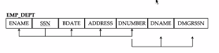

# 오늘 할 일

- [ ] 코테문제풀기

# 오늘 배운 내용  

## 데이터베이스 설계

* 데이터베이스를 설계하는건 테이블을 만드는 과정이다
* 처음에는 테이블은 하나만 존재한다
* 이 상태는 좋지 않기 때문에, 테이블을 쪼개야 한다.
  * 이상현상이 많이 발생하기 때문이다
  * 이렇게 쪼개는 과정을 정규화라고 한다
  * 정규화는 여러 단계로 존재하지만, 3정규화정도까지만 진행한다
  * 더 진행하면 테이블을 너무 많이 쪼개놓아서 성능이 떨어지기 때문에 하지 않는다
* 잘 설계된 테이블의 경우, 다른 테이블의 어트리뷰트를 읽어오려면 외래키 참조를 통해서만 가능해야 한다

#### 정규형과 정규화

* 정규형은 좋은 테이블이 만족해야 하는 기준
* 정규화는 테이블이 정규형을 만족시키도록 만드는 일이다.

### 이상현상

* CRUD할때 문제가 생기는 현상이다.
* 정규화가 안됐기 때문에 발생하는 현상이다
* 1,2,3 정규형과 BCNF정도만 알면 충분하다

#### 삽입 이상

*  
* 이 경우 사원이 없는 부서를 추가할 수 없다. 둘이 같은 테이블에 있기 때문이다.
* 그러나 새로운 부서는 사원이 한명도 없다.

#### 삭제이상

#### 갱신 이상

### 데이터베이스와 키

### 함수적 종속성

* X, Y에서 X가 함수적으로 Y를 결정한다면, X -> Y로 표현한다
* `X^2 = Y`는 함수가 아니다. X가 Y를 결정하지 못하기 때문이다
* X의 값이 유일한 Y를 결정할 수 있어야 한다.
* X가 1이거나 -1이면 Y는 1이 된다. 따라서 유일한 Y를 결정하지 못한다. 
* 이건 1 대 다 라고 하는데, 이런 경우, 함수적으로 종속이 되지 않는다.
* 또한, 서로 다른 Y값인데 같은 X값을 갖는 경우도 함수적으로 종속되지 않는 경우이다

#### 예시

* 주민번호 -> 이름 (o)
* 부서ID -> 부장 이름 (o) : 부서에 부장한 딱 한명 있기 때문.
* 이름 -> 직속상관(x) : 동명이인

### 슈퍼 키

* 애트리뷰트의 집합이고, 이 집합으로 어떤 엔티티를 고유하기 식별할 수 있다.
* id랑 이름의 집합도 슈퍼키이다. id로 고유식별이 가능하기 때문이다.
* 따라서 슈퍼키에는 아직 군살이 있을 수 있다.
* 슈퍼키에서 군살을 제거하면 후보키가 된다

### 후보 키

* 슈퍼키의 부분집합인데, 후보키는 집합에서 어트리뷰트 하나라도 제거하는 순간 슈퍼키가 아니게 된다.
* 즉, 고유식별에 필요없는 어트리뷰트가 없는 집합이다.
* 후보키는 PK의 후보 키이다.

### 인공 키(대리 키 : surrogate key | artificial key)

* 현실에 존재하지 않는 어트리뷰트 집합이다.
* 엔티티 고유식별이 목적인 키이다. JPA에서의 Long id가 그 예이다.
* 인공 키가 아닌 키는 자연 키라고 부른다.

### 정리

* PK라서 다른 어트리뷰트를 함수적으로 결정하는게 아니다.
* 다른 어트리뷰트를 함수적으로 결정할 수 있기에, 후보키가 되고, 선택받아서 PK가 된 것이다.

## 정규형

### 제 1 정규형

* 기본키가 있어야 하고 애트리뷰트 값이 원자값이어야 한다
* 원자값이어야 한다는건 Multi-Value이면 안된다는 것이다. 리스트라던가. 저장하면 위배하는 것이다.

### 제 2 정규형

* 먼저 완전 함수적 종속을 알아야 한다.
* ABC -> X라고 할 때, 
* 멀티 어트리뷰트가 하나의 함수적 종속을 결정할 때, ABC 중 하나라도 제거하면 함수적 종속이 발생하지 않는 경우를 완전 함수적 종속이라고 한다.
* 가령 ABC -> D 인데, BC -> D라면, ABC는 완전 함수적 종속이 아닌 부분 함수적 종속이다.
* 제 2 정규형을 만족시키려면, 완전 함수적 종속만이 남도록 테이블을 쪼개야 한다
* 정리하면 제 1 정규형을 만족하면서 후보키가 아닌 어트리뷰트들이 후보키에 대해 완전 함수적 종속인 경우를 제 2 정규형을 만족한다고 한다

### 제 3 정규형

* 제 2 정규형을 만족하면서 후보키가 아닌 어트리뷰트에서 이행종속이 발생하지 않는 것을 말한다
* 이행종속 
  * X -> Y이고, Y -> Z이면 X -> Z이다
  * [참고](https://yaboong.github.io/database/2018/03/09/database-normalization-1/)
  * 삼단논법같은 관계를 가지는 함수적 종속으로 인해서 논리적으로 말은 되지만 의미가 이상한 관계가 생기는걸 이행적 함수 종속이라고 한다.
  * 이러한 이행적 함수 종속을 제거하면 제 3 정규형을 만족하게 된다.

## 코테문제

* 외판원2랑 로또, 집합, 부분수열의 합 문제를 풀었다
* 비트마스크문제는 처음 풀었는데, 되게 신기했다.
* 또, 2의 n제곱수를 시프트연산으로 구하는건 정말 신기했다.
* 부분수열의 합 문제를 풀 땐 재귀호출을 이용해서 풀어봤는데, 선택을 하는 재귀함수에 대한 이해가 늘은 것 같다

# 일일 결산

#### 내일의 나에게 보내는 전달사항

* 디미터 법칙에 대해 공부해보기

#### 특이사항

* 

