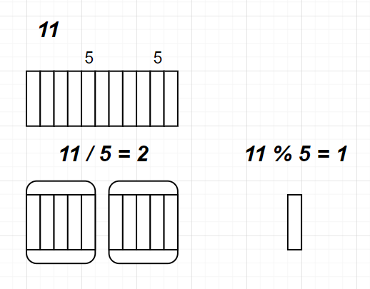

##### 모듈로 연산

m과 n이 있다고 치자. 이때 m/n의 의미는, m개의 원소를 크기n 만큼 묶었을 때, 몇개의 묶음이 생겼냐는 것.

m % n은, 묶음이 되지 못하고 남은 원소가 몇개냐는 것이다.

 

11을 크기 5만큼 묶으면 2개의 묶음이 생긴다. 그리고 원소 하나가 남는다.

그리고 모듈로 연산의 결과는 항상 0 ~ n-1이다. 크기가 n이 될 수 없다. 만약 n이 됐으면 묶음을 형성할 수 있기 때문이다.

##### 문제 해결

여하튼 n=5명의 죄수한테 m=10개의 사탕을 s=1번부터 분배한다고 쳤을 때, 마지막 사탕을 받는건 누구일까. 다시 말해서 n명을 m번 반복해서 방문했을 때, 가장 마지막에 방문하는곳은 어디일까?

```
s
 1 2 3 4 5
[o o o o o]
 o o o o +
[]로 묶은게 사이클.
```

마지막에 방문하는 곳은 5이다. 5는 s=1로부터 4만큼 떨어져 있다.

여기서 우리는 사이클을 찾을 수 있다. 5명을 돌아가면서 방문하기 때문에, 크기n=5의 사이클이 생긴다. 이걸 아까 말하던 묶음으로 생각하자. 그리고 m-1개에서 이 묶음을 만들고 남은 원소의 개수를 구하자. 

m-1을 하는 이유는, 도착지인 +를 포함하기 싫어서이다. 도착지부터 +까지 몇칸가야 하는지 알고싶은거니까 m-1에서 크기n만큼의 사이클을 만들고 남은 거리를 구하면 된다.

그러면 9 % 5 = 4가 나온다.  사이클이 하나 생기고, 4칸만큼 남았으니, 이것만큼 이동하면 된다. s = 1이었으니, 1 + 4 = 5니까 맞다.

```
s
1 2 3   4 5
       [o o
o o o]  o +
```

s=4부터이고 사탕이 7개면? 6 % 5 = 1이다. 사이클이 한번 생기고, 한칸 남았다. 그래서 4 + 1 = 5이다.

```
s
1 2 3   4 5
       [o o
o o o] o o
o o + 
```

s = 4, m = 10이면? 9%5 = 4니까, 얘도 사이클은 하나 생긴다. 남은 거리는 4이다. 근데 s=4인데 남은거리도 4이다. 원형으로 이어져있으니, 결과는 2가 나와야 한다. 이것만 예외처리해주면 된다.

#### 어떤 패턴을 찾는게 힘들다면, 직접 써보는게 좋은 방법일 것 같다.

가령, n = 3이면, 0,0 1,1 2,2를 다 더한거에서 0,2 1,1 2,0을 다 더한걸 뺀 값의 abs를 구하면 된다.

이렇게 써놓고 보면 패턴찾기 쉽다. 첫번째는 걍 i,i이고, 두번째는 i,n-i-1이다.

패턴을 찾는건 여러 방법이 있겠지만, 직접 써보는게 제일 단순하고 확실한 것 같다.

#### DateTimeFormatterBuilder

java8버전부터 DateTimeFormatterBuilder라는게 추가되었다고 한다. 이걸 쓰면 시간의 포맷을 쉽게 만들 수 있고, 이걸로 파싱하거나 시간을 포맷대로 출력할 수 있다. 그래서 이걸 써서 풀려고 했더니, 문제가 하나 생겼다.

##### DateTimeFormatter

```java
DateTimeFormatter myFormatter = new DateTimeFormatterBuilder()
            .appendValue(ChronoField.HOUR_OF_AMPM, 2)
            .appendLiteral(":")
            .appendValue(ChronoField.MINUTE_OF_HOUR, 2)
            .appendLiteral(":")
            .appendValue(ChronoField.SECOND_OF_MINUTE, 2)
            .appendText(ChronoField.AMPM_OF_DAY)
            .toFormatter(Locale.ENGLISH);
String timeConversion2(final String s) {
    return LocalTime.parse(s, myFormatter)
        			.format(militaryFormatter);
}
/*
12:00:00PM : 00:00:00
12:00:01PM : ERROR!
Exception in thread "main" java.time.format.DateTimeParseException: Text '12:00:01PM' could not be parsed: Invalid value for HourOfDay (valid values 0 - 23): 24
	at java.base/java.time.format.DateTimeFormatter.createError(DateTimeFormatter.java:2017)
*/
```

정말 간단하고 쉽게 구현할 수 있긴한데, "12:00:01PM"이걸 넣으면 에러가 발생한다. **이게 좀 이상하고, 더 공부해봐야 할 내용인 것 같다**. 12:00:00PM을 넣으면 00:00:00이 나온다. 이 부분이 문제다.

문제에선 12:00:00AM을 00:00:00으로 보고, 12:00:00PM을 12:00:00으로 본다. 근데 위의 Formatter는 12:00:00PM을 00:00:00으로 표기하고, 12:00:01PM은 24시간을 초과한걸로 보고 예외를 발생시킨다.

##### java.time.temporal ChronoField.java

 ```java
HOUR_OF_AMPM("HourOfAmPm", HOURS, HALF_DAYS, ValueRange.of(0, 11))
 ```

아무래도 이 부분이 문제인 것 같다. 얘는 0시부터 11시로 계산하는 모양이다. 근데 문제에선 12,01,02...11시로 계산해야 한다. 그래서 문제는 12:00:01pm이라는 표현을 하는 반면, TimeFormatter입장에선 12는 범위밖의 숫자라서 에러가 생기는 것 같다.

```note
여담
뭔가 방법이 있을 것 같은데 잘 모르겠다.
분명히 뭔가 해결방법이 있을 것 같은데...... 근데 여기에 너무 시간을 쏟고싶지는 않아서 일단 넘어간다.
너무 아쉽다.
```

#### 스트림의 peek

스트림에서 요소를 소비하면 스트림이 끝나버리는데, 로그는 어떻게 찍을까?

스트림의 중간에 값을 출력하고 싶다. 그럴려면 forEach를 써야 하고, 이거 쓰면 스트림이 닫힌다.

그럴때 peek를 쓰면 된다. 그러면 값도 출력하고 스트림도 안닫을 수 있다.

```java
Arrays.stream(params)
    .peek((param)->{System.out.print(param + " : ");})
    .map(hr_TimeConversion::timeConversion)
    .forEach(System.out::println);
```

#### 같은 시간에 같은 장소에 있어야 한다?

같은 시간에 같은 장소에 있어야 한다. 

같은 시간을 n으로 둘 때, 같은 장소에 있어야 한다.

##### 0 3 4 2일 때

a는 3칸씩 뛰며, 시작점은 0이다. 따라서 3n + 0이라고 할 수 있다.

b는 2칸씩 뛰며 시작점은 4이다. 2n + 4이다.

3n + 0 = 2n + 4

n = 4 즉, 4번째 시간에 서로 만난다는걸 알 수 있다.

이때, 결과는 반드시 양의 정수여야 하는게, 틱레이트가 1이라서 소수시간엔 절대 만날 수 없다. 

또 시간은 양의 방향으로 발산하기 때문에 음수가 나와도 안된다. 

소수가 나오거나 음수가 나온다면, 서로 못만난다는걸 의미한다.

근데 수식을 코드로 표현하려면 어떻게 해야 할까?

생각의 흐름을 그대로 적어보니 이렇게 표현할 수 있었다.

```java
/*
kangaroo(int x1, int v1, int x2, int v2)니까,
v1n + x1 = v2n + x2
v1n - v2n = x2 - x1
(v1-v2)n = x2 - x1
n = x2 - x1 / (v1 - v2)
* */
```


